# Digital Transformation and AI Foundations

## Summary

This chapter introduces the core concepts of digital transformation and establishes the foundational understanding of artificial intelligence that underlies the entire course. Students will learn the distinction between digitization, digitalization, and digital transformation, understand organizational maturity models, and explore how AI and machine learning have evolved to enable generative AI capabilities.

## Concepts Covered

This chapter covers the following 20 concepts from the learning graph:

1. Digital Transformation
2. Digitization
3. Digitalization
4. Digital Maturity
5. Digital Capability Model
6. Organizational Readiness
7. Business Drivers
8. Value Creation
9. Digital Economy
10. Competitive Advantage
11. Artificial Intelligence
12. Machine Learning
13. Deep Learning
14. Neural Networks
15. Generative AI

## Prerequisites

This chapter assumes only the prerequisites listed in the [course description](../../course-description.md). No prior chapters are required.

## Learning Objectives

After completing this chapter, students will be able to:

- Define digital transformation and distinguish it from digitization and digitalization
- Explain the components of digital maturity models
- Identify business drivers for transformation initiatives
- Describe the evolution from AI to machine learning to generative AI
- Assess organizational readiness for digital transformation

---

## Introduction

The contemporary business landscape is characterized by an unprecedented convergence of technological capability and organizational imperative. Digital transformation has evolved from a competitive differentiator to an existential necessity, with organizations across every sector grappling with the challenge of embedding intelligent technologies into their operational fabric. Research from leading consultancies consistently demonstrates that digitally mature organizations outperform their peers—delivering products and services at twice the speed, achieving 25-40% reductions in operational expenditure, and realizing substantial gains in customer satisfaction and brand equity.

Yet the success rate for digital transformation initiatives remains alarmingly low. Fewer than one in four organizations successfully execute their transformation strategies, with failure often attributable not to technological limitations but to inadequate understanding of what transformation truly entails. This chapter establishes the conceptual foundations necessary for understanding both the "digital" and the "AI" dimensions of Digital Transformation 2.0—the convergence of mature digital infrastructure with the transformative power of generative artificial intelligence.

## Understanding the Digital Transformation Spectrum

### Digitization: Converting Analog to Digital

**Digitization** represents the most fundamental layer of the digital transformation spectrum—the conversion of analog information into digital formats. This process involves encoding physical artifacts, documents, images, and analog signals into binary representations that computers can store, process, and transmit. While seemingly straightforward, digitization creates the essential substrate upon which all subsequent digital capabilities depend.

Consider the evolution of medical records: the transition from handwritten patient charts stored in physical filing cabinets to electronic health records (EHRs) exemplifies digitization in practice. The information content remains substantively unchanged—patient demographics, diagnoses, treatment histories—but its representation shifts from ink on paper to bits in databases. This conversion enables searchability, duplication, and transmission capabilities impossible with physical records.

| Analog Form | Digitized Form | Key Benefit |
|-------------|----------------|-------------|
| Paper documents | PDF/Image files | Searchable, shareable |
| Film photographs | Digital images | Lossless copying, metadata |
| VHS tapes | Video files | Streaming, editing |
| Vinyl records | Audio files | Portable, indexable |
| Handwritten notes | Text documents | OCR-enabled search |

However, digitization alone does not constitute transformation. Organizations that merely convert their analog assets to digital formats without reimagining processes or business models achieve incremental efficiency gains at best. The real power of digitization lies in enabling the subsequent stages of the transformation journey.

### Digitalization: Leveraging Digital Data for Process Improvement

**Digitalization** extends beyond mere format conversion to encompass the use of digitized information to improve business processes, enhance decision-making, and create new operational capabilities. Where digitization answers "how do we represent this information digitally?" digitalization asks "how do we leverage this digital information to work differently?"

Returning to our healthcare example: digitalization occurs when the EHR system enables automated prescription refill reminders, surfaces drug interaction warnings, facilitates telemedicine consultations, or aggregates anonymized data for population health analytics. The digitized records become active participants in care delivery rather than passive repositories of information.

Key characteristics of digitalization include:

- Process automation enabled by digital data flows
- Real-time access to information across organizational boundaries
- Data-driven decision support systems
- Integration of previously siloed information sources
- Creation of digital touchpoints for customer interaction

!!! tip "Distinguishing Digitization from Digitalization"
    Ask this diagnostic question: "Does this initiative merely change the format of information, or does it fundamentally change how we use that information to work?" Format change alone is digitization; behavioral and process change indicates digitalization.

### Digital Transformation: Reimagining the Business Model

**Digital Transformation** represents the most profound level of organizational change—a fundamental reimagining of how an organization creates and delivers value, enabled by digital technologies. Unlike digitization (format change) or digitalization (process improvement), true digital transformation involves strategic repositioning, business model innovation, and often the redefinition of organizational identity itself.

The canonical illustration is Netflix's evolution from DVD-by-mail service to streaming platform to content production studio. Each transition represented not merely technological adoption but fundamental business model reinvention:

- **Phase 1**: Digitalization of video rental (digital ordering, optimized logistics)
- **Phase 2**: Transformation to streaming (entirely new delivery model)
- **Phase 3**: Transformation to content creator (vertical integration, original IP)

#### Diagram: Digital Transformation Spectrum

The following diagram illustrates the progression from basic digitization through digitalization to full digital transformation, showing increasing scope and organizational impact at each level.

```mermaid
flowchart TB
    subgraph L3["Level 3: Digital Transformation"]
        direction LR
        T1["🔄 Business Model<br/>Reinvention"]
        T2["🌐 New Value<br/>Propositions"]
        T3["🚀 Ecosystem<br/>Leadership"]
        T1 --- T2 --- T3
    end

    subgraph L2["Level 2: Digitalization"]
        direction LR
        D1["⚙️ Process<br/>Automation"]
        D2["📊 Data-Driven<br/>Decisions"]
        D3["🔗 System<br/>Integration"]
        D1 --- D2 --- D3
    end

    subgraph L1["Level 1: Digitization"]
        direction LR
        B1["📄 Paper to<br/>Digital"]
        B2["💾 Data<br/>Storage"]
        B3["📧 Digital<br/>Communication"]
        B1 --- B2 --- B3
    end

    L1 -->|"Increasing<br/>Complexity"| L2
    L2 -->|"Increasing<br/>Impact"| L3

    style L1 fill:#E3F2FD,stroke:#1565C0,stroke-width:2px
    style L2 fill:#90CAF9,stroke:#1565C0,stroke-width:2px
    style L3 fill:#7C4DFF,stroke:#4527A0,stroke-width:2px,color:#fff
```

| Level | Key Question | Focus | Example |
|-------|--------------|-------|---------|
| **Digitization** | "What format?" | Converting analog to digital | Paper forms → PDF documents |
| **Digitalization** | "How do we work?" | Using digital to improve processes | Manual approvals → Automated workflows |
| **Digital Transformation** | "What business are we in?" | Reimagining the business model | DVD rental → Streaming platform |

!!! tip "Distinguishing the Levels"
    Many organizations confuse digitization projects with digital transformation. True transformation requires questioning fundamental assumptions about how the organization creates and delivers value—not just improving existing processes with technology.

Organizations often conflate these three levels, leading to strategic confusion and misaligned expectations. A common pathology involves declaring "digital transformation" initiatives that amount to digitization or digitalization projects, then wondering why competitive dynamics remain unchanged. True transformation requires the courage to question fundamental assumptions about how the organization creates value.

## Organizational Maturity and Readiness

### Digital Maturity Models

**Digital Maturity** describes an organization's capability to create value through digital technologies, typically assessed across multiple dimensions including strategy, culture, technology infrastructure, data management, and operational processes. Maturity models provide diagnostic frameworks for understanding current state and plotting improvement trajectories.

Several prominent maturity models have emerged from academic research and consulting practice:

| Model | Dimensions | Stages | Key Focus |
|-------|------------|--------|-----------|
| MIT/Capgemini | Digital Intensity, Transformation Management Intensity | 4 quadrants | Balance of technology and leadership |
| Deloitte Digital Maturity Model | Customer, Strategy, Technology, Operations, Culture | 5 levels | Enterprise-wide transformation |
| Gartner Digital Business Maturity | Ambition, Capabilities, Enablers | 5 phases | Value creation velocity |
| McKinsey Digital Quotient | Strategy, Culture, Organization, Capabilities | Continuous scale | Digital health assessment |

The MIT/Capgemini model deserves particular attention for its insight that digital transformation success requires alignment between technological capability (digital intensity) and organizational leadership (transformation management intensity). Their research identified four organizational archetypes:

- **Beginners**: Low digital intensity, low transformation management
- **Fashionistas**: High digital intensity, low transformation management (technology-led, poorly coordinated)
- **Conservatives**: Low digital intensity, high transformation management (cautious, disciplined)
- **Digirati**: High digital intensity, high transformation management (coordinated, strategic)

Organizations in the Digirati quadrant consistently outperform peers on revenue generation, profitability, and market valuation—demonstrating that sustainable transformation requires both technological investment and leadership commitment.

#### Diagram: Digital Maturity Quadrant Model

Digital Maturity Quadrant Model

Type: microsim

Purpose: Interactive exploration of the four digital maturity archetypes with organizational placement exercise

Bloom Taxonomy: Analyze (L4) - Students assess organizational characteristics and classify into quadrants

Learning Objective: Students should be able to evaluate an organization's digital maturity position and recommend improvement vectors

Canvas layout (responsive, minimum 700x500px):
- Main area: 2x2 quadrant grid
- X-axis: Digital Intensity (Low to High)
- Y-axis: Transformation Management Intensity (Low to High)

Quadrant labels and colors:
- Bottom-left: "Beginners" (gray)
- Bottom-right: "Fashionistas" (orange)
- Top-left: "Conservatives" (blue)
- Top-right: "Digirati" (green)

Interactive elements:
- Draggable organization marker that users can position
- When marker placed, display characteristics of that position
- Slider controls for: Technology Investment (0-100), Leadership Commitment (0-100), Data Capabilities (0-100), Culture Readiness (0-100)
- Sliders automatically position the organization marker
- Display recommended "improvement vector" arrow showing path to Digirati

Sample organizations (clickable icons):
- Netflix logo → positions in Digirati
- Traditional bank icon → positions in Conservatives
- Startup icon → positions in Fashionistas
- Small business icon → positions in Beginners

Behavior:
- Hovering over quadrant shows detailed characteristics
- Click quadrant to see example companies and typical challenges
- Reset button returns to initial state

Implementation: p5.js with interactive controls

### Digital Capability Model

The **Digital Capability Model** provides a more granular framework for assessing organizational readiness by decomposing digital maturity into specific, measurable capabilities. Rather than abstract maturity levels, capability models identify concrete competencies that can be developed, measured, and improved.

A comprehensive digital capability model typically encompasses:

**Strategic Capabilities**

- Digital vision articulation and communication
- Technology investment prioritization
- Ecosystem partnership development
- Innovation portfolio management

**Operational Capabilities**

- Process automation maturity
- Real-time data integration
- Agile delivery methodology adoption
- DevOps and continuous deployment practices

**Technological Capabilities**

- Cloud infrastructure utilization
- API-first architecture adoption
- Data platform sophistication
- Cybersecurity posture

**Cultural Capabilities**

- Digital literacy across workforce
- Experimentation tolerance
- Cross-functional collaboration
- Customer-centricity orientation

### Organizational Readiness Assessment

**Organizational Readiness** refers to an organization's preparedness to undertake and sustain digital transformation initiatives. Unlike maturity (which describes current state), readiness assesses the prerequisites for successful change—the cultural, structural, and resource conditions that determine whether transformation efforts will succeed or fail.

Key readiness dimensions include:

- **Leadership alignment**: Do executives share a coherent vision for digital transformation?
- **Resource availability**: Are sufficient financial, human, and technological resources committed?
- **Cultural receptivity**: Is the organization open to experimentation and accepting of failure?
- **Skill base**: Does the workforce possess (or can it acquire) necessary digital competencies?
- **Technical foundation**: Does existing infrastructure support or impede transformation?

!!! warning "The Readiness Trap"
    Organizations sometimes use "readiness assessment" as a delay tactic, endlessly preparing for transformation rather than initiating it. While genuine readiness matters, perfect readiness is unattainable. Transformation inherently involves learning through doing.

## Business Drivers and Value Creation

### Understanding Business Drivers

**Business Drivers** are the internal and external forces that compel organizations to pursue digital transformation. Understanding these drivers is essential for prioritizing initiatives, securing stakeholder commitment, and measuring success. Drivers typically fall into several categories:

**Market Drivers**

- Competitive pressure from digital-native entrants
- Changing customer expectations for digital experiences
- Industry convergence and ecosystem disruption
- Globalization and market access expansion

**Operational Drivers**

- Cost reduction imperatives
- Quality and consistency requirements
- Speed-to-market pressures
- Scalability demands

**Regulatory Drivers**

- Compliance requirements (data protection, accessibility)
- Reporting and transparency mandates
- Industry-specific digital requirements

**Technological Drivers**

- Legacy system obsolescence
- New capability availability (AI, cloud, mobile)
- Security threat evolution
- Integration and interoperability needs

#### Diagram: Business Driver Analysis Framework

The following framework organizes digital transformation business drivers into four categories, helping organizations identify and prioritize the forces driving their transformation initiatives.

| Driver Category | Example Drivers | Impact Assessment Questions |
|-----------------|-----------------|----------------------------|
| **🔵 Market** | Competitor disruption, changing customer expectations, ecosystem shifts | How are competitors using AI? What do customers now expect? |
| **🟢 Operational** | Cost pressure, speed demands, quality requirements, scale needs | Where are our biggest inefficiencies? What can't we scale? |
| **🟠 Regulatory** | Data protection, accessibility, industry mandates, reporting | What compliance requirements affect our AI use? |
| **🟣 Technological** | Legacy obsolescence, new AI capabilities, security threats | What systems are holding us back? What's newly possible? |

**Driver Prioritization Process:**

1. **Identify**: List all relevant drivers from each quadrant
2. **Assess**: Rate each driver's urgency (High/Medium/Low) and impact (High/Medium/Low)
3. **Prioritize**: Focus on High-Urgency + High-Impact drivers first
4. **Align**: Ensure selected drivers connect to strategic objectives

!!! tip "Prioritization Insight"
    Organizations often over-weight operational drivers (internal focus) while under-weighting market drivers (external focus). Successful transformations typically respond to strong market signals, not just internal efficiency goals.

### Value Creation in the Digital Economy

**Value Creation** in the context of digital transformation refers to the mechanisms by which organizations generate economic returns, competitive advantage, and stakeholder benefit through digital capabilities. The **Digital Economy**—the economic activity enabled by digital technologies—operates according to dynamics that differ fundamentally from industrial-era economics.

Key value creation mechanisms in the digital economy include:

- **Network effects**: Value increases as more users participate (platforms, marketplaces)
- **Data monetization**: Extracting value from data assets through analytics, personalization, or direct sale
- **Ecosystem orchestration**: Creating value by connecting producers and consumers
- **Experience differentiation**: Commanding premium through superior digital experiences
- **Operational efficiency**: Reducing costs through automation and optimization
- **Innovation acceleration**: Faster time-to-market for new products and services

The relationship between digital investment and value creation is not linear. Research consistently shows that "Digirati" organizations—those combining high digital intensity with strong transformation management—achieve 9% higher revenue generation, 26% higher profitability, and 12% higher market valuation compared to industry averages.

### Competitive Advantage Through Digital Capabilities

**Competitive Advantage** in the digital age derives from an organization's ability to leverage digital capabilities faster, more effectively, or more creatively than rivals. Traditional sources of advantage—scale, scope, geographic presence—remain relevant but are increasingly supplemented (and sometimes supplanted) by digital factors:

| Traditional Advantage | Digital Enhancement |
|----------------------|---------------------|
| Scale economies | Platform network effects |
| Scope economies | Data synergies across products |
| Geographic presence | Digital global reach |
| Brand recognition | Digital experience differentiation |
| Customer relationships | AI-powered personalization |
| Operational excellence | Intelligent automation |

Sustainable competitive advantage through digital capabilities requires continuous renewal. Unlike physical assets that depreciate gradually, digital advantages can erode rapidly as technologies commoditize and competitors imitate. Organizations must cultivate dynamic capabilities—the capacity to sense opportunities, seize them through resource reconfiguration, and transform organizational capabilities accordingly.

## Foundations of Artificial Intelligence

### What Is Artificial Intelligence?

**Artificial Intelligence (AI)** refers to the development of computer systems capable of performing tasks that typically require human intelligence. These tasks include visual perception, speech recognition, decision-making, language translation, and increasingly, creative endeavors such as writing, art generation, and complex problem-solving.

The field of AI has evolved through several "winters" and "springs" since its founding at the Dartmouth Conference in 1956. Early approaches focused on symbolic AI—explicit programming of rules and logic—which achieved success in constrained domains but struggled with the complexity and ambiguity of real-world problems. The contemporary AI renaissance is powered by fundamentally different approaches: machine learning and its derivatives.

It is essential to distinguish between different conceptions of AI:

- **Narrow AI (ANI)**: Systems designed for specific tasks (image recognition, game playing, language translation). All current AI systems fall into this category.
- **General AI (AGI)**: Hypothetical systems with human-level cognitive abilities across all domains. Does not yet exist.
- **Superintelligent AI (ASI)**: Hypothetical systems exceeding human intelligence. Subject of philosophical speculation and existential risk discourse.

For business applications, we concern ourselves exclusively with narrow AI—sophisticated but specialized systems that augment human capabilities within defined problem spaces.

#### Diagram: AI Evolution Timeline

**Key Eras in AI Development:**

| Era | Period | Characteristics |
|-----|--------|-----------------|
| **Symbolic AI** | 1950-1980 | Rule-based systems, logic programming |
| **Expert Systems** | 1980-1993 | Domain-specific knowledge bases |
| **Machine Learning** | 1990-2010 | Statistical learning, neural networks |
| **Deep Learning** | 2010-2020 | Multi-layer networks, GPU computing |
| **Generative AI** | 2020-present | Foundation models, emergent capabilities |

### Machine Learning: Learning from Data

**Machine Learning (ML)** represents a paradigm shift from explicit programming to learning from data. Rather than encoding rules manually, machine learning algorithms discover patterns and relationships within data, enabling systems to improve performance through experience without being explicitly programmed for each scenario.

The fundamental machine learning paradigm involves:

1. **Data collection**: Gathering representative examples of the target phenomenon
2. **Feature engineering**: Identifying relevant attributes for learning
3. **Model selection**: Choosing appropriate algorithmic approaches
4. **Training**: Adjusting model parameters to minimize prediction error
5. **Evaluation**: Assessing model performance on held-out data
6. **Deployment**: Integrating trained models into operational systems

Machine learning approaches are typically categorized by their learning paradigm:

| Learning Type | Training Data | Example Applications |
|--------------|---------------|---------------------|
| Supervised Learning | Labeled examples (input-output pairs) | Spam detection, credit scoring, image classification |
| Unsupervised Learning | Unlabeled data | Customer segmentation, anomaly detection, dimensionality reduction |
| Reinforcement Learning | Reward signals from environment | Game playing, robotics, recommendation optimization |
| Self-Supervised Learning | Automatically generated labels from data | Language models, representation learning |

The mathematics underlying machine learning draws from statistics, optimization theory, and linear algebra. At its core, most machine learning reduces to optimization problems: finding model parameters that minimize some loss function measuring discrepancy between predictions and actual outcomes.

!!! note "The Data Dependency"
    Machine learning performance is fundamentally bounded by data quality and quantity. The aphorism "garbage in, garbage out" applies with particular force. Organizations pursuing AI capabilities must invest commensurately in data infrastructure, governance, and quality management.

### Neural Networks and Deep Learning

**Neural Networks** are computational models inspired by biological nervous systems, consisting of interconnected nodes (neurons) organized in layers that transform inputs into outputs through learned weight parameters. While neural networks have existed since the 1950s (the Perceptron), practical limitations in training algorithms and computational resources constrained their application until recent advances.

**Deep Learning** refers to neural networks with multiple hidden layers between input and output—hence "deep." These architectures can learn hierarchical representations, with earlier layers detecting simple patterns and later layers composing these into increasingly abstract features. A face recognition system, for example, might learn edge detectors in early layers, face component detectors (eyes, noses) in middle layers, and identity-specific patterns in final layers.

Key neural network architectures include:

- **Feedforward Networks**: Information flows in one direction, input to output
- **Convolutional Neural Networks (CNNs)**: Specialized for spatial data (images, video)
- **Recurrent Neural Networks (RNNs)**: Process sequential data with memory of prior inputs
- **Long Short-Term Memory (LSTM)**: RNN variant addressing long-range dependencies
- **Transformers**: Attention-based architecture enabling parallel processing and context modeling

The transformer architecture, introduced in the seminal 2017 paper "Attention Is All You Need," has proven particularly consequential. By replacing recurrence with attention mechanisms, transformers enable efficient parallel training and superior modeling of long-range dependencies in sequential data. This architecture underlies virtually all contemporary large language models.

#### Diagram: Neural Network Architecture Visualization

Neural Network Architecture Visualization

Type: microsim

Purpose: Interactive visualization of how neural networks process information through layers

Bloom Taxonomy: Understand (L2) - Explain how information flows through network layers

Learning Objective: Students should be able to trace information flow through a neural network and understand the role of layers and weights

Canvas layout (responsive, minimum 800x500px):
- Left panel: Input layer visualization
- Center: Hidden layers (configurable 1-5 layers)
- Right panel: Output layer
- Bottom: Control panel

Visual elements:
- Neurons as circles arranged in vertical layers
- Connections as lines between neurons (thickness indicates weight magnitude)
- Positive weights in blue, negative weights in red
- Activation levels shown as fill intensity

Interactive controls:
- Slider: Number of hidden layers (1-5)
- Slider: Neurons per hidden layer (3-10)
- Input fields: Set input values (e.g., for XOR problem)
- Button: "Forward Pass" - animates signal propagation
- Button: "Reset"
- Dropdown: Activation function (ReLU, Sigmoid, Tanh)

Animation behavior:
- When "Forward Pass" clicked, signals propagate layer by layer
- Each neuron lights up as it activates
- Connection lines pulse as signals pass
- Final output values displayed with confidence

Sample problems:
- XOR classification (2 inputs, 1 output)
- Simple pattern recognition (4 inputs, 3 outputs)
- Regression example (continuous output)

Educational annotations:
- Hover over neuron: shows weighted sum and activation value
- Hover over connection: shows weight value
- Info panel explains current operation

Implementation: p5.js with animation frames

### The Emergence of Generative AI

**Generative AI** represents a category of artificial intelligence systems capable of creating new content—text, images, audio, video, code—rather than merely classifying or predicting based on existing data. While generative models have existed for decades, recent advances in model scale, training methodology, and architectural innovation have produced systems with unprecedented creative capabilities.

The generative AI revolution rests on several foundational developments:

**Foundation Models**: Large neural networks trained on vast datasets that can be adapted to diverse downstream tasks. GPT (Generative Pre-trained Transformer), BERT, and their successors exemplify this paradigm—pre-training on internet-scale text corpora creates general language understanding that transfers to specific applications.

**Scale Hypothesis**: Research has demonstrated that increasing model parameters, training data, and computational resources yields emergent capabilities—abilities that appear suddenly as scale increases rather than improving gradually. GPT-3's 175 billion parameters enabled in-context learning and few-shot reasoning absent in smaller predecessors.

**Diffusion Models**: For image generation, diffusion models (underlying DALL-E, Stable Diffusion, Midjourney) learn to reverse a noise-addition process, generating images by iteratively denoising random inputs conditioned on text prompts.

**Reinforcement Learning from Human Feedback (RLHF)**: Training models to align with human preferences through reward modeling and policy optimization. This technique proved crucial for making language models like ChatGPT helpful, harmless, and honest.

The implications for business are profound. Generative AI enables:

- Automated content creation at scale
- Personalized customer interactions
- Code generation and software development acceleration
- Creative ideation and design assistance
- Knowledge synthesis and research acceleration

However, generative AI also introduces novel risks: hallucination (confident generation of false information), bias amplification, intellectual property ambiguity, and potential for misuse. Subsequent chapters will address these challenges in depth.

## Connecting Transformation and AI

The conjunction of digital transformation and generative AI creates what we term "Digital Transformation 2.0"—a new phase in organizational evolution characterized by:

- **Intelligent automation**: AI-powered systems that handle complex cognitive tasks, not just routine processes
- **Augmented decision-making**: Human-AI collaboration that combines machine pattern recognition with human judgment
- **Generative capabilities**: Ability to create rather than merely process content
- **Adaptive systems**: AI that learns and improves from operational data
- **Conversational interfaces**: Natural language interaction replacing form-based interfaces

Organizations that have achieved digital maturity—robust data infrastructure, cloud platforms, API-first architectures, data-literate workforce—are positioned to leverage generative AI capabilities immediately. Those still wrestling with basic digitalization face compound challenges: they must build foundational infrastructure while simultaneously adapting to AI-driven competitive dynamics.

The chapters that follow will progressively deepen understanding of generative AI technologies (Chapters 2-7), address governance and ethical considerations (Chapter 8), explore workforce implications (Chapter 9), and culminate in practical application through business use cases and capstone projects (Chapter 10).

## Key Takeaways

- **Digital transformation exists on a spectrum** from digitization (format conversion) through digitalization (process improvement) to true transformation (business model reinvention)
- **Organizational maturity models** help assess current state and plot improvement trajectories, with the Digirati archetype representing the optimal combination of digital intensity and transformation management
- **Business drivers** for transformation span market, operational, regulatory, and technological categories—understanding these is essential for prioritization and stakeholder alignment
- **Value creation** in the digital economy operates through network effects, data monetization, ecosystem orchestration, and experience differentiation
- **Artificial intelligence** has evolved from symbolic systems through machine learning to deep learning and now generative AI, with transformer architectures enabling the current revolution
- **Generative AI** creates new content rather than merely classifying existing data, representing a step-change in AI capability with profound business implications
- **Digital Transformation 2.0** combines mature digital infrastructure with generative AI capabilities, requiring both technological investment and organizational readiness

---

## Review Questions

??? question "How does digital transformation differ from digitization and digitalization?"
    **Digitization** is the conversion of analog information to digital format—the foundational layer involving format change only. **Digitalization** uses digitized information to improve business processes and create new capabilities—behavioral and workflow change. **Digital transformation** involves fundamental reimagining of how an organization creates and delivers value—business model reinvention. Netflix's evolution from DVD-by-mail to streaming to content production illustrates transformation; merely creating a website for ordering DVDs would have been digitalization.

??? question "What distinguishes 'Digirati' organizations from other digital maturity archetypes?"
    Digirati organizations achieve high scores on both digital intensity (technology investment and capability) and transformation management intensity (leadership, governance, and change management). Unlike Fashionistas (high tech, low management), they coordinate digital initiatives strategically. Unlike Conservatives (high management, low tech), they invest boldly in digital capabilities. Research shows Digirati outperform peers on revenue, profitability, and market valuation.

??? question "Explain how the transformer architecture enabled the generative AI revolution."
    The transformer architecture, introduced in 2017's "Attention Is All You Need," replaced recurrent processing with attention mechanisms that allow each element in a sequence to attend to all other elements directly. This enables: (1) Efficient parallel training rather than sequential processing, (2) Superior modeling of long-range dependencies, and (3) Scalability to very large models. These properties made possible the training of foundation models like GPT on internet-scale data, yielding emergent capabilities including in-context learning and generative text abilities.

