# Large Language Model Architecture

## Summary

This chapter explores the technical foundations of large language models, explaining how these powerful AI systems work under the hood. Students will learn about transformer architecture, attention mechanisms, and the training processes that enable LLMs to generate human-like text. Understanding these concepts is essential for effectively working with and evaluating AI platforms.

## Concepts Covered

This chapter covers the following 18 concepts from the learning graph:

1. Large Language Models
2. Transformer Architecture
3. Attention Mechanism
4. Self-Attention
5. Multi-Head Attention
6. Pre-Training
7. Fine-Tuning
8. RLHF
9. Token
10. Tokenization
11. Context Window
12. Model Parameters
13. Inference
14. Latency
15. Throughput
16. Embeddings

## Prerequisites

This chapter builds on concepts from:

- [Chapter 1: Digital Transformation and AI Foundations](../01-digital-transformation-ai-foundations/index.md)

## Learning Objectives

After completing this chapter, students will be able to:

- Explain how large language models generate text through next-token prediction
- Describe the transformer architecture and role of attention mechanisms
- Understand the training process including pre-training, fine-tuning, and RLHF
- Explain tokens, context windows, and their business implications
- Interpret model parameters and their effects on performance

---

## Introduction

The remarkable capabilities of modern AI assistants—their ability to write poetry, explain complex concepts, generate code, and engage in nuanced conversation—all derive from a common architectural foundation: the **large language model (LLM)**. These systems represent the culmination of decades of research in natural language processing, neural network design, and distributed computing. Yet despite their sophisticated capabilities, LLMs operate according to a deceptively simple objective: predicting the next word in a sequence.

This chapter demystifies the technical machinery underlying LLMs. While business professionals need not understand every mathematical detail, a working knowledge of how these systems function—their architecture, training processes, and operational characteristics—is essential for making informed decisions about AI adoption, evaluating platform capabilities, and anticipating both the possibilities and limitations of generative AI.

## Understanding Large Language Models

### What Are Large Language Models?

**Large Language Models (LLMs)** are neural networks trained on massive text corpora to understand and generate human language. The term "large" refers to the number of parameters—the learnable weights that the model adjusts during training. Modern LLMs range from billions to trillions of parameters:

| Model | Organization | Parameters | Release Year |
|-------|--------------|------------|--------------|
| GPT-3 | OpenAI | 175 billion | 2020 |
| GPT-4 | OpenAI | ~1.8 trillion (estimated) | 2023 |
| Claude 3.5 Sonnet | Anthropic | Undisclosed | 2024 |
| Gemini Ultra | Google | Undisclosed | 2024 |
| Llama 3.1 | Meta | 405 billion | 2024 |
| Mixtral 8x22B | Mistral | 176 billion (sparse) | 2024 |

At their core, LLMs perform a single task: given a sequence of text, predict the most likely next token. This **next-token prediction** objective, when applied at sufficient scale with appropriate training data, yields systems capable of remarkably sophisticated linguistic behavior.

The fundamental insight is that predicting the next word well requires understanding context, grammar, facts about the world, reasoning patterns, and stylistic conventions. A model that excels at prediction must implicitly learn vast amounts of knowledge about language and the world.

### The Next-Token Prediction Paradigm

Consider how an LLM generates a response to "The capital of France is":

1. The model receives the input tokens
2. It processes them through multiple layers of neural network computations
3. It outputs a probability distribution over its entire vocabulary
4. The token "Paris" receives high probability
5. "Paris" is selected and appended to the sequence
6. The process repeats with "The capital of France is Paris" as input

This autoregressive process continues until the model generates a stop token or reaches a maximum length. Each generation step considers all previous context, enabling coherent multi-paragraph outputs.

!!! note "Temperature and Sampling"
    The selection of the next token need not be deterministic. The **temperature** parameter controls randomness: temperature=0 always selects the highest-probability token, while higher temperatures introduce diversity by making the selection more random. This is why the same prompt can yield different responses.

## Tokens and Tokenization

### Understanding Tokens

A **token** is the fundamental unit of text that LLMs process. Contrary to intuition, tokens are neither words nor characters—they are subword units determined by the model's tokenizer. Common words typically map to single tokens, while rare words are split into multiple tokens.

Examples of tokenization (GPT-style):

| Text | Tokens | Token Count |
|------|--------|-------------|
| "Hello" | ["Hello"] | 1 |
| "artificial" | ["art", "ificial"] | 2 |
| "ChatGPT" | ["Chat", "G", "PT"] | 3 |
| "antidisestablishmentarianism" | ["ant", "id", "is", "establish", "ment", "arian", "ism"] | 7 |

**Tokenization** is the process of converting raw text into token sequences. Different models use different tokenization schemes:

- **Byte Pair Encoding (BPE)**: Used by GPT models. Iteratively merges frequent character pairs to build vocabulary.
- **WordPiece**: Used by BERT. Similar to BPE but uses likelihood-based merging.
- **SentencePiece**: Used by Llama and others. Language-agnostic tokenization that works directly on raw text.

#### Diagram: Tokenization Process Visualization

Tokenization Process Visualization

Type: microsim

Purpose: Interactive demonstration of how text is converted to tokens and the implications for context window usage

Bloom Taxonomy: Understand (L2) - Explain how tokenization works and affects model behavior

Learning Objective: Students should be able to estimate token counts for different text inputs and understand tokenization implications

Canvas layout (responsive, minimum 800x400px):
- Top section: Text input area
- Middle section: Token visualization
- Bottom section: Statistics and metrics

Visual elements:
- Input text area with character counter
- Token display showing each token as a colored chip
- Token IDs displayed below each chip
- Progress bar showing context window usage

Interactive controls:
- Text input field (multi-line)
- Dropdown: Tokenizer selection (GPT-4, Claude, Llama)
- Button: "Tokenize"
- Toggle: Show/hide token IDs
- Slider: Context window size (4K, 8K, 32K, 128K, 200K)

Display metrics:
- Character count
- Token count
- Tokens per character ratio
- Context window percentage used
- Estimated cost (based on typical pricing)

Behavior:
- As user types, real-time token count updates
- Tokens colored by type (word, subword, punctuation, special)
- Hover over token shows: token text, token ID, frequency in training
- Warning when approaching context limit

Sample texts:
- "Hello, world!"
- Technical paragraph with jargon
- Code snippet
- Non-English text (to show multilingual tokenization differences)

Implementation: p5.js or HTML/JavaScript

### Business Implications of Tokenization

Understanding tokens has direct business relevance:

- **Cost calculation**: API pricing is typically per-token (input + output). Efficient prompts reduce costs.
- **Context limits**: Models have maximum token limits. Long documents may require chunking or summarization.
- **Language efficiency**: Tokenizers trained primarily on English may require more tokens for other languages, increasing costs.
- **Code considerations**: Programming languages tokenize differently than natural language, often requiring more tokens.

## The Transformer Architecture

### Why Transformers Revolutionized NLP

The **Transformer architecture**, introduced in the 2017 paper "Attention Is All You Need," replaced the sequential processing of recurrent neural networks with parallel attention-based mechanisms. This innovation enabled:

- **Parallel training**: All positions in a sequence can be processed simultaneously
- **Long-range dependencies**: Direct connections between any two positions regardless of distance
- **Scalability**: Efficient training on massive datasets using modern GPU clusters
- **Transfer learning**: Pre-trained transformers adapt effectively to diverse downstream tasks

Prior architectures—RNNs and LSTMs—processed sequences one element at a time, creating information bottlenecks and gradient flow problems for long sequences. Transformers eliminated these limitations through the attention mechanism.

### Architecture Overview

A transformer model consists of stacked layers, each containing two primary components:

1. **Multi-Head Self-Attention**: Allows each position to attend to all other positions
2. **Feed-Forward Network**: Processes each position independently through dense layers

The full architecture includes:

- **Embedding layer**: Converts tokens to dense vector representations
- **Positional encoding**: Injects sequence position information
- **N transformer layers**: Each with attention and feed-forward sublayers
- **Layer normalization**: Stabilizes training
- **Output projection**: Maps final representations to vocabulary probabilities

#### Diagram: Transformer Architecture

The following diagram illustrates the complete transformer architecture, showing how information flows from input tokens through multiple layers to produce output predictions.

```mermaid
flowchart TB
    subgraph Output["Output Layer"]
        direction TB
        SOFT["Softmax<br/>Probability Distribution"]
        LINEAR["Linear Projection<br/>to Vocabulary"]
    end

    subgraph TL["Transformer Layers (×N)"]
        direction TB
        subgraph Layer["Single Transformer Layer"]
            direction TB
            NORM2["Layer Normalization"]
            FFN["Feed-Forward Network<br/>Linear → ReLU → Linear"]
            ADD2["Add (Residual)"]
            NORM1["Layer Normalization"]
            ATTN["Multi-Head Self-Attention<br/>h parallel attention heads"]
            ADD1["Add (Residual)"]
        end
    end

    subgraph Input["Input Processing"]
        direction TB
        POS["Positional Encoding<br/>Position information"]
        EMB["Token Embeddings<br/>Vocabulary → Vectors"]
        TOK["Input Tokens"]
    end

    TOK --> EMB
    EMB --> POS
    POS --> ADD1
    ADD1 --> ATTN
    ATTN --> NORM1
    NORM1 --> ADD2
    ADD2 --> FFN
    FFN --> NORM2
    NORM2 --> LINEAR
    LINEAR --> SOFT

    %% Residual connections
    POS -.->|"Residual"| ADD1
    NORM1 -.->|"Residual"| ADD2

    style Output fill:#E1BEE7,stroke:#7B1FA2,stroke-width:2px
    style TL fill:#C8E6C9,stroke:#388E3C,stroke-width:2px
    style Input fill:#BBDEFB,stroke:#1976D2,stroke-width:2px
    style ATTN fill:#A5D6A7,stroke:#388E3C
    style FFN fill:#FFCC80,stroke:#F57C00
```

| Component | Function | Key Innovation |
|-----------|----------|----------------|
| **Token Embeddings** | Convert tokens to dense vectors | Learned representations capture meaning |
| **Positional Encoding** | Add position information | Enables parallel processing of sequences |
| **Multi-Head Attention** | Relate all positions to each other | Captures long-range dependencies |
| **Feed-Forward Network** | Transform representations | Adds non-linear processing capacity |
| **Residual Connections** | Bypass around sublayers | Enables training of deep networks |
| **Layer Normalization** | Stabilize activations | Improves training dynamics |

!!! note "Decoder-Only Architecture"
    Modern LLMs like GPT use a decoder-only variant where each position can only attend to earlier positions (causal masking). This enables autoregressive generation: predicting one token at a time based on all previous tokens.

### The Attention Mechanism

**Attention** is the core innovation enabling transformers to model relationships between all positions in a sequence. The mechanism computes a weighted combination of values, where weights reflect the relevance of each position to every other position.

The attention computation follows these steps:

1. **Project inputs**: Transform each position into Query (Q), Key (K), and Value (V) vectors
2. **Compute attention scores**: Calculate dot product of queries with all keys
3. **Scale**: Divide by square root of dimension to stabilize gradients
4. **Apply softmax**: Convert scores to probability distribution
5. **Weight values**: Multiply values by attention weights and sum

The mathematical formulation:

$$\text{Attention}(Q, K, V) = \text{softmax}\left(\frac{QK^T}{\sqrt{d_k}}\right)V$$

Where $d_k$ is the dimension of the key vectors.

### Self-Attention: Tokens Attending to Tokens

**Self-attention** refers to attention where queries, keys, and values all derive from the same sequence. This enables each token to "look at" all other tokens in the input and gather relevant information.

Consider the sentence: "The animal didn't cross the street because it was too tired."

When processing "it," self-attention allows the model to:

- Attend strongly to "animal" (to resolve the pronoun reference)
- Attend to "tired" (which semantically connects to animals, not streets)
- Attend to contextual words that disambiguate meaning

This mechanism enables sophisticated contextual understanding without explicit programming of linguistic rules.

#### Diagram: Self-Attention Visualization

Self-Attention Visualization

Type: microsim

Purpose: Interactive visualization of how tokens attend to other tokens in self-attention

Bloom Taxonomy: Analyze (L4) - Examine attention patterns and their linguistic significance

Learning Objective: Students should be able to interpret attention patterns and understand how context influences token relationships

Canvas layout (responsive, minimum 800x500px):
- Top: Input sentence display with clickable tokens
- Middle: Attention matrix visualization (heatmap)
- Bottom: Selected attention pattern explanation

Visual elements:
- Input tokens as clickable chips arranged horizontally
- Attention matrix as grid with color-coded cells (darker = higher attention)
- Highlighted attention lines connecting selected token to attended tokens
- Attention weight values displayed on hover

Interactive controls:
- Text input field for custom sentences
- Dropdown: Select attention head (1-12)
- Dropdown: Select layer (1-24)
- Toggle: Show attention from → to / to → from
- Button: "Analyze"

Behavior:
- Click any token to highlight its attention pattern
- Attention weights shown as line thickness connecting tokens
- Matrix cells show numerical values on hover
- Side panel explains what the selected head appears to focus on

Sample sentences:
- "The animal didn't cross the street because it was too tired."
- "The bank was closed so I couldn't deposit my check at the river bank."
- "She gave him her book and he gave her his."

Annotations:
- Highlight pronoun resolution patterns
- Show positional attention (adjacent tokens)
- Indicate syntactic attention (subject-verb agreement)

Implementation: p5.js with matrix visualization

### Multi-Head Attention

**Multi-head attention** runs multiple attention operations in parallel, each with different learned projections. This allows the model to attend to information from different representation subspaces at different positions.

The multi-head mechanism:

1. Projects Q, K, V into h different subspaces (h = number of heads)
2. Computes attention in each subspace independently
3. Concatenates the results
4. Projects back to original dimension

$$\text{MultiHead}(Q, K, V) = \text{Concat}(\text{head}_1, ..., \text{head}_h)W^O$$

Where each head computes:

$$\text{head}_i = \text{Attention}(QW_i^Q, KW_i^K, VW_i^V)$$

Different heads learn to focus on different types of relationships:

| Head Type | Typical Focus | Example |
|-----------|---------------|---------|
| Syntactic heads | Subject-verb agreement | "The dogs [run]" |
| Positional heads | Adjacent tokens | Local context |
| Semantic heads | Related concepts | "doctor" ↔ "patient" |
| Coreference heads | Pronoun resolution | "she" ↔ "Maria" |

## Embeddings: Representing Meaning as Numbers

### What Are Embeddings?

**Embeddings** are dense vector representations of tokens (or other discrete entities) in a continuous high-dimensional space. Rather than treating words as arbitrary symbols, embeddings encode semantic relationships through geometric proximity—similar concepts cluster together.

Key properties of embeddings:

- **Dimensionality**: Typically 768 to 4096 dimensions in modern LLMs
- **Learned representations**: Trained from data, not hand-crafted
- **Semantic similarity**: Cosine similarity measures conceptual relatedness
- **Compositionality**: Sentence meanings emerge from token embedding combinations

The famous demonstration of embedding arithmetic:

$$\vec{king} - \vec{man} + \vec{woman} \approx \vec{queen}$$

This suggests embeddings capture semantic relationships that support analogical reasoning.

### Types of Embeddings in LLMs

| Embedding Type | Purpose | When Used |
|---------------|---------|-----------|
| Token embeddings | Initial word representation | Input layer |
| Position embeddings | Encode sequence order | Added to token embeddings |
| Segment embeddings | Distinguish text segments | Some architectures (BERT) |
| Output embeddings | Final token representations | Before generation |

!!! tip "Business Applications of Embeddings"
    Embeddings enable powerful applications beyond text generation: semantic search (finding similar documents), clustering (grouping related items), classification (categorizing content), and recommendation systems (suggesting related content). Many organizations extract embeddings from LLMs for these downstream applications.

## Training Large Language Models

### Pre-Training: Learning from the Internet

**Pre-training** is the initial, computationally intensive phase where the model learns from massive text corpora. The objective is typically next-token prediction (for autoregressive models like GPT) or masked language modeling (for bidirectional models like BERT).

Pre-training characteristics:

- **Data scale**: Trillions of tokens from web text, books, code, academic papers
- **Compute requirements**: Thousands of GPUs for weeks or months
- **Cost**: Millions of dollars for frontier models
- **Learning**: Grammar, facts, reasoning patterns, world knowledge

The pre-training corpus significantly influences model capabilities. Models trained heavily on code excel at programming tasks; those with extensive scientific literature perform better on technical queries.

| Training Data Source | What the Model Learns |
|---------------------|----------------------|
| Web pages | General knowledge, diverse topics |
| Books | Long-form reasoning, narrative structure |
| Wikipedia | Factual information, structured knowledge |
| Academic papers | Technical concepts, citation patterns |
| Code repositories | Programming syntax, algorithms |
| Social media | Conversational patterns, colloquialisms |

### Fine-Tuning: Specializing for Tasks

**Fine-tuning** adapts a pre-trained model to specific tasks or domains by training on smaller, targeted datasets. This transfer learning approach leverages the general capabilities acquired during pre-training while specializing for particular applications.

Fine-tuning approaches include:

- **Full fine-tuning**: Update all model parameters (resource-intensive)
- **Parameter-efficient fine-tuning (PEFT)**: Update only a subset of parameters
- **LoRA (Low-Rank Adaptation)**: Add small trainable matrices to existing weights
- **Prompt tuning**: Learn only soft prompt embeddings, freeze model weights

Fine-tuning enables:

- Domain adaptation (legal, medical, financial language)
- Task specialization (summarization, translation, Q&A)
- Style alignment (formal vs. casual, brand voice)
- Safety improvements (reducing harmful outputs)

### RLHF: Aligning with Human Preferences

**Reinforcement Learning from Human Feedback (RLHF)** is a training methodology that aligns model outputs with human values and preferences. This technique proved crucial for making ChatGPT helpful, harmless, and honest—transforming a raw language model into an effective AI assistant.

The RLHF process:

1. **Supervised fine-tuning**: Train on high-quality human demonstrations of desired behavior
2. **Reward model training**: Train a separate model to predict human preference rankings
3. **Policy optimization**: Use reinforcement learning (typically PPO) to maximize the reward model's score while maintaining output diversity

#### Diagram: RLHF Training Pipeline

**RLHF Stage Summary:**

| Stage | Human Involvement | Input | Output |
|-------|-------------------|-------|--------|
| **1. SFT** | High (write ideal responses) | Pre-trained LLM + demos | SFT Model |
| **2. Reward** | Medium (rank outputs) | SFT outputs + rankings | Reward Model |
| **3. PPO** | None (automated) | SFT Model + Reward Model | Aligned Model |

!!! note "Key Insight"
    Human annotation is the bottleneck. Stage 3 (PPO) runs automatically once the reward model is trained, allowing continuous improvement without additional human labeling.

RLHF addresses limitations of pure pre-training:

- **Helpfulness**: Models learn to provide useful, actionable responses
- **Honesty**: Models learn to acknowledge uncertainty rather than confabulate
- **Harmlessness**: Models learn to refuse harmful requests
- **Format compliance**: Models learn to follow instructions about output format

## Model Parameters and Their Effects

### What Are Parameters?

**Model parameters** are the learnable numerical values (weights and biases) that define a neural network's behavior. During training, these values are adjusted to minimize prediction error. During inference, they remain fixed and determine how inputs are transformed to outputs.

Parameter count correlates roughly with model capability, but the relationship is not linear:

- More parameters → more capacity to store knowledge and patterns
- More parameters → better generalization to novel inputs
- More parameters → higher computational cost for training and inference
- More parameters → greater risk of memorization vs. generalization

The scaling laws observed in LLM research suggest that performance improves predictably with increases in parameters, training data, and compute, though with diminishing returns at the frontier.

### Inference: Running the Model

**Inference** is the process of using a trained model to generate outputs for new inputs. Unlike training (which updates parameters), inference uses fixed parameters to transform inputs through the network.

Inference considerations include:

- **Latency**: Time from input to first output token
- **Throughput**: Tokens generated per second
- **Memory footprint**: GPU memory required to load the model
- **Cost**: Computational expense per token

The autoregressive nature of LLM inference means each output token requires a full forward pass through the network. This creates a fundamental tension between response length and speed.

| Factor | Effect on Latency | Effect on Throughput |
|--------|-------------------|---------------------|
| More parameters | ↑ Higher | ↓ Lower |
| Longer context | ↑ Higher | ↓ Lower |
| Longer output | ↑ Higher (cumulative) | Unchanged per token |
| Batch size | Minimal per request | ↑ Higher aggregate |
| Quantization | ↓ Lower | ↑ Higher |

### Latency and Throughput Optimization

**Latency**—the time to generate a response—matters for interactive applications. Users perceive delays beyond 100-200ms as sluggish. LLM latency has multiple components:

- **Time to first token (TTFT)**: Processing the input and generating the first output token
- **Inter-token latency**: Time between subsequent tokens
- **Total response time**: Cumulative time for complete response

**Throughput**—tokens generated per unit time—matters for batch processing and cost optimization. Techniques for improving throughput include:

- **Batching**: Processing multiple requests simultaneously
- **KV-caching**: Storing key-value computations to avoid recomputation
- **Speculative decoding**: Generating multiple tokens in parallel with verification
- **Model parallelism**: Distributing the model across multiple GPUs

## The Context Window

### What Is a Context Window?

The **context window** is the maximum number of tokens a model can process in a single forward pass—including both input and output tokens. This limit is architectural, determined by positional encoding schemes and attention computation memory requirements.

Context window sizes have grown dramatically:

| Model Generation | Typical Context Window |
|-----------------|----------------------|
| GPT-3 (2020) | 4,096 tokens |
| GPT-4 (2023) | 8,192 / 32,768 tokens |
| Claude 3 (2024) | 200,000 tokens |
| Gemini 1.5 Pro (2024) | 1,000,000 tokens |

A context window of 200,000 tokens accommodates approximately:

- 150,000 words of English text
- A 500-page book
- Multiple lengthy documents for comparison
- Extended multi-turn conversations

### Business Implications of Context Windows

Context window size directly affects application architecture:

| Use Case | Context Requirement | Architectural Approach |
|----------|--------------------|-----------------------|
| Simple Q&A | ~1,000 tokens | Direct prompting |
| Document summarization | 10,000-50,000 tokens | Single-pass with large context |
| Book analysis | 100,000+ tokens | Large context or chunking + synthesis |
| Knowledge base queries | Variable | RAG (Retrieval-Augmented Generation) |
| Extended conversations | Cumulative | Context management, summarization |

!!! warning "Context Window Costs"
    Larger context windows increase computational cost. Processing 100,000 tokens costs substantially more than processing 1,000 tokens. Design applications to use appropriate context sizes, not maximum available.

#### Diagram: Context Window Management

The following diagram compares four strategies for managing context window limitations, each suited to different scenarios and requirements.

```mermaid
flowchart LR
    subgraph S1["📝 Strategy 1: Direct Prompting"]
        direction TB
        D1A["Short Query"] --> D1B["LLM"] --> D1C["Response"]
    end

    subgraph S2["✂️ Strategy 2: Chunking + Synthesis"]
        direction TB
        D2A["Long Doc"]
        D2B["Chunk 1"]
        D2C["Chunk 2"]
        D2D["Chunk 3"]
        D2E["Synthesize"]
        D2A --> D2B & D2C & D2D
        D2B & D2C & D2D --> D2E
    end

    subgraph S3["🔍 Strategy 3: RAG"]
        direction TB
        D3A["Query"] --> D3B["Retrieve"]
        D3B --> D3C["Top K Chunks"]
        D3C --> D3D["Generate"]
    end

    subgraph S4["📚 Strategy 4: Full Context"]
        direction TB
        D4A["Entire Document<br/>in Context"] --> D4B["LLM"] --> D4C["Response"]
    end

    style S1 fill:#E3F2FD,stroke:#1565C0,stroke-width:2px
    style S2 fill:#E8F5E9,stroke:#388E3C,stroke-width:2px
    style S3 fill:#FFF3E0,stroke:#F57C00,stroke-width:2px
    style S4 fill:#F3E5F5,stroke:#7B1FA2,stroke-width:2px
```

| Strategy | Context Usage | Best For | Pros | Cons |
|----------|---------------|----------|------|------|
| **Direct Prompting** | Low (100s of tokens) | Simple queries, short conversations | Fast, cheap, simple | Limited context, no external knowledge |
| **Chunking + Synthesis** | Medium per chunk | Long documents exceeding context | Handles any length | May lose cross-chunk relationships |
| **RAG** | Moderate | Large knowledge bases, specific queries | Scalable, current info, efficient | Retrieval quality critical |
| **Full Context** | High | Complete document understanding | No information loss, holistic | Expensive, slower, still has limits |

**Decision Tree for Strategy Selection:**

!!! tip "Cost Optimization"
    Start with the simplest strategy that meets your needs. Direct prompting costs pennies; full context on a 100K document can cost dollars per request. Match strategy complexity to actual requirements.

## Putting It All Together

The architectural components covered in this chapter work together to enable LLM capabilities:

1. **Tokenization** converts text to numerical representations the model can process
2. **Embeddings** map tokens to dense vectors capturing semantic meaning
3. **Self-attention** enables each position to gather information from all other positions
4. **Multi-head attention** allows simultaneous focus on different relationship types
5. **Transformer layers** stack to build progressively abstract representations
6. **Pre-training** instills broad language knowledge and world understanding
7. **Fine-tuning** specializes the model for particular tasks or domains
8. **RLHF** aligns outputs with human preferences and values
9. **Inference** applies the trained parameters to generate responses
10. **Context windows** bound the information available for each generation

Understanding these components enables informed evaluation of LLM capabilities, realistic expectation setting, and effective application design.

## Key Takeaways

- **LLMs predict the next token** based on all preceding context, with sophisticated language capabilities emerging from this simple objective at scale
- **Tokens are subword units** determined by the tokenizer; understanding tokenization is essential for cost estimation and context management
- **The transformer architecture** replaced sequential processing with parallel attention, enabling efficient training on massive datasets
- **Self-attention** allows each token to attend to all other tokens, capturing long-range dependencies and contextual relationships
- **Multi-head attention** enables simultaneous focus on different relationship types (syntactic, semantic, positional)
- **Embeddings** represent tokens as dense vectors where semantic similarity corresponds to geometric proximity
- **Pre-training** teaches broad language knowledge; **fine-tuning** specializes for tasks; **RLHF** aligns with human preferences
- **Context windows** limit the tokens available for processing; larger windows enable more comprehensive understanding but increase cost
- **Inference characteristics** (latency, throughput) depend on model size, context length, and optimization techniques

---

## Review Questions

??? question "Explain why the attention mechanism was a breakthrough for NLP compared to recurrent architectures."
    Recurrent architectures (RNNs, LSTMs) process sequences one element at a time, creating information bottlenecks as context must pass through each step sequentially. This causes: (1) Gradient vanishing/exploding over long sequences, (2) Difficulty capturing long-range dependencies, (3) Sequential processing preventing parallelization. Attention mechanisms allow direct connections between any two positions regardless of distance, enabling: (1) Parallel processing of all positions simultaneously, (2) Direct modeling of long-range relationships, (3) Efficient training on modern GPU clusters. These advantages enabled training on much larger datasets and longer sequences.

??? question "How does RLHF differ from standard supervised fine-tuning, and why is it necessary?"
    Supervised fine-tuning trains on human-written examples, teaching the model to imitate demonstrations. RLHF goes further by: (1) Training a reward model to predict human preferences between outputs, (2) Using reinforcement learning to optimize for reward model scores. This is necessary because: (1) Writing perfect demonstrations is expensive and limited, (2) Humans are better at comparing outputs than generating ideal ones, (3) RLHF can optimize for implicit preferences difficult to demonstrate (helpfulness, safety, format). The result is models that better align with what users actually want.

??? question "A 100,000-token document needs analysis. Compare using a large-context model versus RAG approach."
    **Large-context approach**: Load entire document into context window; model has complete information for holistic analysis; best for tasks requiring understanding relationships across the full document; higher cost per query; works well when full context is consistently needed.

    **RAG approach**: Index document, retrieve relevant chunks per query; efficient for specific questions; lower per-query cost; scales to unlimited document sizes; may miss cross-section relationships; requires quality retrieval system; better when queries target specific information rather than full-document synthesis.

    Choose large-context for comprehensive analysis (summarization, theme extraction); choose RAG for question-answering over large corpora or when cost matters for many queries.

