# AI Platform Landscape

## Summary

This chapter provides a comprehensive overview of the major generative AI platforms available today. Students will explore OpenAI's GPT models, Anthropic's Claude, Google's Gemini, and other emerging platforms including Perplexity AI and open-source alternatives. Understanding the strengths and differences between platforms is crucial for selecting the right tool for business applications.

## Concepts Covered

This chapter covers the following 20 concepts from the learning graph:

1. OpenAI
2. GPT-4
3. GPT-4 Turbo
4. GPT-4o
5. ChatGPT
6. Anthropic
7. Claude
8. Claude 3 Sonnet
9. Claude 3 Opus
10. Google Gemini
11. Gemini Pro
12. Gemini Ultra
13. Perplexity AI
14. Search-Augmented Gen
15. xAI Grok
16. Meta Llama
17. Mistral AI
18. Mixtral
19. Open-Source Models
20. Proprietary Models

## Prerequisites

This chapter builds on concepts from:

- [Chapter 1: Digital Transformation and AI Foundations](../01-digital-transformation-ai-foundations/index.md)
- [Chapter 2: Large Language Model Architecture](../02-llm-architecture/index.md)

## Learning Objectives

After completing this chapter, students will be able to:

- Identify the major generative AI platforms and their capabilities
- Compare and contrast GPT, Claude, Gemini, and other platforms
- Explain the trade-offs between open-source and proprietary models
- Evaluate platform suitability for specific business use cases
- Navigate the rapidly evolving AI platform landscape

---

## Introduction

The generative AI landscape has evolved from a single dominant player to a competitive ecosystem of platforms, each with distinctive capabilities, philosophies, and target use cases. For business professionals, navigating this landscape requires understanding not just the technical specifications of each platform but also their strategic positioning, pricing models, deployment options, and organizational values.

This chapter surveys the major platforms shaping the generative AI market. We examine OpenAI's GPT family, Anthropic's Claude models, Google's Gemini, and emerging competitors including Perplexity AI, xAI's Grok, and open-source alternatives from Meta and Mistral AI. By chapter's end, readers will possess a framework for evaluating platforms against specific business requirements.

!!! note "A Rapidly Evolving Landscape"
    The AI platform landscape changes rapidly. Model capabilities, pricing, and availability may shift between publication and reading. The frameworks for evaluation presented here remain applicable even as specific details evolve.

## OpenAI: The Pioneer

### Company Overview

**OpenAI** launched the generative AI revolution with ChatGPT in November 2022, demonstrating to a global audience what large language models could accomplish. Founded in 2015 as a non-profit research organization with a mission to ensure artificial general intelligence benefits humanity, OpenAI transitioned to a "capped-profit" structure in 2019 to attract the capital necessary for frontier AI development.

Key organizational characteristics:

- **Partnership with Microsoft**: Microsoft has invested over $13 billion, integrating GPT models into Azure, Office 365, and Bing
- **Developer ecosystem**: The largest third-party developer community building on generative AI
- **Consumer reach**: ChatGPT achieved 100 million users faster than any application in history
- **Research leadership**: Pioneered RLHF, scaling laws, and many foundational techniques

### ChatGPT: The Consumer Interface

**ChatGPT** is OpenAI's conversational interface to its language models. Available as a free tier (GPT-3.5) and paid subscription (ChatGPT Plus with GPT-4), ChatGPT made AI assistants accessible to mainstream users.

ChatGPT features include:

| Feature | Free Tier | Plus Tier ($20/mo) | Team/Enterprise |
|---------|-----------|-------------------|-----------------|
| Model Access | GPT-3.5 | GPT-4, GPT-4o | GPT-4, GPT-4 Turbo |
| Image Generation | Limited | DALL-E 3 | DALL-E 3 |
| Custom GPTs | View only | Create & use | Create & share |
| Code Interpreter | No | Yes | Yes |
| Web Browsing | No | Yes | Yes |
| Priority Access | No | Yes | Yes |

### The GPT-4 Family

**GPT-4**, released in March 2023, represented a significant capability leap over GPT-3.5, demonstrating improved reasoning, broader knowledge, and reduced hallucination rates. The GPT-4 family has subsequently expanded:

**GPT-4 (Original)**

- Parameters: Estimated 1.8 trillion (Mixture of Experts architecture)
- Context window: 8,192 tokens (32K variant available)
- Strengths: Complex reasoning, nuanced instructions, creative writing
- Limitations: Higher latency and cost than smaller models

**GPT-4 Turbo**

- Context window: 128,000 tokens
- Knowledge cutoff: More recent than original GPT-4
- Pricing: Significantly reduced from original GPT-4
- Optimizations: Faster inference, improved instruction following

**GPT-4o** (omni)

- Multimodal native: Natively processes text, audio, images, and video
- Speed: Faster than GPT-4 Turbo with comparable quality
- Real-time: Enables conversational voice interactions
- Cost: Further reduced pricing for production workloads

#### Diagram: GPT Model Evolution

**GPT Model Comparison:**

| Model | Parameters | Context | Key Capability |
|-------|------------|---------|----------------|
| GPT-1 | 117M | 512 | Basic text generation |
| GPT-2 | 1.5B | 1024 | Coherent paragraphs |
| GPT-3 | 175B | 4K | Few-shot learning |
| GPT-3.5 | ~175B | 4K-16K | Chat optimization |
| GPT-4 | ~1.7T* | 8K-32K | Multimodal, reasoning |
| GPT-4 Turbo | ~1.7T* | 128K | Extended context |
| GPT-4o | ~1.7T* | 128K | Native multimodal |

*Estimated, not officially disclosed

## Anthropic: The Safety-Focused Challenger

### Company Overview

**Anthropic** was founded in 2021 by former OpenAI researchers, including Dario and Daniela Amodei, with an explicit focus on AI safety research. The company develops AI systems with an emphasis on reliability, interpretability, and alignment with human values.

Distinguishing characteristics:

- **Constitutional AI**: Training methodology that uses principles rather than human feedback for alignment
- **Safety research**: Significant investment in understanding and mitigating AI risks
- **Enterprise focus**: Strong emphasis on business applications with robust safety guarantees
- **Transparency**: Published research on model behavior and limitations

### Claude: The Helpful, Harmless, Honest Assistant

**Claude** is Anthropic's family of AI assistants, designed around the principles of being helpful, harmless, and honest (the "3 H's"). Claude models aim to be genuinely useful while avoiding harmful outputs and acknowledging uncertainty.

The **Claude 3** family (released early 2024) includes three tiers:

| Model | Positioning | Context | Strengths |
|-------|-------------|---------|-----------|
| Claude 3 Haiku | Fast & affordable | 200K tokens | Speed, cost-efficiency, high-volume tasks |
| Claude 3 Sonnet | Balanced performance | 200K tokens | Best price-performance ratio |
| Claude 3 Opus | Highest capability | 200K tokens | Complex reasoning, nuanced understanding |

**Claude 3.5 Sonnet** (mid-2024) achieved benchmark scores exceeding Claude 3 Opus while maintaining Sonnet-tier speed and pricing, demonstrating rapid capability improvements.

Key Claude capabilities:

- **Extended context**: 200,000 token context window standard across all models
- **Document analysis**: Optimized for processing and analyzing long documents
- **Coding**: Strong performance on code generation and debugging
- **Safety**: Reduced harmful outputs while maintaining helpfulness
- **Artifacts**: Can generate and display interactive content in the interface

!!! tip "Choosing Between Claude Models"
    Use **Haiku** for high-volume, latency-sensitive tasks where cost matters. Use **Sonnet** for most business applications balancing quality and cost. Reserve **Opus** for tasks requiring the deepest reasoning or most nuanced outputs.

## Google: The Infrastructure Giant

### Company Overview

**Google** brings to generative AI its massive infrastructure capabilities, extensive research history (including inventing the transformer architecture), and integration with the world's most popular productivity tools. Google's AI efforts span consumer products (Search, Workspace) and enterprise platforms (Google Cloud, Vertex AI).

Strategic position:

- **Infrastructure advantage**: Tensor Processing Units (TPUs), global data centers
- **Distribution**: Integration with Gmail, Docs, Search reaches billions of users
- **Research heritage**: DeepMind, Google Brain, transformer invention
- **Enterprise platform**: Vertex AI for managed AI/ML services

### Google Gemini

**Gemini** is Google's family of multimodal AI models, designed from the ground up to understand and generate across text, code, images, audio, and video.

**Gemini model tiers**:

| Model | Capability Level | Use Cases |
|-------|-----------------|-----------|
| Gemini Nano | On-device | Mobile applications, offline tasks |
| Gemini Pro | Mainstream | Most conversational and productivity tasks |
| Gemini Ultra | Frontier | Complex reasoning, research, enterprise |

**Gemini 1.5 Pro** introduced breakthrough context length—up to 1 million tokens—enabling analysis of entire codebases, multiple documents, or hours of video in a single prompt. This represents a qualitative shift in what's possible with large-context models.

Key Gemini capabilities:

- **Native multimodality**: Trained on interleaved text, images, audio, video from the start
- **Long context**: Up to 1 million tokens enables unprecedented document analysis
- **Google integration**: Deep integration with Workspace, Search, Cloud
- **Grounding**: Can ground responses in Google Search results for current information

## Perplexity AI: Search Meets Generation

### The Search-Augmented Paradigm

**Perplexity AI** pioneered the **search-augmented generation** approach, combining real-time web search with language model generation. Rather than relying solely on training data (which has a knowledge cutoff), Perplexity retrieves current information from the web and synthesizes it into coherent responses.

This approach addresses fundamental LLM limitations:

- **Currency**: Access to information published after training cutoff
- **Verifiability**: Citations allow users to check sources
- **Factual grounding**: Reduces hallucination by anchoring responses in retrieved content
- **Transparency**: Users can see what sources informed the response

### How Search-Augmented Generation Works

The Perplexity pipeline:

1. **Query understanding**: Parse user question to identify search intent
2. **Search execution**: Query web search engine(s) for relevant results
3. **Content retrieval**: Fetch and process relevant web page content
4. **Synthesis**: Use LLM to generate coherent response from retrieved content
5. **Citation**: Include source links for verification

#### Diagram: Search-Augmented Generation Architecture

**Search-Augmented Generation Steps:**

| Stage | Process | Output |
|-------|---------|--------|
| 1. Query | Parse user question | Search intent |
| 2. Search | Execute web queries | Top 10-20 results |
| 3. Retrieve | Fetch page content | Raw text chunks |
| 4. Rank | Score relevance | Top K chunks |
| 5. Synthesize | LLM generation | Coherent response |
| 6. Cite | Add source links | Verified answer |

!!! info "Key Advantage"
    Unlike standard LLMs limited to training data, search-augmented systems access **real-time information**, enabling accurate responses about current events, recent research, and changing facts.

### Perplexity Capabilities

Perplexity offers multiple modes:

| Mode | Description | Best For |
|------|-------------|----------|
| Basic Search | Quick answers with citations | Simple factual queries |
| Pro Search | Multi-step research with follow-up | Complex research questions |
| Focus Modes | Specialized for Academic, Writing, Wolfram, etc. | Domain-specific queries |
| Spaces | Persistent research threads | Ongoing projects |

The platform has become particularly valuable for:

- **Research tasks**: Academic or market research requiring current data
- **Fact-checking**: Verifying claims with source citations
- **Current events**: Questions about recent developments
- **Technical queries**: Developer documentation and tutorials

## Emerging Platforms

### xAI Grok

**Grok** is the AI assistant developed by xAI, Elon Musk's AI company launched in 2023. Grok is integrated with X (formerly Twitter) and positioned as an AI with "personality" and real-time access to X posts.

Distinguishing features:

- **X integration**: Access to real-time social media content
- **Personality**: Designed to have wit and willingness to engage with edgy topics
- **Image generation**: Includes Grok-created image capabilities
- **Political positioning**: Marketed as less "politically correct" than competitors

!!! warning "Evaluation Considerations"
    When evaluating any AI platform, consider the source and nature of its training data. Platforms with access to social media content may exhibit different characteristics—both beneficial (real-time awareness) and problematic (misinformation, bias)—than those trained primarily on curated content.

### Meta Llama

**Meta's Llama** models represent the most significant open-source contribution to the LLM landscape. Meta has released progressively capable models under permissive licenses, enabling researchers, startups, and enterprises to build on frontier-class technology.

**Llama model evolution**:

| Version | Parameters | Release | License |
|---------|------------|---------|---------|
| Llama 1 | 7B-65B | Feb 2023 | Research only |
| Llama 2 | 7B-70B | July 2023 | Commercial use allowed |
| Llama 3 | 8B-70B | April 2024 | Permissive commercial |
| Llama 3.1 | 8B-405B | July 2024 | Most permissive |

**Llama 3.1 405B** represents Meta's frontier model, competitive with GPT-4 and Claude 3 Opus on many benchmarks while being freely available for fine-tuning and self-hosting.

Benefits of open-source models:

- **Control**: Full control over model deployment and data handling
- **Customization**: Can fine-tune for specific domains or tasks
- **Cost**: No per-token API fees for inference
- **Privacy**: Data never leaves your infrastructure
- **Transparency**: Model weights and architecture fully visible

### Mistral AI

**Mistral AI**, a French startup founded by former DeepMind and Meta researchers, has rapidly established itself as a leading provider of efficient, high-performance open-source models.

**Key Mistral models**:

| Model | Architecture | Parameters | Highlights |
|-------|--------------|------------|------------|
| Mistral 7B | Dense | 7B | Best-in-class for its size |
| Mixtral 8x7B | MoE | 47B (13B active) | Efficient sparse architecture |
| Mixtral 8x22B | MoE | 176B (39B active) | Near-frontier performance |
| Mistral Large | Dense | Undisclosed | Flagship commercial model |

**Mixtral** models use Mixture of Experts (MoE) architecture, activating only a subset of parameters for each token. This enables larger effective model size with smaller inference cost.

## Open-Source vs. Proprietary Models

### The Strategic Trade-Off

Organizations face a fundamental choice between **proprietary models** (accessed via API from OpenAI, Anthropic, Google) and **open-source models** (deployed on owned infrastructure or cloud providers).

| Factor | Proprietary API | Open-Source Self-Hosted |
|--------|-----------------|------------------------|
| **Upfront cost** | Low (pay-per-use) | High (infrastructure) |
| **Marginal cost** | Per-token pricing | Minimal after setup |
| **Data privacy** | Data sent to provider | Data stays internal |
| **Customization** | Limited (prompting, some fine-tuning) | Full control |
| **Maintenance** | Provider handles | Internal responsibility |
| **Capability** | Frontier access | Slightly behind frontier |
| **Latency** | Network-dependent | Infrastructure-dependent |
| **Compliance** | Depends on provider | Full control |

### Decision Framework

#### Diagram: Model Selection Decision Tree

The following decision tree helps organizations choose between proprietary APIs and self-hosted open-source models based on key requirements.

**Decision Factor Summary:**

| Factor | Favors Open-Source | Favors Proprietary |
|--------|-------------------|-------------------|
| **Data Sensitivity** | High (regulatory, privacy) | Low (public data OK) |
| **Volume** | High (millions/month) | Low to moderate |
| **Customization** | Fine-tuning needed | Prompting sufficient |
| **Latency** | <50ms required | Flexible requirements |
| **ML Capacity** | Strong team available | Limited ML expertise |
| **Budget** | Variable (TCO depends) | Predictable per-token |

**Terminal Recommendations:**

| Outcome | Description | Example Organization |
|---------|-------------|---------------------|
| 🟢 **Open-Source** | Self-host for control, cost, or compliance | Healthcare company with PHI data |
| 🔵 **Proprietary** | Use APIs for simplicity and access to frontier models | Startup with small team, moderate volume |
| 🟡 **Hybrid** | Mix strategies based on use case | Enterprise with varied requirements |

!!! tip "Hybrid Strategy Benefits"
    Many organizations use proprietary APIs for prototyping and complex tasks while deploying open-source models for high-volume, production workloads. This provides flexibility without over-committing to either approach.

### The Hybrid Approach

Many organizations adopt hybrid strategies:

- **Proprietary for exploration**: Use GPT-4 or Claude for prototyping, experimentation, and low-volume applications
- **Open-source for production**: Migrate proven use cases to self-hosted Llama or Mistral for cost control
- **Specialized models**: Fine-tune open-source models for specific domains while using proprietary for general tasks
- **Fallback chains**: Route to open-source for simple queries, escalate complex queries to proprietary

## Platform Comparison Framework

### Evaluation Dimensions

When comparing platforms, consider these dimensions:

**Capability Dimensions**

- Reasoning and analysis depth
- Code generation quality
- Creative writing ability
- Instruction following precision
- Multimodal capabilities (vision, audio, video)
- Context window size

**Operational Dimensions**

- API reliability and uptime
- Latency (time to first token, throughput)
- Rate limits and scaling
- Pricing (input tokens, output tokens, features)

**Strategic Dimensions**

- Data handling and privacy policies
- Compliance certifications
- Enterprise support availability
- Ecosystem and integrations
- Company stability and trajectory

#### Diagram: Platform Comparison Matrix

The following matrix enables side-by-side comparison of major AI platforms across key dimensions for informed selection decisions.

**AI Platform Comparison Matrix** *(Last updated: January 2026)*

| Dimension | OpenAI GPT-4o | Claude 3.5 Sonnet | Gemini 1.5 Pro | Llama 3.3 70B | Mistral Large |
|-----------|---------------|-------------------|----------------|---------------|---------------|
| **Reasoning** | ⭐⭐⭐⭐⭐ | ⭐⭐⭐⭐⭐ | ⭐⭐⭐⭐ | ⭐⭐⭐⭐ | ⭐⭐⭐⭐ |
| **Coding** | ⭐⭐⭐⭐⭐ | ⭐⭐⭐⭐⭐ | ⭐⭐⭐⭐ | ⭐⭐⭐⭐ | ⭐⭐⭐⭐ |
| **Context Window** | 128K | 200K | 2M | 128K | 128K |
| **Multimodal** | ✅ Vision+Audio | ✅ Vision | ✅ Vision+Audio | ⚠️ Limited | ✅ Vision |
| **Input Price** | $2.50/1M | $3.00/1M | $1.25/1M | Self-host | $2.00/1M |
| **Output Price** | $10.00/1M | $15.00/1M | $5.00/1M | Self-host | $6.00/1M |
| **Latency** | Fast | Fast | Medium | Variable | Fast |
| **Data Privacy** | API only | API only | API only | ✅ Self-host | API + Self-host |
| **Fine-tuning** | ✅ Available | ⚠️ Limited | ✅ Available | ✅ Full control | ✅ Available |
| **Enterprise** | ✅ Strong | ✅ Strong | ✅ Strong | Community | ⚠️ Growing |

**Legend:** ⭐ = Capability rating (1-5), ✅ = Available, ⚠️ = Limited, ❌ = Not available

```mermaid
flowchart LR
    subgraph Selection["Platform Selection by Use Case"]
        direction TB
        UC1["🤖 Customer Service<br/>Chatbot"] --> R1["Claude, GPT-4o<br/>(Safety, instruction following)"]
        UC2["💻 Code Generation"] --> R2["GPT-4o, Claude<br/>(Strong reasoning)"]
        UC3["🔍 Research Assistant"] --> R3["Gemini, Perplexity<br/>(Real-time info)"]
        UC4["📄 Long Document<br/>Analysis"] --> R4["Gemini 1.5, Claude<br/>(Large context)"]
        UC5["💰 Cost-Sensitive<br/>Production"] --> R5["Llama, Mistral<br/>(No API costs)"]
        UC6["🏥 Regulated Industry"] --> R6["Self-hosted Llama<br/>(Data sovereignty)"]
    end

    style Selection fill:#F5F5F5,stroke:#757575
    style R1 fill:#E3F2FD,stroke:#1565C0
    style R2 fill:#E8F5E9,stroke:#388E3C
    style R3 fill:#FFF3E0,stroke:#F57C00
    style R4 fill:#FCE4EC,stroke:#C2185B
    style R5 fill:#E1BEE7,stroke:#7B1FA2
    style R6 fill:#FFECB3,stroke:#FF8F00
```

!!! warning "Rapid Evolution"
    This comparison reflects capabilities as of early 2026. The AI platform landscape evolves rapidly—new models launch frequently, pricing changes, and capabilities improve. Always verify current specifications before making deployment decisions.

**Evaluation Criteria Definitions:**

| Dimension | How to Evaluate | What "Best" Means |
|-----------|-----------------|-------------------|
| **Reasoning** | Complex problem-solving, logical inference | Handles multi-step reasoning accurately |
| **Coding** | Code generation, debugging, explanation | Produces working code, understands context |
| **Context Window** | Maximum input tokens | Longer = more context can be included |
| **Multimodal** | Image, audio, video understanding | Can process multiple modalities |
| **Pricing** | Cost per million tokens | Lower cost per quality unit |
| **Latency** | Time to first token, streaming | Faster response times |
| **Data Privacy** | Where data is processed | Self-hosting = full control |

### Matching Platform to Use Case

| Use Case | Recommended Platform(s) | Rationale |
|----------|------------------------|-----------|
| Customer service chatbot | Claude, GPT-4 | Safety, instruction following |
| Code generation | GPT-4, Claude | Strong reasoning, code quality |
| Research assistant | Perplexity, Gemini | Real-time information, citations |
| Document analysis | Claude (long context), Gemini 1.5 | Extended context windows |
| Cost-sensitive production | Llama, Mistral | No per-token API costs |
| Regulated industry | Self-hosted open-source | Data sovereignty, compliance |
| Creative writing | GPT-4, Claude Opus | Nuanced, high-quality output |
| Real-time applications | Optimized open-source | Latency control |

## Navigating Platform Evolution

### Staying Current

The AI platform landscape evolves rapidly. Strategies for staying current:

- **Follow release announcements**: Subscribe to platform blogs and changelogs
- **Monitor benchmarks**: Track evaluations like LMSYS Chatbot Arena, MMLU, HumanEval
- **Experiment continuously**: Maintain test harnesses to evaluate new models quickly
- **Community engagement**: Participate in developer communities for real-world insights
- **Avoid lock-in**: Design applications with abstraction layers for model swapping

### Future Directions

Trends shaping platform evolution:

- **Multimodality**: Native understanding of images, audio, video becoming standard
- **Agentic capabilities**: Models that can take actions, use tools, execute multi-step plans
- **Specialization**: Domain-specific models optimized for medicine, law, finance, code
- **Efficiency**: Smaller, faster models approaching larger model quality
- **On-device**: Capable models running locally on phones and laptops
- **Real-time**: Voice and video interactions at conversational speed

## Key Takeaways

- **OpenAI** pioneered the commercial LLM market; GPT-4 and ChatGPT remain industry benchmarks with the largest developer ecosystem
- **Anthropic Claude** prioritizes safety and offers the largest standard context window (200K tokens); Claude 3.5 Sonnet provides excellent price-performance
- **Google Gemini** brings infrastructure scale and integration with Google services; Gemini 1.5 Pro's million-token context enables unprecedented document analysis
- **Perplexity AI** demonstrates the power of search-augmented generation for current, cited information
- **Open-source models** (Llama, Mistral) offer control, customization, and cost benefits at near-frontier performance
- **Platform selection** should consider capability requirements, data sensitivity, volume economics, and organizational capacity
- **Hybrid approaches** often optimize for both flexibility and cost by mixing proprietary and open-source models
- **The landscape evolves rapidly**; design for flexibility and maintain evaluation frameworks

---

## Review Questions

??? question "What are the key differences between OpenAI's GPT-4, GPT-4 Turbo, and GPT-4o?"
    **GPT-4 (original)**: First frontier multimodal model with strong reasoning; 8K/32K context; higher cost and latency. **GPT-4 Turbo**: Extended context to 128K tokens; more recent knowledge; significantly reduced pricing; faster inference. **GPT-4o**: Native multimodal (text, audio, images, video processed together); fastest variant; enables real-time voice conversation; further cost reduction. The progression shows OpenAI optimizing for speed, cost, and multimodal integration while maintaining capability.

??? question "Why might an organization choose self-hosted open-source models over proprietary APIs?"
    Key reasons include: (1) **Data privacy**: Sensitive data never leaves internal infrastructure, (2) **Cost at scale**: No per-token fees make high-volume use economical, (3) **Customization**: Full fine-tuning control for domain-specific applications, (4) **Compliance**: Easier to meet regulatory requirements when controlling the stack, (5) **Latency**: Potential for lower latency with optimized infrastructure. Trade-offs include upfront infrastructure costs, maintenance burden, and potentially lagging behind frontier capabilities.

??? question "How does Perplexity's search-augmented generation address LLM limitations?"
    Traditional LLMs have knowledge cutoffs and can hallucinate facts. Perplexity addresses this by: (1) Executing real-time web searches for current information, (2) Retrieving and processing source content, (3) Grounding responses in retrieved content to reduce hallucination, (4) Providing citations so users can verify claims, (5) Synthesizing information from multiple sources into coherent responses. This approach trades off the self-contained nature of pure LLMs for access to current, verifiable information.

