# Prompt Engineering Fundamentals

## Summary

This chapter covers the art and science of prompt engineering - the techniques used to effectively communicate with large language models to achieve desired outputs. Students will master zero-shot, few-shot, and chain-of-thought prompting, learn to design system prompts and personas, and develop strategies for output formatting and prompt optimization.

## Concepts Covered

This chapter covers the following 18 concepts from the learning graph:

1. Prompt Engineering
2. Zero-Shot Prompting
3. Few-Shot Prompting
4. In-Context Learning
5. Chain-of-Thought
6. Tree-of-Thought
7. Self-Consistency
8. System Prompt
9. User Prompt
10. Persona Design
11. Output Formatting
12. Structured Output
13. JSON Output
14. Markdown Output
15. Prompt Templates
16. Prompt Libraries
17. Prompt Iteration
18. Prompt Optimization

## Prerequisites

This chapter builds on concepts from:

- [Chapter 2: Large Language Model Architecture](../02-llm-architecture/index.md)
- [Chapter 3: AI Platform Landscape](../03-ai-platform-landscape/index.md)

## Learning Objectives

After completing this chapter, students will be able to:

- Apply zero-shot and few-shot prompting techniques effectively
- Use chain-of-thought prompting to improve reasoning in complex tasks
- Design system prompts to establish consistent AI personas
- Generate structured outputs in JSON, markdown, and other formats
- Iterate and optimize prompts for improved response quality

---

## Introduction

The interface between humans and large language models is text—specifically, the carefully crafted instructions we call prompts. **Prompt engineering** is the discipline of designing, testing, and optimizing these textual inputs to elicit desired outputs from AI systems. While LLMs possess remarkable capabilities, unlocking those capabilities reliably requires understanding how to communicate effectively with them.

Prompt engineering has evolved from an ad-hoc practice to a systematic discipline with established techniques, patterns, and best practices. This chapter introduces the foundational concepts and methods that enable practitioners to extract maximum value from generative AI systems. From simple zero-shot queries to sophisticated multi-step reasoning chains, mastering these techniques is essential for any professional working with AI.

!!! tip "The Prompt Engineering Mindset"
    Think of prompt engineering as programming in natural language. Just as traditional programming requires understanding how computers interpret instructions, prompt engineering requires understanding how language models process and respond to text.

## Understanding Prompts

### The Anatomy of a Prompt

A **prompt** is the input text provided to a language model to guide its response. Prompts can range from simple questions ("What is the capital of France?") to complex multi-component instructions with examples, constraints, and formatting requirements.

Modern LLM interfaces typically distinguish between different prompt components:

| Component | Purpose | Visibility |
|-----------|---------|------------|
| **System prompt** | Establishes context, persona, and behavior guidelines | Set by developer |
| **User prompt** | The immediate request or question | Visible to user |
| **Assistant response** | Model's output from previous turns | Part of conversation history |
| **Context** | Retrieved documents, data, or prior conversation | May be hidden or visible |

The **system prompt** sets persistent instructions that apply across all interactions, while the **user prompt** contains the specific request. Together, they form the complete input the model processes.

### How Models Interpret Prompts

Understanding how LLMs process prompts illuminates why certain techniques work:

1. **Tokenization**: The prompt is converted to tokens (see Chapter 2)
2. **Context assembly**: System prompt, conversation history, and user prompt are concatenated
3. **Attention**: The model attends to all tokens, weighing their relevance
4. **Generation**: Output tokens are generated autoregressively based on the full context

Key implications:

- **Order matters**: Information placement affects attention and recall
- **Recent is stronger**: Content near the end of the prompt tends to have more influence
- **Explicit is better**: Models respond to what's stated, not what's implied
- **Examples demonstrate**: Showing the model what you want often outperforms describing it

## Zero-Shot Prompting

### The Simplest Approach

**Zero-shot prompting** involves asking the model to perform a task without providing any examples. You simply describe what you want and trust the model's pre-trained knowledge to produce an appropriate response.

```
Classify the sentiment of this review as positive, negative, or neutral:

"The product arrived quickly and works exactly as described. Very satisfied with my purchase."

Sentiment:
```

Zero-shot prompting relies entirely on the model's pre-existing understanding of the task from its training data. It works well when:

- The task is common and well-defined
- Instructions are clear and unambiguous
- The expected output format is standard
- The domain is well-represented in training data

### Zero-Shot Best Practices

Effective zero-shot prompts share common characteristics:

- **Clear task definition**: Explicitly state what you want the model to do
- **Specific constraints**: Define output format, length, or style expectations
- **Relevant context**: Provide necessary background information
- **Action verbs**: Use imperative instructions ("Summarize," "List," "Explain")

| Weak Zero-Shot | Strong Zero-Shot |
|----------------|------------------|
| "Tell me about this email" | "Identify the main action items in this email and list them as bullet points" |
| "What do you think?" | "Analyze this proposal and provide three strengths and three weaknesses" |
| "Help with this code" | "Debug this Python function and explain what was causing the error" |

## Few-Shot Prompting and In-Context Learning

### Learning from Examples

**Few-shot prompting** provides the model with examples of input-output pairs before the actual task. This technique leverages the model's remarkable ability to perform **in-context learning**—adapting its behavior based on patterns observed in the prompt without any weight updates.

```
Convert these product descriptions to bullet points:

Description: The XR-500 headphones feature 40-hour battery life with quick charge. Active noise cancellation blocks ambient sound. Premium drivers deliver rich bass.

Bullet points:
- 40-hour battery life with quick charge capability
- Active noise cancellation
- Premium drivers with rich bass

Description: CloudWalk running shoes have responsive foam cushioning for all-day comfort. Breathable mesh upper keeps feet cool. Durable rubber outsole.

Bullet points:
- Responsive foam cushioning for all-day comfort
- Breathable mesh upper
- Durable rubber outsole

Description: The SmartBrew coffee maker features programmable brewing with customizable strength settings. Built-in grinder ensures fresh grounds. Keeps coffee warm for 4 hours.

Bullet points:
```

The model learns the pattern from examples and applies it to the new input.

### Optimizing Few-Shot Examples

The quality and selection of examples significantly impacts performance:

**Diversity**: Include examples covering different variations of the task

```
# Poor: All examples are similar
Example 1: Positive review → Positive
Example 2: Positive review → Positive
Example 3: Positive review → Positive

# Better: Examples cover the output space
Example 1: Positive review → Positive
Example 2: Negative review → Negative
Example 3: Neutral review → Neutral
```

**Relevance**: Choose examples similar to expected inputs

**Format consistency**: Maintain identical formatting across examples

**Order effects**: Place more important or representative examples later (closer to the query)

#### Diagram: Few-Shot Prompting Structure

The following diagram shows the anatomy of a few-shot prompt, illustrating how task instructions, examples, and the actual query work together to guide model behavior.


**Concrete Example:**

```text
Classify the sentiment of the following text as positive, negative, or neutral.

Input: The product exceeded my expectations!
Output: positive

Input: The delivery was delayed by three weeks.
Output: negative

Input: The package arrived on Tuesday.
Output: neutral

Input: Customer service was incredibly helpful and resolved my issue quickly.
Output: [MODEL GENERATES: positive]
```

| Component | Purpose | Best Practice |
|-----------|---------|---------------|
| **Task Instruction** | Sets expectations for the task | Be specific about format and constraints |
| **Examples** | Demonstrate the input-output pattern | Use 2-5 diverse, representative examples |
| **Query** | The actual input to process | Follow exact same format as examples |
| **Model Output** | Generated response | Should mirror example output format |

!!! tip "Example Selection Strategy"
    Place your most representative or important examples last (closer to the query). LLMs show recency bias, giving more weight to examples that appear just before the actual input.

### The Power of In-Context Learning

**In-context learning** represents one of the most surprising capabilities of large language models. Unlike traditional machine learning that requires gradient updates to learn new tasks, LLMs can adapt their behavior purely based on examples provided in the prompt.

This capability emerges at scale and enables:

- **Rapid adaptation**: New tasks can be specified in seconds
- **No training required**: Examples work immediately without fine-tuning
- **Dynamic behavior**: The same model can perform countless tasks
- **Easy iteration**: Changing examples instantly changes behavior

!!! note "Limits of In-Context Learning"
    In-context learning has limits. Very novel tasks, those requiring capabilities absent from pre-training, or those with complex procedural logic may not be learnable from a few examples alone. When few-shot fails, consider fine-tuning or breaking the task into simpler components.

## Chain-of-Thought Prompting

### Reasoning Step by Step

**Chain-of-thought (CoT) prompting** improves model reasoning by encouraging explicit step-by-step thinking before reaching a conclusion. Rather than jumping directly to an answer, the model "shows its work," which often leads to more accurate results on reasoning-intensive tasks.

Standard prompt:
```
Roger has 5 tennis balls. He buys 2 more cans of tennis balls. Each can has 3 balls. How many tennis balls does he have now?
```

Chain-of-thought prompt:
```
Roger has 5 tennis balls. He buys 2 more cans of tennis balls. Each can has 3 balls. How many tennis balls does he have now?

Let's think step by step:
1. Roger starts with 5 tennis balls
2. He buys 2 cans, each with 3 balls
3. That's 2 × 3 = 6 new balls
4. Total: 5 + 6 = 11 tennis balls

Answer: 11
```

### Triggering Chain-of-Thought

CoT can be elicited in several ways:

**Zero-shot CoT**: Simply add "Let's think step by step" to the prompt

```
[Problem description]

Let's think step by step:
```

**Few-shot CoT**: Provide examples that include reasoning chains

```
Example problem with step-by-step solution...

New problem:
Let's solve this step by step:
```

**Structured CoT**: Explicitly request specific reasoning steps

```
Analyze this business proposal:
1. First, identify the key assumptions
2. Then, evaluate each assumption's validity
3. Next, assess the financial projections
4. Finally, provide your recommendation with reasoning
```

### When to Use Chain-of-Thought

CoT is particularly effective for:

| Task Type | Why CoT Helps |
|-----------|--------------|
| Math problems | Forces arithmetic to be explicit |
| Logic puzzles | Makes deductive steps visible |
| Multi-step reasoning | Maintains coherence across steps |
| Analysis tasks | Ensures systematic consideration |
| Decision-making | Documents reasoning for review |

CoT may be unnecessary or counterproductive for:

- Simple factual questions
- Creative writing tasks
- Classification with clear categories
- Tasks where explanation isn't needed

## Advanced Reasoning Techniques

### Tree-of-Thought

**Tree-of-thought (ToT)** extends chain-of-thought by exploring multiple reasoning paths and evaluating which leads to the best solution. Rather than a single chain, the model considers a tree of possible reasoning branches.

The ToT approach:

1. **Generate** multiple initial thoughts/approaches
2. **Evaluate** the promise of each approach
3. **Expand** promising branches with further reasoning
4. **Backtrack** if a branch leads to dead ends
5. **Select** the best path based on evaluation

This technique is particularly valuable for:

- Complex planning problems
- Creative problem-solving where multiple approaches exist
- Situations requiring exploration and backtracking
- Tasks where initial intuitions may be misleading

### Self-Consistency

**Self-consistency** improves reliability by generating multiple independent reasoning chains and selecting the most common answer. This technique leverages the insight that correct reasoning paths often converge on the same answer.

Implementation:
1. Run the same prompt multiple times with temperature > 0
2. Each run produces a potentially different reasoning chain
3. Extract the final answer from each chain
4. Select the answer that appears most frequently (majority vote)

Self-consistency is effective when:

- The task has a definitive correct answer
- Multiple valid reasoning paths exist
- You can afford the additional API calls
- Reliability is more important than latency or cost

#### Diagram: Advanced Reasoning Techniques Comparison

The following diagram compares three advanced reasoning techniques, showing their structure, use cases, and trade-offs.


| Technique | Structure | Best For | Cost | Reliability |
|-----------|-----------|----------|------|-------------|
| **Chain-of-Thought** | Single linear path | Straightforward multi-step problems (math, logic) | 1× inference | Moderate |
| **Tree-of-Thought** | Branching exploration with pruning | Complex problems requiring planning, search | Higher (multiple evaluations) | High for complex tasks |
| **Self-Consistency** | Multiple parallel samples with voting | Tasks with definitive answers | N× inference | High through aggregation |

**When to Use Each Technique:**

| Scenario | Recommended Technique | Reasoning |
|----------|----------------------|-----------|
| Simple math word problem | Chain-of-Thought | Linear reasoning sufficient |
| Complex planning task | Tree-of-Thought | Need to explore and backtrack |
| Multiple-choice with one correct answer | Self-Consistency | Voting increases accuracy |
| Creative writing | Chain-of-Thought | No single "correct" answer to vote on |
| Strategic decision-making | Tree-of-Thought | Multiple paths worth exploring |

!!! info "Cost-Benefit Trade-off"
    More sophisticated techniques increase accuracy but also increase API costs and latency. Start with Chain-of-Thought; escalate to Tree-of-Thought or Self-Consistency only when the simpler technique fails on your specific use case.

## System Prompts and Persona Design

### The Power of System Prompts

The **system prompt** establishes the foundational context, personality, and behavioral guidelines for an AI assistant. Unlike user prompts that contain specific requests, system prompts define how the model should approach all interactions.

Effective system prompts typically include:

- **Role definition**: Who/what the assistant is
- **Behavioral guidelines**: How to respond
- **Constraints**: What to avoid or refuse
- **Output preferences**: Default formatting or style
- **Domain context**: Relevant background knowledge

Example system prompt structure:

```
You are a financial advisor assistant for individual investors.

Core responsibilities:
- Explain financial concepts in accessible terms
- Provide balanced analysis of investment options
- Help users understand risk and return tradeoffs

Guidelines:
- Never provide specific investment advice or recommendations
- Always remind users to consult licensed professionals for major decisions
- Use plain language, avoiding jargon unless specifically asked
- When discussing numbers, provide context for scale

Response style:
- Conversational but professional
- Acknowledge uncertainty when data is ambiguous
- Use examples to illustrate abstract concepts
```

### Persona Design

**Persona design** involves crafting a coherent identity and behavioral profile for the AI assistant. A well-designed persona creates consistent, predictable interactions aligned with user expectations and business requirements.

Key persona elements:

| Element | Description | Example |
|---------|-------------|---------|
| Identity | Who the assistant is | "Alex, a customer support specialist" |
| Expertise | Domain knowledge areas | "Expert in software products and billing" |
| Tone | Communication style | "Friendly, patient, solution-oriented" |
| Values | Guiding principles | "Customer satisfaction, accuracy, efficiency" |
| Limitations | What persona won't do | "Cannot access account details without verification" |

!!! warning "Persona Consistency"
    Users quickly detect inconsistency in persona behavior. If the assistant is described as "friendly and casual" but responds formally, trust erodes. Test personas across diverse scenarios to ensure behavioral coherence.

## Output Formatting

### Structured Output

**Structured output** refers to generating responses in specific formats—JSON, XML, markdown tables, etc.—that can be parsed programmatically or displayed consistently. This capability bridges the gap between human-readable text and machine-processable data.

Why structured output matters:

- **Integration**: Outputs feed directly into downstream systems
- **Consistency**: Predictable formats simplify processing
- **Validation**: Structured data can be schema-validated
- **Presentation**: Markdown enables rich text display

### JSON Output

**JSON output** is particularly valuable for application integration. Modern LLMs can reliably generate valid JSON when properly instructed.

Techniques for reliable JSON generation:

```
Extract the following information from this customer email and return as JSON:
- customer_name (string)
- issue_type (one of: billing, technical, account, other)
- urgency (one of: low, medium, high)
- summary (string, max 100 characters)

Email: [customer email text]

Respond only with valid JSON, no additional text:
```

Best practices:

- Specify the exact schema expected
- List valid values for enumerated fields
- Request "only JSON, no additional text"
- Use example JSON in few-shot prompts
- Validate output and retry if invalid

### Markdown Output

**Markdown output** provides structured formatting for human consumption, enabling headings, lists, tables, and emphasis without complex rendering.

```
Summarize this article using the following markdown structure:

## Key Points
- [3-5 bullet points]

## Summary
[2-3 paragraph summary]

## Key Terms
| Term | Definition |
|------|------------|
[Table of important terms]
```

Markdown is ideal for:

- Reports and documentation
- Chat interfaces with rich rendering
- Content that will be exported or published
- Responses requiring visual hierarchy

## Prompt Templates and Libraries

### Creating Reusable Templates

**Prompt templates** are parameterized prompts with placeholders for variable content. Templates enable consistency, reuse, and systematic testing across different inputs.

Template structure:

```
You are a {role} with expertise in {domain}.

Your task: {task_description}

Context:
{context}

User request:
{user_input}

Respond in {output_format} format.
```

Template benefits:

- **Consistency**: Same structure applied across instances
- **Maintainability**: Update template once, affect all uses
- **Testing**: Systematic evaluation across input variations
- **Versioning**: Track template evolution over time

### Building Prompt Libraries

**Prompt libraries** are curated collections of tested, optimized prompts for common tasks. Organizations developing significant AI applications should maintain libraries that:

- Document proven prompt patterns
- Capture lessons from optimization
- Enable knowledge sharing across teams
- Support A/B testing and improvement
- Track performance metrics

Library organization example:

```
/prompts
  /customer-service
    complaint-classification.yaml
    response-generation.yaml
    escalation-detection.yaml
  /content
    summarization.yaml
    translation.yaml
    proofreading.yaml
  /analysis
    sentiment.yaml
    entity-extraction.yaml
    topic-classification.yaml
```

## Prompt Iteration and Optimization

### The Iteration Cycle

**Prompt iteration** is the systematic process of testing prompts, analyzing outputs, and refining based on results. Rarely does the first version of a prompt achieve optimal performance.

The iteration cycle:

1. **Draft**: Create initial prompt based on task understanding
2. **Test**: Run prompt on representative inputs
3. **Analyze**: Evaluate outputs against success criteria
4. **Identify gaps**: Determine why failures occurred
5. **Refine**: Modify prompt to address identified issues
6. **Repeat**: Continue until quality targets are met

#### Diagram: Prompt Optimization Cycle

```mermaid
flowchart TB
    A["1. Define Requirements<br/>What is the task?<br/>Success criteria?"] --> B["2. Draft Prompt<br/>Apply techniques<br/>Add context"]
    B --> C["3. Test on Examples<br/>Diverse inputs<br/>Edge cases"]
    C --> D["4. Evaluate Results<br/>Score vs criteria<br/>Find patterns"]
    D --> E["5. Analyze Failures<br/>Root cause<br/>Missing info?"]
    E --> F["6. Refine Prompt<br/>Add clarifications<br/>Include examples"]
    F --> C

    D -->|Success ≥95%| G[Deploy to Production]

    style A fill:#e3f2fd
    style B fill:#fff3e0
    style C fill:#f3e5f5
    style D fill:#e8f5e9
    style E fill:#ffebee
    style F fill:#fff8e1
    style G fill:#c8e6c9
```



**Typical Optimization Journey:**

| Iteration | Success Rate | Key Improvements |
|-----------|--------------|------------------|
| 1 | 60% | Baseline prompt |
| 2 | 75% | Added output format |
| 3 | 85% | Added few-shot examples |
| 4 | 92% | Added edge case handling |
| 5 | 96% | Fine-tuned constraints |

!!! tip "Optimization Best Practice"
    Track success rate quantitatively across iterations. Don't stop at "good enough"—aim for 95%+ success rate before production deployment.

### Optimization Techniques

When prompts underperform, consider these refinements:

| Problem | Potential Solutions |
|---------|---------------------|
| Wrong format | Add explicit format examples; use few-shot |
| Missing information | Add context; break into sub-questions |
| Inconsistent results | Add constraints; use self-consistency |
| Poor reasoning | Add chain-of-thought; break into steps |
| Off-topic responses | Strengthen task definition; add negative examples |
| Hallucinations | Add "only use provided information"; reduce temperature |
| Too verbose | Specify length limits; request conciseness |
| Too terse | Request elaboration; ask for examples |

### Prompt Optimization at Scale

For production applications, optimization becomes systematic:

- **Evaluation datasets**: Curated examples with expected outputs
- **Automated testing**: CI/CD pipelines running prompt regression tests
- **A/B testing**: Compare prompt variants on live traffic
- **Metrics tracking**: Monitor quality, latency, cost over time
- **Version control**: Track prompt changes with rationale

## Key Takeaways

- **Prompt engineering** is the discipline of designing effective inputs for language models; mastery requires understanding both LLM behavior and communication best practices
- **Zero-shot prompting** works for common, well-defined tasks; clear instructions and explicit constraints improve results
- **Few-shot prompting** leverages in-context learning; quality, diversity, and relevance of examples significantly impact performance
- **Chain-of-thought** improves reasoning by encouraging step-by-step thinking; particularly effective for math, logic, and analysis tasks
- **Advanced techniques** like tree-of-thought and self-consistency provide further improvements at increased cost
- **System prompts** establish persistent context and behavior; well-designed personas create consistent user experiences
- **Structured output** (JSON, markdown) enables integration and consistent presentation; explicit schemas improve reliability
- **Prompt templates and libraries** enable reuse, consistency, and organizational learning
- **Iteration is essential**; systematic testing and refinement typically yield substantial improvements over initial drafts

---

## Review Questions

??? question "When would you choose few-shot over zero-shot prompting?"
    Choose few-shot prompting when: (1) The task is specialized or unusual and may not be well-represented in training data, (2) You need consistent output formatting that's easier to demonstrate than describe, (3) Zero-shot attempts produce inconsistent or incorrect results, (4) The task involves domain-specific conventions or terminology, (5) You want to steer the model toward a particular style or approach. Zero-shot is preferred when the task is common, instructions are unambiguous, and you want to minimize token usage.

??? question "How does chain-of-thought prompting improve model performance on reasoning tasks?"
    Chain-of-thought prompting improves reasoning by: (1) Making intermediate steps explicit, which forces the model to show its work rather than jumping to conclusions, (2) Reducing errors that occur when multi-step reasoning is compressed into a single output, (3) Enabling verification—humans can check intermediate steps for errors, (4) Creating richer context that subsequent reasoning can attend to, (5) Aligning model generation with human problem-solving patterns. The key insight is that token-by-token generation benefits from having reasoning explicitly present in the context.

??? question "What elements should a well-designed system prompt include for a customer service chatbot?"
    A customer service system prompt should include: (1) **Role definition**: "You are a customer service representative for [Company]," (2) **Expertise scope**: What products/services and what the bot can/cannot help with, (3) **Behavioral guidelines**: Tone, empathy requirements, escalation triggers, (4) **Constraints**: What the bot should never do (promise unauthorized refunds, share internal info), (5) **Response format**: Length expectations, structure, when to ask clarifying questions, (6) **Handoff criteria**: When to transfer to human agents, (7) **Brand voice**: Specific communication style aligned with company brand.

