# Custom GPTs, Agents, and RAG Systems

## Summary

This chapter explores building custom AI solutions beyond basic prompting. Students will learn to create custom GPTs for specific business applications, understand AI agents and autonomous systems, and implement Retrieval-Augmented Generation (RAG) to enhance AI accuracy with external knowledge. These skills enable the development of sophisticated AI-powered workflows.

## Concepts Covered

This chapter covers the following 17 concepts from the learning graph:

1. Custom GPT
2. GPT Builder
3. GPT Actions
4. AI Agents
5. Autonomous Systems
6. Agent Workflows
7. No-Code AI Tools
8. Low-Code Platforms
9. Workflow Automation
10. RAG
11. Retrieval Systems
12. Knowledge Bases
13. Vector Database
14. Semantic Search
15. Similarity Search
16. Cosine Similarity

## Prerequisites

This chapter builds on concepts from:

- [Chapter 2: Large Language Model Architecture](../02-llm-architecture/index.md)
- [Chapter 3: AI Platform Landscape](../03-ai-platform-landscape/index.md)
- [Chapter 4: Prompt Engineering](../04-prompt-engineering/index.md)

## Learning Objectives

After completing this chapter, students will be able to:

- Build custom GPTs for specific business applications
- Design AI agent workflows for automated task completion
- Implement RAG patterns for knowledge-augmented applications
- Use vector databases and embeddings for semantic search
- Evaluate no-code and low-code AI platforms

---

## Introduction

Moving beyond direct prompting opens a vast landscape of possibilities for AI-powered applications. This chapter explores three interconnected approaches to building sophisticated AI systems: **custom GPTs** that package specialized capabilities into reusable assistants, **AI agents** that can plan and execute multi-step tasks autonomously, and **Retrieval-Augmented Generation (RAG)** that grounds AI responses in authoritative knowledge sources.

These technologies represent the practical frontier of generative AI deployment. While prompting remains foundational, scaling AI capabilities across an organization requires tools that non-technical users can customize, workflows that execute without constant human oversight, and systems that access proprietary knowledge bases rather than relying solely on training data.

## Custom GPTs: Packaging AI Expertise

### Understanding Custom GPTs

A **Custom GPT** is a specialized version of ChatGPT configured with specific instructions, knowledge, and capabilities for a particular purpose. Introduced by OpenAI in late 2023, Custom GPTs democratize AI customization by enabling non-developers to create tailored AI assistants.

Custom GPTs package together:

- **System instructions**: Detailed guidance on persona and behavior
- **Knowledge files**: Documents the GPT can reference
- **Actions**: API integrations for external system access
- **Conversation starters**: Suggested prompts for users

| Component | Purpose | Example |
|-----------|---------|---------|
| Instructions | Define behavior and expertise | "You are a legal contract analyst specializing in SaaS agreements" |
| Knowledge | Provide reference information | Company policy documents, product catalogs |
| Actions | Enable external integrations | Query CRM, update databases, send emails |
| Starters | Guide user interaction | "Analyze this contract," "What's our refund policy?" |

### Building with GPT Builder

The **GPT Builder** is OpenAI's conversational interface for creating Custom GPTs. Rather than configuring settings manually, users describe what they want, and GPT Builder translates those descriptions into configuration.

The GPT Builder process:

1. **Describe your GPT**: Explain its purpose and capabilities in natural language
2. **Configure details**: Refine instructions, add knowledge files
3. **Define actions**: Connect to external APIs if needed
4. **Test**: Interact with the GPT in preview mode
5. **Publish**: Share privately, within organization, or publicly

GPT Builder conversation example:

```
User: I want to create a GPT that helps my sales team understand our product features and answer customer objections.

GPT Builder: Great! I'll help you create a sales assistant. What products does your company sell?

User: We sell enterprise project management software called TeamFlow.

GPT Builder: I'll configure this GPT as a TeamFlow product expert. You'll want to upload product documentation and common objection handling guides. Would you like me to set this up?
```

### GPT Actions: Connecting to the World

**GPT Actions** enable Custom GPTs to interact with external systems via API calls. This transforms GPTs from knowledge assistants into operational tools that can retrieve real-time data, trigger workflows, and update external systems.

Actions are defined using OpenAPI specifications:

```yaml
openapi: 3.0.0
info:
  title: CRM Integration
  version: 1.0.0
paths:
  /customers/{id}:
    get:
      summary: Get customer details
      parameters:
        - name: id
          in: path
          required: true
          schema:
            type: string
      responses:
        '200':
          description: Customer data
```

Action use cases:

| Domain | Action Example | Business Value |
|--------|---------------|----------------|
| Sales | Retrieve customer history from CRM | Personalized conversation context |
| Support | Create support tickets | Automated issue logging |
| HR | Query employee policies | Self-service HR assistance |
| Finance | Look up invoice status | Real-time billing information |
| Operations | Trigger workflow in automation platform | Process automation |

!!! warning "Security Considerations"
    GPT Actions execute API calls with configured credentials. Implement proper authentication, rate limiting, and audit logging. Avoid exposing sensitive operations without appropriate access controls.

## AI Agents: Autonomous Task Execution

### What Are AI Agents?

**AI Agents** are systems that use language models to reason about tasks, create plans, and execute actions autonomously. Unlike simple prompt-response interactions, agents can decompose complex goals into subtasks, use tools to gather information or take actions, and iterate until objectives are achieved.

Key agent capabilities:

- **Planning**: Breaking down goals into actionable steps
- **Tool use**: Invoking external functions, APIs, or code execution
- **Memory**: Maintaining context across extended interactions
- **Reasoning**: Deciding next actions based on observations
- **Self-correction**: Detecting and recovering from errors

### Autonomous Systems

**Autonomous systems** extend agent concepts to operate with minimal human intervention. These systems observe environments, make decisions, and take actions in pursuit of defined objectives.

The autonomy spectrum:

| Level | Description | Human Role | Example |
|-------|-------------|------------|---------|
| Assistive | AI suggests, human executes | Decision maker | Email drafting suggestions |
| Collaborative | AI executes routine, escalates complex | Supervisor | Automated ticket routing with escalation |
| Supervised | AI executes autonomously, human reviews | Auditor | Code review bots with merge approval |
| Autonomous | AI executes and self-evaluates | Monitor | Automated trading within parameters |

!!! note "The Loop: AI in the Loop vs. Human in the Loop"
    "Human in the loop" systems require human approval for actions. "Human on the loop" systems proceed autonomously but with human monitoring capability. "Human out of the loop" systems operate fully autonomously. Choose the appropriate level based on risk tolerance and regulatory requirements.

### Agent Workflows

**Agent workflows** orchestrate multiple agents or agent actions to accomplish complex business processes. These workflows define how agents coordinate, share information, and hand off tasks.

Common workflow patterns:

**Sequential Pipeline**
```
Agent A (Research) → Agent B (Analysis) → Agent C (Report Generation)
```

**Parallel Execution**
```
                → Agent A (Data Source 1) ─┐
User Request ─┤                           ├→ Synthesizer Agent
                → Agent B (Data Source 2) ─┘
```

**Supervisor Pattern**
```
Supervisor Agent
    ├── Worker Agent 1 (Specialized Task)
    ├── Worker Agent 2 (Specialized Task)
    └── Worker Agent 3 (Specialized Task)
```

#### Diagram: Agent Workflow Patterns

The following diagram compares three common patterns for organizing multi-agent workflows, each suited to different types of automation scenarios.

```mermaid
flowchart TB
    subgraph Pattern3["Pattern 3: Supervisor/Worker"]
        direction TB
        S3["🎯 Supervisor Agent<br/>Coordinates & Decides"]
        W3A["👷 Worker A<br/>Code Generation"]
        W3B["👷 Worker B<br/>Testing"]
        W3C["👷 Worker C<br/>Documentation"]
        S3 <-->|"Tasks"| W3A
        S3 <-->|"Results"| W3B
        S3 <-->|"Feedback"| W3C
    end

    subgraph Pattern2["Pattern 2: Parallel Fan-Out"]
        direction TB
        D2["📤 Dispatcher"]
        P2A["🔍 Search Agent"]
        P2B["📊 Analysis Agent"]
        P2C["📝 Summary Agent"]
        A2["📥 Aggregator"]
        D2 --> P2A & P2B & P2C
        P2A & P2B & P2C --> A2
    end

    subgraph Pattern1["Pattern 1: Sequential Pipeline"]
        direction LR
        A1["📥 Research<br/>Agent"] --> B1["🔬 Analysis<br/>Agent"] --> C1["📤 Output<br/>Agent"]
    end

    style Pattern1 fill:#E3F2FD,stroke:#1565C0,stroke-width:2px
    style Pattern2 fill:#E8F5E9,stroke:#388E3C,stroke-width:2px
    style Pattern3 fill:#FFF3E0,stroke:#F57C00,stroke-width:2px
```



| Pattern | Best For | Use Case | Trade-offs |
|---------|----------|----------|------------|
| **Sequential Pipeline** | Linear processes with clear handoffs | Document processing, data transformation | Simple but no parallelism |
| **Parallel Fan-Out** | Independent subtasks that can run concurrently | Multi-source research, batch processing | Fast but requires aggregation logic |
| **Supervisor/Worker** | Complex tasks requiring dynamic coordination | Software development, creative projects | Flexible but more complex orchestration |

!!! example "Choosing the Right Pattern"
    - Use **Sequential** when each step depends entirely on the previous step's output
    - Use **Parallel** when you can split work into independent chunks and merge results
    - Use **Supervisor/Worker** when tasks require iteration, feedback loops, or dynamic decision-making

## No-Code and Low-Code AI Platforms

### The Democratization of AI Development

**No-code AI tools** enable users without programming skills to build AI-powered applications through visual interfaces, pre-built components, and natural language configuration. **Low-code platforms** provide visual development with optional code customization for advanced use cases.

This democratization enables:

- **Faster prototyping**: Ideas to working prototypes in hours
- **Business ownership**: Domain experts build their own solutions
- **Reduced bottlenecks**: Less dependency on engineering teams
- **Experimentation**: Easy testing of AI applications before investment

### Platform Categories

| Category | Examples | Capabilities |
|----------|----------|--------------|
| Custom GPT builders | OpenAI GPTs, Claude Projects | Specialized assistants with knowledge |
| Visual workflow builders | Zapier AI, Make | Connect apps with AI processing |
| Chatbot platforms | Botpress, Voiceflow | Conversational interfaces |
| Content generation | Jasper, Copy.ai | Marketing and content creation |
| Document processing | DocuSign Intelligent Agreement Management | Contract analysis, extraction |
| Analytics | ThoughtSpot, Tableau AI | Natural language data queries |

### Workflow Automation

**Workflow automation** platforms connect AI capabilities with business applications, enabling automated data flows and decision-making across systems.

Typical automation patterns:

```
Trigger: New email received
  ↓
AI Action: Classify intent and extract entities
  ↓
Condition: If intent = "support request"
  ↓
Action: Create ticket in helpdesk
  ↓
AI Action: Generate initial response
  ↓
Action: Send email response
```

Key automation platforms:

- **Zapier**: Connect 5,000+ apps with AI-powered automations
- **Make (Integromat)**: Visual workflow builder with AI modules
- **Microsoft Power Automate**: Enterprise automation with Copilot integration
- **n8n**: Open-source workflow automation
- **Tray.io**: Enterprise integration platform

## Retrieval-Augmented Generation (RAG)

### The RAG Architecture

**Retrieval-Augmented Generation (RAG)** is an architecture pattern that enhances LLM responses by retrieving relevant information from external knowledge sources and including it in the prompt context. This addresses fundamental LLM limitations around knowledge currency and hallucination.

The RAG process:

1. **Query**: User submits a question or request
2. **Retrieve**: System searches knowledge base for relevant content
3. **Augment**: Retrieved content is added to the prompt context
4. **Generate**: LLM produces response grounded in retrieved information

#### Diagram: RAG Architecture

The following diagram illustrates the complete RAG (Retrieval-Augmented Generation) pipeline, showing both the offline ingestion process and the real-time query flow.

```mermaid
flowchart LR
    subgraph Ingestion["📚 Offline Ingestion Pipeline"]
        direction TB
        D1["📄 Documents<br/>PDFs, Web, DBs"]
        D2["✂️ Chunking<br/>Split into segments"]
        D3["🔢 Embedding<br/>Text → Vectors"]
        D4[("💾 Vector<br/>Database")]
        D1 --> D2 --> D3 --> D4
    end

    subgraph Query["⚡ Real-Time Query Pipeline"]
        direction TB
        Q1["❓ User Query"]
        Q2["🔢 Query<br/>Embedding"]
        Q3["🔍 Similarity<br/>Search"]
        Q4["📋 Retrieved<br/>Chunks"]
        Q5["🤖 LLM with<br/>Context"]
        Q6["💬 Grounded<br/>Response"]
        Q1 --> Q2 --> Q3 --> Q4 --> Q5 --> Q6
    end

    D4 -.->|"Semantic<br/>Matching"| Q3

    style Ingestion fill:#E3F2FD,stroke:#1565C0,stroke-width:2px
    style Query fill:#E8F5E9,stroke:#388E3C,stroke-width:2px
    style D4 fill:#FFCC80,stroke:#F57C00
    style Q5 fill:#E1BEE7,stroke:#7B1FA2
```



| Stage | Component | Function |
|-------|-----------|----------|
| **Ingestion** | Document Sources | Gather content from files, databases, APIs |
| **Ingestion** | Chunking | Split documents into retrievable segments (200-500 tokens) |
| **Ingestion** | Embedding | Convert text chunks to vector representations |
| **Ingestion** | Vector Database | Store embeddings for efficient similarity search |
| **Query** | Query Embedding | Convert user question to same vector space |
| **Query** | Similarity Search | Find most relevant chunks by cosine similarity |
| **Query** | LLM Generation | Produce response grounded in retrieved evidence |

!!! info "Key RAG Insight"
    The power of RAG lies in semantic matching—the query and document chunks are compared in a learned vector space where similar meanings cluster together, enabling retrieval based on conceptual relevance rather than just keyword matching.

### Why RAG Matters

RAG addresses critical LLM limitations:

| Limitation | How RAG Helps |
|------------|---------------|
| Knowledge cutoff | Access current information from updated knowledge bases |
| Hallucination | Ground responses in retrieved evidence |
| Domain specificity | Include proprietary organizational knowledge |
| Source attribution | Cite specific documents supporting claims |
| Data privacy | Keep sensitive data in controlled systems |

### Knowledge Bases

A **knowledge base** in RAG context is a structured or semi-structured collection of documents that the retrieval system can search. Effective knowledge bases require:

- **Comprehensive coverage**: Include all relevant information
- **Quality content**: Well-written, accurate source material
- **Appropriate chunking**: Documents split into retrievable units
- **Metadata**: Tags, dates, sources for filtering and attribution
- **Currency**: Regular updates to maintain relevance

Knowledge base sources:

- Internal documentation (policies, procedures, guides)
- Product catalogs and specifications
- Customer support histories
- Research reports and white papers
- Email archives and communication records
- Database exports and structured data

## Vector Databases and Semantic Search

### Understanding Embeddings for Search

Traditional search relies on keyword matching—finding documents containing query terms. **Semantic search** uses embeddings to find conceptually similar content regardless of exact word matches.

Comparison:

| Query | Keyword Match | Semantic Match |
|-------|--------------|----------------|
| "How to cancel subscription" | Documents with "cancel" and "subscription" | Also finds documents about "ending membership," "stopping service," "termination process" |
| "Employee vacation policy" | Documents mentioning "employee," "vacation," "policy" | Also finds "PTO guidelines," "time off procedures," "leave entitlement" |

### Vector Databases

A **vector database** is a specialized database optimized for storing and searching high-dimensional embedding vectors. Unlike traditional databases that search by field values, vector databases find similar items by mathematical distance between vectors.

Key vector database capabilities:

- **High-dimensional indexing**: Efficient search across thousands of dimensions
- **Approximate nearest neighbor (ANN)**: Fast similarity search at scale
- **Metadata filtering**: Combine semantic search with attribute filters
- **Real-time updates**: Add new vectors without full reindexing
- **Scalability**: Handle millions to billions of vectors

Popular vector databases:

| Database | Type | Key Features |
|----------|------|--------------|
| Pinecone | Managed | Easy scaling, high performance |
| Weaviate | Open source | Schema support, modules |
| Milvus | Open source | High throughput, GPU acceleration |
| Chroma | Open source | Simple, good for prototyping |
| pgvector | PostgreSQL extension | Integrate with existing PostgreSQL |
| Qdrant | Open source | Filtering, cloud-native |

### Similarity Search and Cosine Similarity

**Similarity search** finds vectors most similar to a query vector. The most common similarity metric is **cosine similarity**, which measures the angle between two vectors.

The cosine similarity formula:

$$\text{cosine\_similarity}(A, B) = \frac{A \cdot B}{||A|| \times ||B||}$$

Where:
- $A \cdot B$ is the dot product of vectors A and B
- $||A||$ and $||B||$ are the magnitudes (lengths) of the vectors

Cosine similarity ranges from -1 to 1:
- 1: Vectors point in same direction (identical meaning)
- 0: Vectors are orthogonal (unrelated)
- -1: Vectors point in opposite directions (opposite meaning)

#### Diagram: Vector Similarity Visualization

<details markdown="1">
<summary>Vector Similarity Concepts</summary>
Type: microsim

Purpose: Interactive visualization of how semantic similarity works with embeddings

Bloom Taxonomy: Understand (L2) - Explain how vector similarity captures semantic relationships

Learning Objective: Students should be able to interpret cosine similarity values and understand why semantic search outperforms keyword matching

Canvas layout (responsive, minimum 700x500px):
- Left panel: 2D projection of embedding space with sample words
- Right panel: Similarity calculator and explanation

Visual elements in embedding space:
- Words plotted as points in 2D space
- Clusters of related concepts (colors by category)
- Example clusters: Animals (blue), Vehicles (green), Food (orange)
- Lines showing similarity between selected words

Interactive controls:
- Click any word to select it
- Click second word to see similarity
- Display cosine similarity score
- Show the angle between vectors visually
- Slider to add/remove word clusters

Sample words by cluster:
- Animals: dog, cat, puppy, kitten, pet, mammal
- Vehicles: car, truck, automobile, vehicle, motorcycle
- Food: apple, banana, fruit, vegetable, meal

Behavior:
- Select two words, display similarity score
- Similar concepts (dog, puppy) show high scores (~0.9)
- Related concepts (dog, cat) show moderate scores (~0.7)
- Unrelated concepts (dog, automobile) show low scores (~0.1)
- Animate the angle measurement between vectors

Educational annotations:
- "High similarity: concepts are semantically related"
- "Low similarity: concepts are unrelated"
- "Embeddings capture meaning, not just words"

Implementation: p5.js with clickable elements
</details>

## Building RAG Applications

### The RAG Development Process

Implementing RAG requires attention to each pipeline stage:

**1. Document Processing**
- Extract text from various formats (PDF, DOCX, HTML)
- Clean and normalize content
- Split into chunks (typically 200-1000 tokens)
- Handle overlapping for context continuity

**2. Embedding Generation**
- Select appropriate embedding model
- Generate embeddings for all chunks
- Store embeddings with source metadata

**3. Vector Indexing**
- Choose vector database
- Configure index parameters (dimension, distance metric)
- Load embeddings and metadata
- Optimize for query patterns

**4. Query Processing**
- Embed the user query
- Perform similarity search
- Apply metadata filters if needed
- Rank and select top results

**5. Response Generation**
- Construct prompt with retrieved context
- Generate response using LLM
- Include source citations
- Handle cases with insufficient context

### Chunking Strategies

Effective chunking balances several concerns:

| Strategy | Description | Trade-offs |
|----------|-------------|------------|
| Fixed size | Split by character/token count | Simple but may cut mid-sentence |
| Sentence | Split at sentence boundaries | Maintains coherence, variable sizes |
| Paragraph | Split at paragraph breaks | Natural units, may be too large |
| Semantic | Use embeddings to find topic boundaries | Optimal meaning preservation, complex |
| Recursive | Try large splits first, subdivide if needed | Adaptive, handles variable content |

Chunking best practices:

- Include overlap between chunks (10-20%) to preserve context
- Maintain metadata linking chunks to sources
- Consider hierarchical chunking for long documents
- Test retrieval quality with representative queries

### Prompt Construction for RAG

The augmented prompt must effectively integrate retrieved content:

```
You are a customer support assistant. Answer questions using ONLY the
information provided in the context below. If the context doesn't contain
relevant information, say "I don't have information about that in my
knowledge base."

CONTEXT:
{retrieved_chunk_1}

{retrieved_chunk_2}

{retrieved_chunk_3}

USER QUESTION: {user_query}

Provide a helpful response, citing the source documents where applicable.
```

Key prompt design considerations:

- Instruct the model to use only provided context
- Handle missing information gracefully
- Request source citations
- Balance context length with response quality

## Integration Patterns

### Combining Custom GPTs, Agents, and RAG

The technologies in this chapter are complementary:

**Custom GPT with RAG**
- Upload knowledge files directly to Custom GPT
- GPT automatically retrieves from uploaded content
- Limited by file size and format constraints

**Agent with RAG**
- Agent uses RAG as a tool for knowledge retrieval
- Can decide when to search vs. use existing context
- Enables multi-source, multi-step research

**Full Integration**
```
User Query
    ↓
Custom GPT (conversational interface)
    ↓
Agent (plans research steps)
    ↓
RAG System (retrieves relevant knowledge)
    ↓
LLM (generates grounded response)
    ↓
Response with citations
```

### Implementation Considerations

| Factor | Consideration |
|--------|---------------|
| Latency | RAG adds retrieval time; consider caching |
| Cost | Embedding + retrieval + generation costs compound |
| Accuracy | Retrieval quality bounds generation quality |
| Maintenance | Knowledge bases require regular updates |
| Scale | Vector databases need sizing for content volume |
| Security | Access control for sensitive knowledge |

## Key Takeaways

- **Custom GPTs** package specialized instructions, knowledge, and capabilities into reusable AI assistants accessible to non-developers
- **GPT Builder** enables conversational creation of Custom GPTs; **GPT Actions** connect them to external systems via APIs
- **AI agents** can plan, use tools, and execute multi-step tasks autonomously, operating along a spectrum of human oversight levels
- **Workflow automation** platforms enable no-code/low-code integration of AI with business applications
- **RAG** addresses LLM limitations by retrieving relevant information from knowledge bases before generation
- **Vector databases** store embeddings for efficient semantic search; **cosine similarity** measures conceptual relatedness
- Effective RAG requires attention to chunking, embedding model selection, and prompt construction
- These technologies complement each other: agents can use RAG for knowledge; Custom GPTs can wrap agent capabilities

---

## Review Questions

??? question "How do GPT Actions extend the capabilities of Custom GPTs beyond static knowledge?"
    GPT Actions connect Custom GPTs to external systems through API calls, enabling: (1) Real-time data retrieval—accessing current information rather than static uploads, (2) Write operations—creating records, triggering workflows, sending notifications, (3) Authentication—accessing protected resources with user credentials, (4) Multi-system integration—connecting to CRMs, databases, internal tools. This transforms Custom GPTs from knowledge assistants into operational tools that can take actions and access live data.

??? question "What are the key components of a RAG system and how do they work together?"
    A RAG system has five key components: (1) **Document processing**—extracts, cleans, and chunks source documents, (2) **Embedding model**—converts chunks to vector representations, (3) **Vector database**—stores embeddings for similarity search, (4) **Retrieval system**—finds chunks similar to user queries, (5) **LLM with augmented prompt**—generates responses using retrieved context. The flow is: documents are processed and embedded offline; at query time, the query is embedded, similar chunks are retrieved, and the LLM generates a response grounded in the retrieved content.

??? question "Why does cosine similarity work for semantic search, and what do the values mean?"
    Cosine similarity works because embeddings encode semantic meaning as direction in high-dimensional space. Similar concepts point in similar directions regardless of vector magnitude. The cosine of the angle between vectors captures this directional similarity: (1) Score near 1.0 means vectors point the same direction—semantically very similar, (2) Score near 0 means vectors are orthogonal—semantically unrelated, (3) Score near -1.0 means vectors point opposite directions—semantically opposite (rare in practice). This enables finding conceptually related content even when queries don't share exact words with documents.

