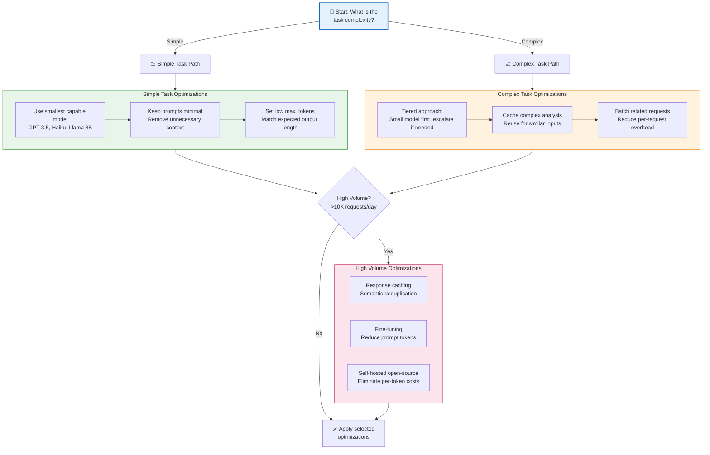

# LLM API Integration

## Summary

This chapter covers the technical aspects of integrating large language models into applications through APIs. Students will learn API fundamentals, authentication methods, and how to configure parameters like temperature and max tokens. The chapter also addresses practical concerns like rate limiting, cost optimization, and token counting for production deployments.

## Concepts Covered

This chapter covers the following 17 concepts from the learning graph:

1. API Fundamentals
2. REST API
3. SDK
4. OpenAI API
5. Anthropic API
6. API Endpoints
7. API Authentication
8. API Keys
9. Temperature Parameter
10. Top-P Parameter
11. Max Tokens Parameter
12. Stop Sequences
13. Streaming Responses
14. Rate Limiting
15. Cost Optimization
16. API Pricing
17. Token Counting

## Prerequisites

This chapter builds on concepts from:

- [Chapter 2: Large Language Model Architecture](../02-llm-architecture/index.md)
- [Chapter 3: AI Platform Landscape](../03-ai-platform-landscape/index.md)

## Learning Objectives

After completing this chapter, students will be able to:

- Implement OpenAI and Anthropic APIs for text generation
- Apply API parameters appropriately to control output characteristics
- Manage rate limiting and optimize costs for API usage
- Count tokens and estimate costs for AI applications
- Design API integration architectures for enterprise applications

---

## Introduction

While consumer interfaces like ChatGPT demonstrate generative AI capabilities, building production applications requires direct API integration. **Application Programming Interfaces (APIs)** provide programmatic access to LLM capabilities, enabling developers to embed AI into custom applications, automate workflows, and create novel user experiences.

This chapter provides the technical foundation for working with LLM APIs. We explore the mechanics of API communication, authentication practices, parameter configuration, and operational concerns including rate limiting and cost management. Whether building a customer service chatbot or a document analysis pipeline, mastering these concepts is essential for successful AI application development.

## API Fundamentals

### What Is an API?

An **Application Programming Interface (API)** is a contract between software systems that defines how they communicate. APIs specify request formats, response structures, and the operations available. For LLMs, APIs allow applications to send prompts and receive generated text programmatically.

Key API concepts:

| Concept | Description |
|---------|-------------|
| **Endpoint** | A specific URL where API requests are sent |
| **Request** | Data sent to the API (method, headers, body) |
| **Response** | Data returned from the API (status, headers, body) |
| **Authentication** | Verification of caller identity and permissions |
| **Rate limiting** | Constraints on request frequency |

### REST APIs

**REST (Representational State Transfer)** is the dominant architectural style for web APIs. LLM providers use REST APIs with HTTP methods to expose their models.

Common HTTP methods:

| Method | Purpose | LLM API Usage |
|--------|---------|---------------|
| POST | Create/submit data | Submit prompts for completion |
| GET | Retrieve data | List models, check status |
| DELETE | Remove data | Delete fine-tuned models |

A typical REST API request:

```http
POST /v1/chat/completions HTTP/1.1
Host: api.openai.com
Authorization: Bearer sk-your-api-key
Content-Type: application/json

{
  "model": "gpt-4",
  "messages": [
    {"role": "user", "content": "Explain REST APIs briefly."}
  ]
}
```

### Software Development Kits (SDKs)

**SDKs** are client libraries that simplify API interaction. Rather than manually constructing HTTP requests, developers use language-specific objects and methods.

SDK benefits:

- **Abstraction**: Hide HTTP complexity behind clean interfaces
- **Type safety**: Catch errors at compile time (in typed languages)
- **Convenience**: Built-in serialization, error handling, retries
- **Maintenance**: SDK updates as API evolves

SDK example (Python with OpenAI):

```python
from openai import OpenAI

client = OpenAI()  # Uses OPENAI_API_KEY environment variable

response = client.chat.completions.create(
    model="gpt-4",
    messages=[
        {"role": "user", "content": "Explain REST APIs briefly."}
    ]
)

print(response.choices[0].message.content)
```

## Major LLM APIs

### OpenAI API

The **OpenAI API** provides access to GPT models, DALL-E image generation, Whisper transcription, and embedding models.

Key endpoints:

| Endpoint | Purpose |
|----------|---------|
| `/v1/chat/completions` | Conversational text generation |
| `/v1/completions` | Legacy text completion (deprecated for most models) |
| `/v1/embeddings` | Generate vector embeddings |
| `/v1/images/generations` | Create images with DALL-E |
| `/v1/audio/transcriptions` | Transcribe audio with Whisper |
| `/v1/fine-tuning/jobs` | Manage fine-tuning |

Chat completions request structure:

```json
{
  "model": "gpt-4",
  "messages": [
    {"role": "system", "content": "You are a helpful assistant."},
    {"role": "user", "content": "What is machine learning?"}
  ],
  "temperature": 0.7,
  "max_tokens": 500
}
```

### Anthropic API

The **Anthropic API** provides access to Claude models with a focus on safety and extended context.

Key endpoint: `/v1/messages`

Anthropic request structure:

```json
{
  "model": "claude-3-sonnet-20240229",
  "max_tokens": 1024,
  "system": "You are a helpful assistant.",
  "messages": [
    {"role": "user", "content": "What is machine learning?"}
  ]
}
```

Key differences from OpenAI:

| Aspect | OpenAI | Anthropic |
|--------|--------|-----------|
| System prompt | In messages array | Separate `system` field |
| Model naming | `gpt-4`, `gpt-4-turbo` | `claude-3-sonnet-20240229` |
| Default context | Varies by model | 200K standard |
| Header auth | `Authorization: Bearer` | `x-api-key` |

## Authentication and Security

### API Keys

**API keys** are secret tokens that authenticate API requests. They identify the calling application and associate usage with a billing account.

API key best practices:

- **Never expose in client-side code**: Keys in JavaScript, mobile apps, or repositories can be stolen
- **Use environment variables**: Store keys outside code; reference via `process.env` or similar
- **Rotate periodically**: Generate new keys and deprecate old ones
- **Restrict permissions**: Use project-specific keys with minimal permissions
- **Monitor usage**: Set up alerts for unexpected consumption patterns

Environment variable usage:

```python
import os
from openai import OpenAI

# Key loaded from OPENAI_API_KEY environment variable
client = OpenAI()

# Or explicitly:
client = OpenAI(api_key=os.environ.get("OPENAI_API_KEY"))
```

!!! danger "Security Warning"
    Exposed API keys can result in significant financial liability and data exposure. Immediately rotate any key that may have been compromised. Use secret scanning tools to prevent accidental commits.

### Authentication Headers

LLM APIs use HTTP headers for authentication:

**OpenAI**:
```http
Authorization: Bearer sk-your-api-key
```

**Anthropic**:
```http
x-api-key: sk-ant-your-api-key
anthropic-version: 2023-06-01
```

## Generation Parameters

### Temperature

The **temperature** parameter controls the randomness of model outputs. It scales the probability distribution over tokens before sampling.

| Temperature | Effect | Use Cases |
|-------------|--------|-----------|
| 0.0 | Deterministic; highest probability token always selected | Factual Q&A, code generation, consistency-critical tasks |
| 0.3-0.5 | Low variation; mostly predictable with occasional diversity | Professional writing, summarization |
| 0.7-0.9 | Moderate creativity; balanced exploration | Creative writing, brainstorming |
| 1.0-1.5 | High creativity; unexpected, diverse outputs | Poetry, idea generation, experimental content |

The mathematical effect: temperature divides the logits (pre-softmax scores) before computing probabilities. Lower temperature sharpens the distribution (concentrating probability on top tokens); higher temperature flattens it (more uniform sampling).

### Top-P (Nucleus Sampling)

**Top-P** (nucleus sampling) offers an alternative to temperature for controlling diversity. Instead of scaling probabilities, top-p dynamically selects the smallest set of tokens whose cumulative probability exceeds the threshold.

| Top-P | Effect |
|-------|--------|
| 0.1 | Very focused; only top ~10% probability mass considered |
| 0.5 | Moderate; top 50% probability mass |
| 0.9 | Broad; most tokens considered except extreme tail |
| 1.0 | All tokens considered (equivalent to no nucleus sampling) |

!!! note "Temperature vs. Top-P"
    OpenAI recommends adjusting one or the other, not both simultaneously. Temperature is generally more intuitive; top-p provides finer control for specific applications.

### Max Tokens

The **max tokens** parameter limits the length of generated output. It specifies the maximum number of tokens the model will generate before stopping.

Considerations:

- Output may be shorter if the model generates a stop token naturally
- Setting too low truncates responses mid-thought
- Setting too high increases cost and latency unnecessarily
- Context window limits apply to input + output combined

Estimation guidelines:

| Content Type | Approximate Tokens |
|--------------|-------------------|
| Short answer | 50-100 |
| Paragraph | 100-250 |
| Email | 150-400 |
| Page of text | 500-700 |
| Long document | 1000+ |

### Stop Sequences

**Stop sequences** are strings that, when generated, cause the model to stop producing output. They enable structured generation and prevent runaway responses.

Example use cases:

```python
# Stop at end of first sentence
stop=["."]

# Stop at markdown headers or code blocks
stop=["##", "```"]

# Stop at JSON object close
stop=["}"]
```

Stop sequences are useful for:

- Extracting single items from potential lists
- Preventing model from adding unwanted commentary
- Enforcing output structure

## Streaming Responses

### Why Stream?

**Streaming responses** return tokens as they're generated rather than waiting for complete output. This dramatically improves perceived latency for users.

Without streaming:
```
User sends prompt → [Wait 3 seconds] → Entire response appears
```

With streaming:
```
User sends prompt → [100ms] → First token → [50ms] → Next token → ...
```

For a 500-token response, streaming delivers first content in ~100ms versus ~3000ms for non-streaming.

### Implementing Streaming

OpenAI streaming example:

```python
from openai import OpenAI

client = OpenAI()

stream = client.chat.completions.create(
    model="gpt-4",
    messages=[{"role": "user", "content": "Write a haiku about APIs."}],
    stream=True
)

for chunk in stream:
    if chunk.choices[0].delta.content is not None:
        print(chunk.choices[0].delta.content, end="", flush=True)
```

Server-Sent Events (SSE) format:

```
data: {"id":"chatcmpl-xxx","choices":[{"delta":{"content":"APIs"}}]}

data: {"id":"chatcmpl-xxx","choices":[{"delta":{"content":" connect"}}]}

data: {"id":"chatcmpl-xxx","choices":[{"delta":{"content":" us"}}]}

data: [DONE]
```

## Rate Limiting

### Understanding Rate Limits

**Rate limiting** restricts how frequently and how much you can use an API within time windows. LLM APIs enforce multiple limits:

| Limit Type | Description |
|------------|-------------|
| Requests per minute (RPM) | Maximum API calls per minute |
| Tokens per minute (TPM) | Maximum tokens processed per minute |
| Tokens per day (TPD) | Maximum tokens processed per day |
| Concurrent requests | Maximum simultaneous requests |

Rate limits vary by:

- Subscription tier (free, pay-as-you-go, enterprise)
- Account history and usage patterns
- Specific model (GPT-4 often has lower limits than GPT-3.5)

### Handling Rate Limits

When limits are exceeded, APIs return HTTP 429 (Too Many Requests) errors.

Mitigation strategies:

**Exponential backoff with jitter**:

```python
import time
import random

def call_with_retry(func, max_retries=5):
    for attempt in range(max_retries):
        try:
            return func()
        except RateLimitError:
            wait = (2 ** attempt) + random.random()
            time.sleep(wait)
    raise Exception("Max retries exceeded")
```

**Request batching**: Combine multiple small requests into fewer larger ones

**Request queuing**: Buffer requests and process at sustainable rate

**Load distribution**: Spread requests across multiple API keys or accounts (where permitted)

## Token Counting and Cost Optimization

### Counting Tokens

Understanding token counts is essential for cost estimation and context management.

OpenAI's `tiktoken` library:

```python
import tiktoken

encoding = tiktoken.encoding_for_model("gpt-4")
text = "How many tokens is this sentence?"
tokens = encoding.encode(text)
print(f"Token count: {len(tokens)}")  # Output: 7
```

Token counting considerations:

- Different models use different tokenizers
- Special tokens (system instructions, formatting) add overhead
- Non-English text often requires more tokens per word
- Code typically requires more tokens than prose

### API Pricing

LLM APIs charge per token, typically quoted per million tokens:

| Model | Input Price | Output Price |
|-------|-------------|--------------|
| GPT-4 | $30/1M tokens | $60/1M tokens |
| GPT-4 Turbo | $10/1M tokens | $30/1M tokens |
| GPT-4o | $5/1M tokens | $15/1M tokens |
| GPT-3.5 Turbo | $0.50/1M tokens | $1.50/1M tokens |
| Claude 3 Opus | $15/1M tokens | $75/1M tokens |
| Claude 3 Sonnet | $3/1M tokens | $15/1M tokens |
| Claude 3 Haiku | $0.25/1M tokens | $1.25/1M tokens |

*Prices as of early 2024; check current pricing*

Cost calculation:

$$\text{Cost} = \frac{\text{Input Tokens} \times \text{Input Price}}{1,000,000} + \frac{\text{Output Tokens} \times \text{Output Price}}{1,000,000}$$

### Cost Optimization Strategies

| Strategy | Implementation | Potential Savings |
|----------|----------------|-------------------|
| Model selection | Use smaller models for simple tasks | 50-90% |
| Prompt optimization | Shorter prompts, fewer examples | 10-30% |
| Caching | Cache responses for repeated queries | 30-80% |
| Batching | Process multiple items per API call | 10-20% |
| Output limits | Set appropriate max_tokens | 10-40% |
| Context management | Summarize rather than include full history | 20-50% |

#### Diagram: Cost Optimization Decision Tree

The following decision tree guides LLM API cost optimization decisions based on task complexity and usage volume.



**Cost Optimization Quick Reference:**

| Optimization | Savings Potential | Implementation Effort | Best For |
|--------------|-------------------|----------------------|----------|
| **Smaller model** | 50-90% | Low | Simple tasks currently using large models |
| **Prompt reduction** | 20-40% | Low | Verbose system prompts |
| **Output limits** | 10-40% | Low | Tasks generating more tokens than needed |
| **Response caching** | 30-70% | Medium | Repeated similar queries |
| **Tiered models** | 40-60% | Medium | Mix of simple and complex tasks |
| **Fine-tuning** | 50-80% | High | High-volume, specialized tasks |
| **Self-hosted** | 70-95% | High | Very high volume, privacy requirements |

**Monthly Cost Estimation Formula:**

```
Monthly Cost = (Requests/day × 30) × (Avg Input Tokens × Input Price + Avg Output Tokens × Output Price)
```

!!! example "Example Calculation"
    - 10,000 requests/day × 30 = 300,000 requests/month
    - 500 input tokens @ $0.003/1K = $0.0015/request
    - 200 output tokens @ $0.006/1K = $0.0012/request
    - Monthly cost: 300,000 × ($0.0015 + $0.0012) = **$810/month**

    Switching to a 10× cheaper model for 80% of requests: **$243/month** (70% savings)

## Production Architecture

### Integration Patterns

**Synchronous request-response**:
- Client waits for API response
- Simplest pattern
- Suitable for interactive applications with short responses

**Asynchronous processing**:
- Submit request, poll for result
- Suitable for long-running tasks
- Enables better resource utilization

**Queue-based architecture**:
- Requests queued; workers process at controlled rate
- Smooths traffic spikes
- Enables priority management

### Error Handling

LLM APIs can fail for various reasons:

| Error Type | HTTP Status | Handling Strategy |
|------------|-------------|-------------------|
| Rate limit | 429 | Exponential backoff, queue requests |
| Server error | 500, 503 | Retry with backoff |
| Invalid request | 400 | Log, fix prompt/parameters |
| Authentication | 401, 403 | Check key validity, permissions |
| Context exceeded | 400 | Truncate input, use larger context model |
| Content filter | 400 | Review content, adjust approach |

Robust error handling:

```python
from openai import OpenAI, RateLimitError, APIError

client = OpenAI()

try:
    response = client.chat.completions.create(
        model="gpt-4",
        messages=[{"role": "user", "content": prompt}]
    )
except RateLimitError:
    # Handle rate limiting with backoff
    pass
except APIError as e:
    # Handle other API errors
    pass
```

## Key Takeaways

- **REST APIs** provide the interface for programmatic LLM access; **SDKs** simplify integration with language-specific libraries
- **API keys** authenticate requests; protect them carefully and never expose in client-side code
- **Temperature** controls output randomness (0 = deterministic, 1+ = creative); **top-p** offers alternative diversity control
- **Max tokens** limits output length and affects cost; set appropriately for each use case
- **Streaming** delivers tokens progressively, dramatically improving perceived latency for interactive applications
- **Rate limits** constrain usage by requests, tokens, and time; implement exponential backoff and queuing
- **Token counting** is essential for cost estimation and context management; use provider tokenization libraries
- **Cost optimization** strategies include model selection, prompt optimization, caching, and batching

---

## Review Questions

??? question "Why should API keys never be included in client-side code or version control?"
    Client-side code (JavaScript in browsers, mobile apps) is accessible to end users who can extract embedded keys. Version control systems retain history, so even deleted keys remain accessible in repository history. Exposed keys enable unauthorized usage billed to your account, potential data access if keys have broad permissions, and no way to trace who made specific requests. Best practices: use environment variables, backend proxies, and rotate keys periodically.

??? question "How do temperature and top-p parameters affect model output differently?"
    **Temperature** scales the probability distribution by dividing logits before softmax. Low temperature (0-0.3) makes the distribution sharper, concentrating probability on top tokens; high temperature (>1.0) flattens it, making unlikely tokens more probable. **Top-p** (nucleus sampling) dynamically selects the smallest token set exceeding the probability threshold, then samples uniformly within that set. Temperature affects how probabilities are distributed; top-p affects which tokens are even considered. For most applications, adjust one or the other, not both.

??? question "What strategies would you recommend to reduce LLM API costs by 50% without significantly impacting quality?"
    A 50% cost reduction strategy: (1) **Model tiering**—use smaller models (GPT-3.5, Haiku) for simple tasks, reserving larger models for complex queries, (2) **Response caching**—cache identical or similar queries (can reduce costs 30-80% depending on query repetition), (3) **Prompt optimization**—remove redundant instructions, use concise examples (10-30% savings), (4) **Output limits**—set appropriate max_tokens rather than defaults (prevents overly long responses), (5) **Batch processing**—combine related requests where possible. Combination of these approaches can achieve 50%+ reduction while maintaining quality for priority use cases.

