# Multimodal AI

## Summary

This chapter explores AI capabilities beyond text, including image generation, vision analysis, audio processing, and emerging video technologies. Students will learn about diffusion models, text-to-image platforms like DALL-E and Midjourney, and how to leverage multimodal capabilities for business applications. Understanding these technologies prepares students for the next wave of AI innovation.

## Concepts Covered

This chapter covers the following 17 concepts from the learning graph:

1. Multimodal AI
2. Text-to-Image
3. DALL-E
4. Midjourney
5. Stable Diffusion
6. Diffusion Models
7. Image Generation
8. Image Analysis
9. Vision Capabilities
10. GPT-4 Vision
11. Text-to-Video
12. Sora
13. Audio AI
14. Speech-to-Text
15. Text-to-Speech
16. Voice Cloning
17. Multimodal Applications

## Prerequisites

This chapter builds on concepts from:

- [Chapter 1: Digital Transformation and AI Foundations](../01-digital-transformation-ai-foundations/index.md)
- [Chapter 3: AI Platform Landscape](../03-ai-platform-landscape/index.md)

## Learning Objectives

After completing this chapter, students will be able to:

- Use text-to-image tools to generate visual content for business needs
- Explain how diffusion models work for image generation
- Apply vision capabilities and image analysis in applications
- Evaluate text-to-video and audio AI technologies
- Design multimodal content strategies for business applications

---

## Introduction

The AI revolution extends far beyond text. **Multimodal AI** systems process, understand, and generate content across multiple modalities—text, images, audio, video, and more. These capabilities transform how organizations create content, analyze visual information, and build user experiences.

This chapter surveys the multimodal AI landscape: image generation systems that create visuals from text descriptions, vision models that understand and analyze images, audio AI for speech processing, and emerging video generation capabilities. For business professionals, understanding these technologies opens new possibilities for marketing, product design, customer experience, and operational efficiency.

## Understanding Multimodal AI

### What Is Multimodal AI?

**Multimodal AI** refers to artificial intelligence systems that can process and generate content in multiple formats—text, images, audio, video—and often understand relationships between modalities.

Multimodal capabilities include:

| Modality Pair | Direction | Examples |
|---------------|-----------|----------|
| Text → Image | Generation | DALL-E, Midjourney, Stable Diffusion |
| Image → Text | Understanding | GPT-4 Vision, Claude Vision |
| Text → Audio | Generation | ElevenLabs, Amazon Polly |
| Audio → Text | Understanding | Whisper, Google Speech-to-Text |
| Text → Video | Generation | Sora, Runway, Pika |
| Image+Text → Text | Understanding | Visual question answering |

### The Evolution Toward Multimodality

Early AI systems were unimodal—specialized for one data type. The progression toward multimodality reflects both technical advances and recognition that human understanding is inherently multimodal.

Key developments:

- **2021**: CLIP connects images and text in shared embedding space
- **2022**: DALL-E 2 and Stable Diffusion demonstrate high-quality text-to-image
- **2023**: GPT-4V adds vision understanding to language models
- **2024**: Video generation models (Sora) achieve photorealistic output
- **2025**: Fully integrated multimodal models become standard

## Image Generation

### Diffusion Models Explained

**Diffusion models** are the architecture powering modern image generation. They work by learning to reverse a gradual noising process.

The training process:

1. Start with a training image
2. Progressively add random noise over many steps
3. Train the model to predict and remove noise at each step
4. Eventually, the model learns to denoise pure noise into coherent images

Generation process:

1. Start with pure random noise
2. Apply the denoising model iteratively
3. At each step, the model removes noise while incorporating the text prompt
4. After many steps, a coherent image emerges

The mathematical intuition: diffusion models learn the probability distribution of images. Text conditioning biases this distribution toward images matching the description.

#### Diagram: Diffusion Model Process

The following diagram illustrates how diffusion models generate images through iterative denoising, showing both the training process (forward diffusion) and the generation process (reverse diffusion).

```mermaid
flowchart LR
    subgraph Training["🎓 Training: Forward Diffusion"]
        direction LR
        T1["🖼️ Original<br/>Image"]
        T2["🌫️ Slightly<br/>Noisy"]
        T3["🌫️🌫️ More<br/>Noisy"]
        T4["📺 Pure<br/>Noise"]
        T1 -->|"+noise"| T2 -->|"+noise"| T3 -->|"+noise"| T4
    end

    subgraph Generation["🎨 Generation: Reverse Diffusion"]
        direction LR
        G1["📺 Random<br/>Noise"]
        G2["🌫️🌫️ Emerging<br/>Structure"]
        G3["🌫️ Clearer<br/>Details"]
        G4["🖼️ Final<br/>Image"]
        G1 -->|"-noise"| G2 -->|"-noise"| G3 -->|"-noise"| G4
    end

    PROMPT["📝 Text Prompt<br/>'A sunset over mountains'"]
    PROMPT -.->|"Guides each<br/>denoising step"| G1
    PROMPT -.-> G2
    PROMPT -.-> G3

    MODEL["🧠 Neural Network<br/>Learns to predict noise"]
    T4 -.->|"Training"| MODEL
    MODEL -.->|"Inference"| G1

    style Training fill:#FFEBEE,stroke:#C62828,stroke-width:2px
    style Generation fill:#E8F5E9,stroke:#2E7D32,stroke-width:2px
    style PROMPT fill:#E3F2FD,stroke:#1565C0
    style MODEL fill:#FFF3E0,stroke:#EF6C00
```



| Process | Direction | Purpose | Key Action |
|---------|-----------|---------|------------|
| **Forward Diffusion** | Image → Noise | Training | Gradually add Gaussian noise over ~1000 steps |
| **Reverse Diffusion** | Noise → Image | Generation | Iteratively predict and remove noise (~50-100 steps) |
| **Text Conditioning** | Prompt → Image | Guidance | Bias each denoising step toward matching the description |

!!! note "Why Diffusion Works"
    The model learns the statistical patterns of noise at each degradation level. During generation, it uses this knowledge to reverse the process—starting from pure noise and gradually revealing an image that matches the conditioning prompt. Each denoising step makes small, incremental improvements guided by the text description.

### DALL-E

**DALL-E** is OpenAI's text-to-image model, now in its third iteration (DALL-E 3). It generates images from natural language descriptions with remarkable understanding of concepts, styles, and composition.

DALL-E 3 capabilities:

- High-fidelity image generation
- Understanding of complex prompts
- Multiple artistic styles
- Text rendering within images
- Safety filters to prevent harmful content
- Integrated with ChatGPT for conversational image creation

Effective DALL-E prompting:

| Element | Purpose | Example |
|---------|---------|---------|
| Subject | What to depict | "A golden retriever puppy" |
| Action | What's happening | "playing in autumn leaves" |
| Setting | Environment/context | "in a suburban backyard" |
| Style | Artistic approach | "in the style of a children's book illustration" |
| Mood | Emotional tone | "warm and joyful atmosphere" |
| Technical | Camera/rendering | "soft natural lighting, shallow depth of field" |

### Midjourney

**Midjourney** is an independent research lab producing AI-generated images with distinctive artistic quality. Accessed primarily through Discord, Midjourney excels at creating stylized, aesthetically striking images.

Midjourney characteristics:

- Strong artistic and stylistic outputs
- Active community with shared prompts
- Distinctive "Midjourney look" (can be both strength and limitation)
- Versioned models with different capabilities
- Commercial licensing for generated images

Midjourney prompt parameters:

```
/imagine prompt: a cyberpunk marketplace at night, neon signs, rain-slicked streets
--ar 16:9 --style raw --v 6 --q 2
```

| Parameter | Function |
|-----------|----------|
| `--ar` | Aspect ratio (16:9, 4:3, 1:1, etc.) |
| `--style` | Aesthetic approach (raw, stylize) |
| `--v` | Model version |
| `--q` | Quality/detail level |
| `--no` | Negative prompt (elements to exclude) |

### Stable Diffusion

**Stable Diffusion** is an open-source image generation model that can be run locally or customized extensively.

Advantages of open-source:

- **Local execution**: Run on personal hardware (with capable GPU)
- **Customization**: Fine-tune on specific styles or subjects
- **No usage limits**: Generate unlimited images after setup
- **Privacy**: Images never sent to external servers
- **Extensions**: Community-developed plugins and modifications

Business considerations:

| Platform | Best For |
|----------|----------|
| DALL-E 3 | Quick generation, ChatGPT integration, safety-critical |
| Midjourney | Artistic/stylized content, creative exploration |
| Stable Diffusion | High volume, customization, privacy requirements, cost control |

## Image Understanding and Vision AI

### Vision Capabilities

Modern LLMs with **vision capabilities** can analyze images, answer questions about visual content, and integrate visual understanding with language processing.

Vision model capabilities:

- **Object identification**: What objects are present in an image
- **Scene understanding**: Comprehending the overall context
- **Text extraction (OCR)**: Reading text within images
- **Chart/graph interpretation**: Understanding data visualizations
- **Spatial reasoning**: Understanding relationships between objects
- **Visual question answering**: Responding to questions about images

### GPT-4 Vision

**GPT-4 Vision (GPT-4V)** and subsequent models integrate vision understanding with language capabilities, enabling conversations about images.

Use cases:

| Domain | Application |
|--------|-------------|
| Customer service | Analyze customer-submitted photos of product issues |
| Healthcare | Medical image analysis assistance (with appropriate oversight) |
| Retail | Product recognition, inventory verification |
| Real estate | Property photo analysis and description |
| Accessibility | Image description for visually impaired users |
| Quality control | Defect detection in manufacturing |

GPT-4V API usage:

```python
response = client.chat.completions.create(
    model="gpt-4-vision-preview",
    messages=[
        {
            "role": "user",
            "content": [
                {"type": "text", "text": "What issues do you see in this product image?"},
                {"type": "image_url", "image_url": {"url": image_url}}
            ]
        }
    ]
)
```

### Image Analysis Applications

Practical applications of vision AI:

**Document processing**:
- Extract data from invoices, receipts, forms
- Digitize handwritten notes
- Analyze contracts and agreements

**Visual search**:
- Find products by image
- Identify parts or components
- Match similar items in inventory

**Content moderation**:
- Detect inappropriate content
- Verify brand compliance
- Monitor user-generated images

## Audio AI

### Speech-to-Text

**Speech-to-text (STT)** converts spoken language into written text. Modern STT systems achieve near-human accuracy across multiple languages.

Leading STT solutions:

| Solution | Strengths |
|----------|-----------|
| OpenAI Whisper | High accuracy, multilingual, open-source |
| Google Speech-to-Text | Real-time streaming, extensive language support |
| Amazon Transcribe | AWS integration, specialized vocabularies |
| Azure Speech | Enterprise features, custom models |
| AssemblyAI | Developer-friendly, transcript analysis features |

Whisper usage example:

```python
from openai import OpenAI

client = OpenAI()

audio_file = open("meeting.mp3", "rb")
transcript = client.audio.transcriptions.create(
    model="whisper-1",
    file=audio_file
)
print(transcript.text)
```

### Text-to-Speech

**Text-to-speech (TTS)** generates spoken audio from text. Modern TTS produces remarkably natural speech with appropriate prosody and emotion.

TTS capabilities:

- **Multiple voices**: Different speakers, genders, ages
- **Language support**: Generate speech in various languages
- **Emotion control**: Adjust speaking style (happy, serious, urgent)
- **SSML support**: Fine control over pronunciation, pauses, emphasis
- **Real-time**: Low-latency generation for interactive applications

Leading TTS platforms:

| Platform | Notable Features |
|----------|------------------|
| ElevenLabs | Ultra-realistic voices, voice cloning |
| Amazon Polly | Many languages, SSML, neural voices |
| Google Cloud TTS | WaveNet voices, custom voice creation |
| Azure Speech | Neural TTS, custom neural voice |
| OpenAI TTS | Natural voices, simple API |

### Voice Cloning

**Voice cloning** creates synthetic speech that mimics a specific person's voice. This technology enables personalized audio content but raises significant ethical considerations.

Legitimate applications:

- Content creators scaling audio production
- Accessibility tools for those who've lost speech capability
- Dubbing/localization preserving original voice characteristics
- Virtual assistants with branded voices
- Audiobook narration at scale

!!! warning "Ethical and Legal Considerations"
    Voice cloning without consent is generally illegal and unethical. Many jurisdictions have laws against impersonation. Reputable platforms require consent verification and maintain audit trails.

## Video Generation

### Text-to-Video Technology

**Text-to-video** generates video content from text descriptions. This emerging technology represents a major frontier in generative AI.

The technical challenge: Video generation requires temporal consistency—objects must maintain identity across frames, motion must be coherent, and lighting must be consistent over time.

### Sora and Video Generation Models

**Sora**, OpenAI's text-to-video model announced in 2024, demonstrated unprecedented quality in video generation.

Sora capabilities:

- Generate videos up to a minute long
- High visual fidelity and temporal consistency
- Complex scenes with multiple subjects
- Understanding of physics and motion
- Text-to-video and image-to-video

Other video generation platforms:

| Platform | Focus |
|----------|-------|
| Runway | Professional creative tools, Gen-2 model |
| Pika | Short clips, stylized content |
| Stable Video Diffusion | Open-source video generation |
| Synthesia | AI avatar videos for business |
| HeyGen | AI spokesperson videos |

### Business Applications of Video AI

Video AI applications:

- **Marketing**: Personalized video ads at scale
- **Training**: Custom training videos without production costs
- **Product demos**: Dynamic product visualization
- **Social media**: Content creation acceleration
- **Localization**: Video translation with lip sync

## Multimodal Applications in Business

### Content Creation at Scale

Multimodal AI enables unprecedented content creation efficiency:

| Content Type | Traditional Process | AI-Augmented |
|--------------|---------------------|--------------|
| Blog post with images | Writer + designer + stock photos | Writer prompts AI for custom images |
| Product description | Photographer + copywriter | Vision AI describes products automatically |
| Video tutorial | Scripting, recording, editing | AI generates from outline |
| Audio content | Recording studio, voice talent | TTS from scripts |

### Accessibility Enhancement

Multimodal AI improves accessibility:

- **Image descriptions**: Auto-generate alt text for visually impaired users
- **Captions**: Automatic subtitles for deaf/hard-of-hearing audiences
- **Audio versions**: TTS creates audio from written content
- **Translation**: Multi-language content from single source

### Customer Experience Applications

Multimodal capabilities enhance customer interactions:

- **Visual customer service**: Customers share images; AI diagnoses issues
- **Voice interfaces**: Natural spoken interaction with AI systems
- **Visual search**: Find products by uploading images
- **Personalized content**: Dynamic image/video creation for individuals

## Key Takeaways

- **Multimodal AI** processes and generates content across text, images, audio, and video modalities
- **Diffusion models** power modern image generation by learning to reverse a noise-addition process
- **DALL-E, Midjourney, and Stable Diffusion** offer different trade-offs for text-to-image generation (integration, style, customization)
- **Vision models** like GPT-4V enable image understanding and analysis in business applications
- **Speech-to-text** (Whisper) and **text-to-speech** (ElevenLabs) provide high-quality audio capabilities
- **Voice cloning** enables personalized audio but requires ethical consideration
- **Text-to-video** (Sora, Runway) represents the emerging frontier of generative AI
- **Business applications** span content creation, accessibility, and customer experience

---

## Review Questions

??? question "Explain how diffusion models generate images from text prompts."
    Diffusion models learn to reverse a gradual noising process. During training, images are progressively corrupted with noise over many steps; the model learns to predict and remove this noise at each step. For generation, the process starts with pure random noise, and the model iteratively denoises it into a coherent image. Text conditioning works by biasing the denoising process toward images that match the text description—at each step, the model removes noise in a direction consistent with the prompt. This iterative refinement over 50-100 steps produces high-quality images matching the description.

??? question "Compare the trade-offs between DALL-E 3, Midjourney, and Stable Diffusion for enterprise use."
    **DALL-E 3**: Best for seamless ChatGPT integration, safety-critical applications, quick generation without technical setup. Trade-offs: usage costs, less stylistic control, dependent on OpenAI infrastructure. **Midjourney**: Best for artistic/stylized content where aesthetic quality matters. Trade-offs: Discord-based workflow, distinctive style that may not match all needs, subscription model. **Stable Diffusion**: Best for high volume, privacy-sensitive applications, heavy customization, cost control. Trade-offs: requires technical setup, GPU hardware, model management; less out-of-box quality than commercial options.

??? question "What business applications does vision AI enable that weren't practical before?"
    Vision AI enables: (1) **Automated document processing**—extract data from invoices, receipts, forms without manual entry, (2) **Visual customer service**—customers share photos; AI diagnoses product issues, (3) **Automated accessibility**—generate image descriptions for all visual content, (4) **Visual quality control**—detect manufacturing defects at scale, (5) **Content moderation**—automatically flag inappropriate images, (6) **Visual search**—customers find products by uploading images rather than keywords. These applications were impractical before because they required human judgment at each instance; vision AI scales this analysis.

