# Future of Work and Workforce Transformation

## Summary

This chapter examines how AI is fundamentally reshaping work, jobs, and organizational structures. Students will explore workforce augmentation strategies, skill transformation requirements, and the evolving dynamics of human-AI collaboration. Understanding these trends is essential for leaders preparing their organizations for an AI-augmented future.

## Concepts Covered

This chapter covers the following 13 concepts from the learning graph:

1. Future of Work
2. AI-Augmented Workforce
3. Skill Transformation
4. Reskilling
5. Upskilling
6. Role Evolution
7. Job Displacement
8. Job Creation
9. Human-AI Collaboration
10. Augmented Intelligence
11. Productivity Enhancement
12. Creativity Enhancement
13. Organizational Change

## Prerequisites

This chapter builds on concepts from:

- [Chapter 1: Digital Transformation and AI Foundations](../01-digital-transformation-ai-foundations/index.md)
- [Chapter 8: AI Governance, Ethics, and Responsible AI](../08-governance-ethics-responsible-ai/index.md)

## Learning Objectives

After completing this chapter, students will be able to:

- Analyze workforce transformation strategies across industries
- Design reskilling and upskilling programs for AI adoption
- Evaluate the impact of AI on jobs and role evolution
- Create AI-augmented workflows that enhance human productivity
- Develop change management plans for organizational transformation

---

## Introduction

The integration of generative AI into the workplace represents one of the most significant labor market transformations since the industrial revolution. Unlike previous technological shifts that primarily affected manual labor, AI capabilities now extend into knowledge work—writing, analysis, coding, design, and decision-making. This reality demands that organizations fundamentally rethink how work is structured, how skills are developed, and how humans and AI systems collaborate.

**The Future of Work** encompasses the evolving landscape of employment, work structures, and workplace dynamics driven by technological advancement, changing workforce demographics, and shifting societal expectations. For business and technology leaders, understanding these changes is not optional—it is essential for organizational survival and competitive advantage.

This chapter explores the multidimensional aspects of workforce transformation: how AI augments rather than simply replaces human workers, the critical importance of skill development, the complex dynamics of job displacement and creation, and the organizational changes required to thrive in an AI-enabled environment.

## The AI-Augmented Workforce

### Defining Workforce Augmentation

An **AI-Augmented Workforce** consists of human workers whose capabilities are enhanced through AI tools and systems, enabling higher productivity, better decision-making, and new forms of value creation. This paradigm differs fundamentally from automation, which seeks to replace human labor.

| Approach | Focus | Human Role | AI Role | Outcome |
|----------|-------|------------|---------|---------|
| **Automation** | Task elimination | Supervise, exception handling | Perform entire tasks | Cost reduction |
| **Augmentation** | Capability enhancement | Decision-making, creativity, judgment | Assist, recommend, accelerate | Value creation |
| **Collaboration** | Joint problem-solving | Strategic direction, context | Pattern recognition, synthesis | Innovation |

The augmentation paradigm recognizes that AI systems and humans possess complementary capabilities. AI excels at processing vast amounts of data, recognizing patterns, generating variations, and maintaining consistency. Humans excel at contextual understanding, ethical judgment, creative vision, and interpersonal connection.

### Augmentation Across Job Functions

Different job functions benefit from AI augmentation in different ways:

**Knowledge Work Augmentation:**

- Research analysts use AI to synthesize literature reviews in hours rather than weeks
- Financial analysts employ AI to identify patterns across thousands of data points
- Legal professionals leverage AI for contract analysis and case research
- Marketing teams use AI to generate and test content variations

**Creative Work Augmentation:**

- Designers use AI to generate initial concepts and explore variations
- Writers employ AI as a collaborative drafting partner
- Musicians use AI to experiment with arrangements and compositions
- Architects leverage AI for generative design exploration

**Customer-Facing Work Augmentation:**

- Sales professionals use AI for lead scoring and personalized outreach
- Customer service representatives employ AI for real-time knowledge access
- Healthcare providers leverage AI for diagnostic support
- Educators use AI for personalized learning recommendations

#### Diagram: AI Augmentation Spectrum

The following diagram illustrates the spectrum of human-AI work arrangements, from tasks where humans maintain full control with AI support to fully automated processes with human oversight.

```mermaid
flowchart LR
    subgraph Spectrum["Human-AI Collaboration Spectrum"]
        direction LR
        Z1["🧑 Human-Led<br/>0-20% AI"]
        Z2["🧑‍💼 Human-Directed<br/>20-40% AI"]
        Z3["🤝 Collaborative<br/>40-60% AI"]
        Z4["🤖 AI-Directed<br/>60-80% AI"]
        Z5["⚙️ AI-Led<br/>80-100% AI"]
        Z1 --> Z2 --> Z3 --> Z4 --> Z5
    end

    E1["Strategic Planning<br/>Executive Decisions"]
    E2["Creative Direction<br/>Complex Analysis"]
    E3["Content Creation<br/>Code Development"]
    E4["Data Processing<br/>Routine Comms"]
    E5["Fraud Detection<br/>Quality Monitoring"]

    E1 -.-> Z1
    E2 -.-> Z2
    E3 -.-> Z3
    E4 -.-> Z4
    E5 -.-> Z5

    style Z1 fill:#1565C0,stroke:#0D47A1,color:#fff
    style Z2 fill:#42A5F5,stroke:#1976D2,color:#fff
    style Z3 fill:#66BB6A,stroke:#388E3C,color:#fff
    style Z4 fill:#FFCA28,stroke:#F9A825
    style Z5 fill:#FF7043,stroke:#E64A19,color:#fff

    style E1 fill:#E3F2FD,stroke:#1565C0
    style E2 fill:#BBDEFB,stroke:#1976D2
    style E3 fill:#C8E6C9,stroke:#388E3C
    style E4 fill:#FFF8E1,stroke:#F9A825
    style E5 fill:#FFCCBC,stroke:#E64A19
```



| Zone | AI Contribution | Human Role | Example Tasks |
|------|-----------------|------------|---------------|
| **Human-Led** | 0-20% | Primary decision-maker, AI provides information | Strategic planning, executive decisions |
| **Human-Directed** | 20-40% | Leads work, AI assists significantly | Creative direction, complex analysis |
| **Collaborative** | 40-60% | True partnership, shared responsibility | Content creation, software development |
| **AI-Directed** | 60-80% | Reviews and refines AI output | Data processing, routine communications |
| **AI-Led** | 80-100% | Supervises exceptions, handles edge cases | Fraud detection, quality monitoring |

!!! info "Trend Direction"
    Most knowledge work is shifting toward the collaborative zone (40-60% AI contribution). Workers who master human-AI collaboration will be most valuable, combining uniquely human judgment with AI capabilities for speed and scale.

### Augmented Intelligence

**Augmented Intelligence** represents a human-centered partnership model where AI systems enhance human cognition rather than attempting to replicate it. This framing emphasizes that the goal is not artificial general intelligence that replaces human thinking, but rather systems that make human experts more effective.

Key principles of augmented intelligence:

- **Human agency**: Humans retain decision-making authority
- **Transparency**: AI reasoning is explainable and auditable
- **Complementarity**: AI handles what humans struggle with; humans handle what AI cannot
- **Continuous learning**: Both human and AI capabilities improve through collaboration

!!! example "Augmented Intelligence in Medical Diagnosis"
    A radiologist reviewing medical images exemplifies augmented intelligence. AI systems analyze scans and highlight areas of concern, but the radiologist applies clinical judgment, patient history, and contextual factors to make the diagnosis. The AI makes the radiologist more effective—catching subtle patterns that might be missed during a busy day—while the radiologist provides the holistic understanding that AI lacks.

## Skill Transformation in the AI Era

### The Skill Transformation Imperative

**Skill Transformation** refers to the comprehensive change in the skills that workers need to remain effective and employable as AI reshapes job requirements. This transformation is not merely about learning to use AI tools—it involves fundamental shifts in how value is created and what capabilities matter.

The half-life of skills—the time for a skill to become half as valuable—has shortened dramatically:

| Era | Typical Skill Half-Life | Implication |
|-----|------------------------|-------------|
| Industrial (pre-1970) | 20-30 years | One career, one skill set |
| Information (1970-2010) | 10-15 years | Mid-career retraining |
| Digital (2010-2022) | 5-7 years | Continuous learning |
| AI (2023+) | 2-4 years | Learning as core job function |

### Reskilling vs. Upskilling

Organizations must invest in both **reskilling** and **upskilling** their workforce:

**Reskilling** involves training workers for entirely different roles when their current roles are significantly impacted by AI:

- Customer service representatives reskilling as customer success managers
- Data entry clerks reskilling as data quality analysts
- Bookkeepers reskilling as financial analysts
- Assembly workers reskilling as robot maintenance technicians

**Upskilling** involves enhancing workers' current capabilities to work effectively with AI:

- Accountants upskilling to leverage AI for analytical insights
- Writers upskilling to direct and edit AI-generated content
- Software developers upskilling to use AI coding assistants
- Project managers upskilling to manage human-AI hybrid teams

| Dimension | Reskilling | Upskilling |
|-----------|-----------|------------|
| **Scope** | New role, new function | Same role, enhanced capabilities |
| **Duration** | 6-24 months | 1-6 months |
| **Investment** | High (full training program) | Moderate (targeted learning) |
| **Risk** | Higher (new domain) | Lower (existing expertise) |
| **When needed** | Role becoming obsolete | Role evolving with AI |

### The New Skill Landscape

The skills that differentiate human workers in an AI-enabled environment cluster into several categories:

**Uniquely Human Skills:**

- Emotional intelligence and empathy
- Ethical judgment and values-based decision making
- Creative vision and aesthetic sensibility
- Complex stakeholder management
- Physical presence and embodied interaction

**Human-AI Collaboration Skills:**

- Prompt engineering and AI direction
- AI output evaluation and refinement
- Understanding AI capabilities and limitations
- Human-AI workflow design
- AI-assisted decision making

**Meta-Learning Skills:**

- Learning agility and adaptability
- Knowledge synthesis across domains
- Critical evaluation of information sources
- Self-directed learning design
- Comfort with ambiguity and change

#### Diagram: T-Shaped Skills Model for AI Era

The following diagram illustrates the ideal skill profile for AI-era professionals, combining deep domain expertise (vertical) with broad cross-cutting skills (horizontal).

```mermaid
flowchart TB
    subgraph Breadth["🔄 Horizontal Bar: Cross-Cutting Skills"]
        direction LR
        B1["🤖 AI Tool<br/>Proficiency"]
        B2["📊 Data<br/>Literacy"]
        B3["💬 Prompt<br/>Engineering"]
        B4["⭐ Integration<br/>Point"]
        B5["🤝 Collaboration<br/>Skills"]
        B6["📣 Cross-Functional<br/>Communication"]
        B7["🎨 Design<br/>Thinking"]
        B1 --- B2 --- B3 --- B4 --- B5 --- B6 --- B7
    end

    subgraph Depth["📐 Vertical Bar: Domain Expertise"]
        direction TB
        D1["🏆 Professional<br/>Credentials"]
        D2["🔧 Technical Skills<br/>in Domain"]
        D3["📚 Industry<br/>Knowledge"]
        D4["💡 Tacit Knowledge<br/>& Experience"]
        D5["🎯 Deep Specialist<br/>Expertise"]
        D1 --> D2 --> D3 --> D4 --> D5
    end

    B4 --> D1

    style Breadth fill:#E8F5E9,stroke:#388E3C,stroke-width:2px
    style Depth fill:#E3F2FD,stroke:#1565C0,stroke-width:2px
    style B4 fill:#E1BEE7,stroke:#7B1FA2,stroke-width:3px
```



| Dimension | Skills | Why It Matters in AI Era |
|-----------|--------|-------------------------|
| **Depth (Vertical)** | Domain expertise, technical skills, industry knowledge, credentials | Provides credibility, judgment, and the ability to evaluate AI outputs critically |
| **Breadth (Horizontal)** | AI tools, data literacy, collaboration, systems thinking | Enables effective use of AI across contexts and communication with diverse teams |
| **Integration Point** | Applying AI to domain expertise | The unique value creation zone where deep knowledge meets AI capability |

!!! tip "Building Your T"
    Traditional career paths focused almost exclusively on vertical depth. In the AI era, deliberately invest time in developing horizontal breadth—particularly AI tool proficiency, prompt engineering, and cross-functional collaboration. The professionals who thrive will be those who can integrate AI capabilities with deep domain expertise.

### Designing Effective Reskilling Programs

Successful reskilling programs share common characteristics:

**Program Design Principles:**

1. **Skills-based, not role-based**: Focus on transferable skills rather than specific job titles
2. **Personalized pathways**: Assess individual starting points and create customized journeys
3. **Experiential learning**: Include hands-on projects, not just instruction
4. **Social learning**: Create cohorts and peer support networks
5. **Milestone recognition**: Provide credentials and certifications throughout journey
6. **Business integration**: Connect training to actual business problems

**Program Implementation Framework:**

```
Phase 1: Assessment (Weeks 1-2)
├── Skills inventory
├── Role impact analysis
├── Learning readiness evaluation
└── Pathway recommendation

Phase 2: Foundation (Weeks 3-8)
├── Core digital literacy
├── AI tool familiarization
├── Collaboration skill building
└── Learning-to-learn techniques

Phase 3: Specialization (Weeks 9-20)
├── Domain-specific AI applications
├── Project-based learning
├── Mentorship pairing
└── Cross-functional exposure

Phase 4: Integration (Weeks 21-24)
├── Real-world application
├── Performance assessment
├── Certification
└── Placement support
```

## Job Dynamics: Displacement and Creation

### Understanding Job Displacement

**Job Displacement** occurs when AI and automation reduce the demand for human workers in specific roles. This displacement follows predictable patterns based on task characteristics.

Tasks most vulnerable to displacement:

| Task Characteristic | Vulnerability | Example Tasks |
|--------------------|---------------|---------------|
| Routine, repetitive | Very High | Data entry, form processing |
| Rule-based decision | High | Loan application screening |
| Pattern matching | High | Quality inspection, fraud detection |
| Information synthesis | Medium | Research summarization |
| Content generation | Medium | Routine writing, basic design |
| Creative judgment | Low | Brand strategy, artistic direction |
| Interpersonal | Low | Negotiation, counseling |
| Physical, unstructured | Low | Repair, construction |

!!! warning "Displacement Is Task-Level, Not Job-Level"
    Most jobs will not disappear entirely. Instead, specific tasks within jobs will be automated. A financial analyst's job won't be eliminated, but spreadsheet creation, data gathering, and initial analysis tasks may be automated—changing the job rather than eliminating it.

### Job Creation Through AI

**Job Creation** occurs as AI enables new products, services, and business models that require human workers. Historical evidence suggests technological advancement creates more jobs than it destroys—but with significant transition challenges.

**New job categories emerging from AI:**

Direct AI-related roles:

- AI trainers and data labelers
- Prompt engineers and AI interaction designers
- AI ethics officers and governance specialists
- AI auditors and quality assurance
- Machine learning engineers and MLOps specialists

AI-enabled roles:

- AI-assisted customer experience designers
- Human-AI workflow architects
- AI content curators and editors
- Digital twin specialists
- AI implementation consultants

Expanded human-touch roles:

- Complex problem advisors
- Relationship managers (enhanced by AI insights)
- Creative directors (with AI execution support)
- Care workers (augmented by AI monitoring)
- Experience designers (using AI personalization)

#### Diagram: Job Transformation Matrix

The following diagram categorizes jobs by their transformation trajectory under AI impact, using two key dimensions: task routine level and human interaction requirements.


| Quadrant | Position | Characteristics | Example Jobs | Trajectory |
|----------|----------|-----------------|--------------|------------|
| **Transformed** | Low routine, High interaction | AI augments significant portion of tasks | Sales, HR, Marketing, Consulting | Job changes substantially but remains human-centered |
| **Augmented** | High routine, High interaction | Routine tasks automated, human interaction preserved | Customer service, Healthcare support, Education | Role evolves with AI handling administrative burden |
| **Enhanced** | Low routine, Low interaction | AI provides powerful tools for complex work | Research, Engineering, Data Science, Design | Productivity increases dramatically with AI partnership |
| **Restructured** | High routine, Low interaction | Significant automation potential | Data entry, Basic accounting, Routine analysis | Roles consolidated, remaining workers supervise AI |

!!! warning "Jobs at Risk"
    Jobs in the **Restructured** quadrant (high routine, low interaction) face the highest automation risk. Workers in these roles should proactively develop skills that move them toward other quadrants—either increasing human interaction skills or reducing routine task dependency.

### Managing the Transition

The challenge is not whether AI creates more jobs than it destroys—historically, technology has done so. The challenge is managing the transition for affected workers and communities.

**Transition challenges:**

- **Timing mismatch**: Job destruction can be rapid; job creation and reskilling take time
- **Geographic mismatch**: New jobs may not emerge where old jobs disappear
- **Skill mismatch**: New jobs require different skills than displaced workers possess
- **Demographic mismatch**: Older workers may face greater barriers to reskilling
- **Wage mismatch**: New jobs may not offer equivalent compensation

**Mitigation strategies:**

| Level | Strategies |
|-------|------------|
| **Individual** | Continuous learning, skill diversification, financial reserves |
| **Organizational** | Internal mobility, reskilling investment, gradual transition |
| **Industry** | Sector-wide training initiatives, job placement networks |
| **Government** | Safety net programs, education investment, transition support |

## Human-AI Collaboration Models

### Principles of Effective Collaboration

**Human-AI Collaboration** represents work arrangements where humans and AI systems jointly contribute to outcomes, with each contributing their distinctive strengths. Effective collaboration requires intentional design of interaction patterns.

Key collaboration design principles:

1. **Clear role definition**: Explicit understanding of what human vs. AI handles
2. **Appropriate trust calibration**: Neither over-trusting nor under-trusting AI
3. **Effective handoffs**: Smooth transitions between human and AI phases
4. **Feedback loops**: Mechanisms for improving collaboration over time
5. **Exception handling**: Clear protocols when AI encounters limitations

### Collaboration Patterns

Common patterns for human-AI collaboration:

**Pattern 1: AI Drafts, Human Refines**

- AI generates initial content, analysis, or recommendations
- Human reviews, edits, and approves
- Suitable for: content creation, report generation, initial analysis

**Pattern 2: Human Directs, AI Executes**

- Human provides high-level direction and constraints
- AI performs detailed execution
- Suitable for: design exploration, data analysis, code generation

**Pattern 3: AI Monitors, Human Decides**

- AI continuously monitors data and flags issues
- Human makes decisions on flagged items
- Suitable for: quality control, risk monitoring, anomaly detection

**Pattern 4: Human Creates, AI Scales**

- Human develops template, approach, or creative direction
- AI applies it at scale across many instances
- Suitable for: personalization, content adaptation, customer communication

**Pattern 5: Iterative Ping-Pong**

- Human and AI alternate contributions
- Each iteration builds on the previous
- Suitable for: complex problem-solving, creative development, strategic analysis

#### MicroSim: Human-AI Collaboration Simulator

<details markdown="1">
<summary>Human-AI Task Allocation Simulator</summary>
Type: MicroSim

Purpose: Enable students to experiment with different human-AI task allocation strategies and observe productivity outcomes

Bloom Taxonomy: Apply (L3) - Apply collaboration principles to task allocation decisions

Learning Objective: Students should be able to design effective human-AI task allocation for various work scenarios

Visual layout:
- Left panel: Task queue showing incoming work items with characteristics
- Center panel: Allocation interface for assigning to human, AI, or collaborative
- Right panel: Results dashboard showing quality, speed, and cost metrics

Controls:

Scenario selector (dropdown):
- Customer service responses
- Financial report generation
- Software code review
- Marketing content creation
- Data quality verification

Task stream controls:
- Incoming task rate slider (1-20 tasks/minute)
- Task complexity distribution slider (simple to complex)
- Time pressure toggle (relaxed vs. urgent)

Allocation strategy:
- Radio buttons: Manual allocation, Rule-based auto, AI recommends
- Draggable task assignment to: Human Only, AI Only, Collaborative

Metrics display (real-time):
- Quality score (accuracy, appropriateness)
- Throughput (tasks completed per hour)
- Cost (human time + AI API costs)
- Customer satisfaction simulation

Behavior:
- Tasks arrive with visible characteristics (complexity, urgency, type)
- Allocation decisions affect quality and speed
- Trade-offs become apparent through experimentation
- Optimal allocation varies by scenario

Scenario-specific insights:
- Show why certain tasks benefit from human involvement
- Demonstrate AI limitations on complex/novel tasks
- Illustrate productivity gains from effective collaboration

Canvas size: 1000x600 pixels, responsive

Implementation: p5.js with task queue visualization and animated workflow
</details>

### Productivity and Creativity Enhancement

**Productivity Enhancement** through AI manifests in multiple forms:

| Enhancement Type | Mechanism | Typical Improvement |
|-----------------|-----------|---------------------|
| Speed | Faster execution of tasks | 2-10x faster completion |
| Volume | Handling more tasks | 3-5x throughput increase |
| Quality | Catching errors, improving consistency | 20-40% quality improvement |
| Availability | 24/7 operation capability | Continuous service |
| Personalization | Tailoring at scale | Individual-level customization |

**Creativity Enhancement** through AI operates differently—AI expands the creative possibility space rather than simply accelerating existing processes:

- **Exploration**: AI generates many variations for human selection
- **Combination**: AI connects disparate ideas and domains
- **Iteration**: AI enables rapid prototyping and refinement
- **Inspiration**: AI presents unexpected alternatives
- **Execution**: AI handles technical aspects, freeing creative energy

!!! note "Creativity Enhancement vs. Creative Replacement"
    AI enhances human creativity by handling execution and exploration while humans provide vision, judgment, and meaning. The photographer using AI image editing becomes more creative, not less—able to realize visions previously impossible to execute.

## Organizational Change for AI Adoption

### The Organizational Transformation Challenge

**Organizational Change** for AI adoption extends far beyond technology implementation. It requires fundamental shifts in structure, culture, processes, and capabilities.

Dimensions of organizational change:

**Structural Changes:**

- New roles (AI specialists, prompt engineers, human-AI workflow designers)
- Reorganized teams (human-AI hybrid teams)
- Adjusted spans of control (fewer middle management layers)
- New functions (AI ethics committees, AI governance)

**Cultural Changes:**

- Experimentation mindset (willingness to try AI approaches)
- Comfort with AI collaboration (trust and appropriate reliance)
- Continuous learning orientation (skills as dynamic asset)
- Ethical awareness (AI impact considerations)

**Process Changes:**

- AI-integrated workflows
- New quality assurance procedures
- Updated decision-making protocols
- Changed performance metrics

**Capability Changes:**

- New hiring criteria (AI literacy)
- Training and development programs
- Changed career progression paths
- New performance evaluation methods

### Change Management Framework for AI

Successful AI transformation requires systematic change management:

**Phase 1: Awareness and Vision**

- Communicate why AI transformation is necessary
- Share vision for AI-enabled organization
- Address fears and concerns directly
- Identify and empower champions

**Phase 2: Assessment and Planning**

- Inventory current capabilities and gaps
- Identify high-impact AI opportunities
- Design transition roadmap
- Plan resource allocation

**Phase 3: Piloting and Learning**

- Launch limited pilots with willing teams
- Capture lessons learned systematically
- Refine approaches based on feedback
- Build internal expertise and examples

**Phase 4: Scaling and Integration**

- Expand successful pilots
- Standardize best practices
- Integrate AI into core processes
- Adjust organization structure as needed

**Phase 5: Continuous Evolution**

- Monitor AI capability evolution
- Refresh skills and capabilities
- Evolve governance and ethics practices
- Maintain competitive awareness

#### Diagram: AI Transformation Readiness Model

The following diagram presents a six-dimension framework for assessing organizational readiness for AI transformation. Each dimension can be scored 0-100.

```mermaid
flowchart TB
    subgraph Assessment["🎯 AI Transformation Readiness Assessment"]
        direction TB
        subgraph Dimensions["Six Assessment Dimensions"]
            direction LR
            D1["👔 Leadership<br/>Commitment<br/>━━━━━━━━<br/>• Executive sponsorship<br/>• Strategic priority<br/>• Resource allocation"]
            D2["🖥️ Technical<br/>Infrastructure<br/>━━━━━━━━<br/>• Data quality<br/>• Computing resources<br/>• Integration capabilities"]
            D3["👥 Workforce<br/>Capability<br/>━━━━━━━━<br/>• Digital literacy<br/>• AI awareness<br/>• Learning agility"]
        end
        subgraph Dimensions2[""]
            direction LR
            D4["🎭 Cultural<br/>Alignment<br/>━━━━━━━━<br/>• Innovation orientation<br/>• Experimentation tolerance<br/>• Trust in technology"]
            D5["⚙️ Process<br/>Maturity<br/>━━━━━━━━<br/>• Documentation<br/>• Standardization<br/>• Data-driven ops"]
            D6["📋 Governance<br/>Readiness<br/>━━━━━━━━<br/>• Ethics awareness<br/>• Risk management<br/>• Policy capacity"]
        end
    end

    style Assessment fill:#F5F5F5,stroke:#757575,stroke-width:2px
    style D1 fill:#E3F2FD,stroke:#1565C0
    style D2 fill:#E8F5E9,stroke:#388E3C
    style D3 fill:#FFF3E0,stroke:#F57C00
    style D4 fill:#FCE4EC,stroke:#C2185B
    style D5 fill:#E1BEE7,stroke:#7B1FA2
    style D6 fill:#FFF8E1,stroke:#FF8F00
```

**Scoring Interpretation:**

| Score Range | Readiness Level | Action Required |
|-------------|-----------------|-----------------|
| 🟢 **80-100** | Ready for aggressive transformation | Proceed with ambitious AI initiatives |
| 🟡 **60-79** | Ready with targeted preparation | Address specific gaps before scaling |
| 🟠 **40-59** | Significant preparation needed | Invest in foundational capabilities first |
| 🔴 **Below 40** | Foundational work required | Focus on prerequisites before AI adoption |

**Assessment Guidelines:**

| Dimension | Key Questions to Ask | Warning Signs |
|-----------|---------------------|---------------|
| **Leadership** | Is AI a board-level priority? Is budget allocated? | No executive sponsor, competing priorities |
| **Technical** | Is data accessible and clean? Can systems integrate? | Data silos, legacy systems, security concerns |
| **Workforce** | Do employees have basic digital skills? Are they open to AI? | Resistance, skill gaps, fear of displacement |
| **Cultural** | Does the organization embrace experimentation? | Risk aversion, blame culture, siloed teams |
| **Process** | Are processes documented and standardized? | Ad hoc operations, no clear workflows |
| **Governance** | Are AI ethics discussed? Is there risk management? | No AI policy, compliance concerns |

!!! example "Using the Assessment"
    Score your organization on each dimension (0-100). Average the scores for an overall readiness rating. Focus improvement efforts on the lowest-scoring dimensions, as they represent the biggest blockers to AI transformation success.

### Building AI-Ready Culture

Cultural transformation is often the most challenging aspect of AI adoption. Key cultural enablers:

**Psychological Safety:**

- Safe to experiment with AI tools
- Permission to fail and learn
- Open discussion of AI concerns
- No punishment for honest mistakes with AI

**Learning Organization:**

- Continuous skill development expected
- Time allocated for learning
- Knowledge sharing valued
- External learning encouraged

**Ethical Foundation:**

- Clear values guiding AI use
- Open discussion of AI ethics
- Consideration of stakeholder impacts
- Responsible innovation mindset

**Collaborative Orientation:**

- Cross-functional teamwork
- Human-AI team thinking
- Knowledge sharing across silos
- Collective problem-solving

## Role Evolution Patterns

### How Jobs Are Changing

**Role Evolution** describes how job responsibilities, required skills, and performance expectations shift as AI becomes integrated into work processes. Understanding these patterns helps individuals and organizations prepare for change.

Common role evolution patterns:

**Pattern 1: Task Automation → Supervision**

- Routine tasks automated
- Worker shifts to supervising AI
- New skills: exception handling, AI monitoring
- Example: Data entry clerk → Data quality supervisor

**Pattern 2: Execution → Direction**

- AI handles execution details
- Worker focuses on direction and judgment
- New skills: AI prompting, output evaluation
- Example: Copywriter → Content director

**Pattern 3: Specialist → Generalist**

- AI handles specialist knowledge
- Worker coordinates across domains
- New skills: integration, synthesis
- Example: Tax specialist → Financial advisor

**Pattern 4: Individual → Team Orchestrator**

- AI multiplies individual capacity
- Worker manages human-AI team
- New skills: workflow design, collaboration optimization
- Example: Designer → Design team lead (human + AI)

**Pattern 5: Reactive → Proactive**

- AI handles routine queries/issues
- Worker focuses on proactive initiatives
- New skills: strategic thinking, relationship building
- Example: Customer service → Customer success

### Preparing for Role Evolution

Individuals can prepare for role evolution through deliberate development:

1. **Understand your task portfolio**: Map which tasks are automation-vulnerable
2. **Develop AI collaboration skills**: Learn to work effectively with AI tools
3. **Strengthen uniquely human skills**: Invest in empathy, creativity, judgment
4. **Build domain expertise**: Deep knowledge provides foundation for AI direction
5. **Cultivate adaptability**: Develop comfort with continuous change
6. **Expand network**: Relationships provide information and opportunity

## Key Takeaways

- The **Future of Work** involves AI augmentation rather than wholesale replacement—most workers will see their roles transformed rather than eliminated
- An **AI-Augmented Workforce** combines human judgment, creativity, and empathy with AI's processing power, consistency, and scalability
- **Skill Transformation** is continuous—the half-life of skills has shortened to 2-4 years, requiring ongoing learning
- **Reskilling** trains workers for new roles while **Upskilling** enhances current capabilities with AI tools
- **Job Displacement** occurs at the task level; most jobs will change rather than disappear
- **Job Creation** through AI generates new roles—AI-related positions, AI-enabled positions, and expanded human-touch roles
- **Human-AI Collaboration** requires intentional design of interaction patterns and clear role definition
- **Productivity Enhancement** and **Creativity Enhancement** operate differently—productivity multiplies output while creativity expands possibilities
- **Organizational Change** for AI spans structure, culture, processes, and capabilities
- **Role Evolution** follows predictable patterns that individuals can anticipate and prepare for
- **Augmented Intelligence** emphasizes human-centered design where AI enhances rather than replaces human cognition

---

## Review Questions

??? question "Compare and contrast automation and augmentation approaches to AI implementation. When is each appropriate?"
    **Automation** seeks to replace human labor with AI systems, focusing on cost reduction and efficiency for routine, rule-based tasks. It's appropriate when tasks are highly repetitive, standardizable, and don't require human judgment. **Augmentation** enhances human capabilities through AI partnership, focusing on value creation and enabling humans to work at higher levels. It's appropriate when work requires judgment, creativity, or interpersonal elements. Most knowledge work benefits from augmentation rather than automation. The key distinction is the human role: in automation, humans supervise exceptions; in augmentation, humans remain central to value creation with AI as a powerful tool. Organizations should use automation for truly routine work while applying augmentation to work requiring human expertise and judgment.

??? question "Design a reskilling program for customer service representatives whose routine inquiry handling is being automated by AI chatbots."
    A comprehensive reskilling program would include: **Phase 1 (Assessment, 2 weeks)**: Evaluate each representative's current skills, career interests, and learning style. Identify transferable skills (communication, problem-solving, product knowledge). **Phase 2 (Foundation, 6 weeks)**: Train all participants in digital literacy, AI tool usage, data interpretation, and advanced communication. **Phase 3 (Specialization tracks, 12 weeks)**: Offer multiple pathways: (1) Customer Success Manager—focusing on relationship building, proactive outreach, and retention strategies; (2) AI Training Specialist—teaching how to train and improve chatbots; (3) Complex Issue Resolution—handling escalations requiring human judgment; (4) Quality Assurance—monitoring AI responses and ensuring quality. **Phase 4 (Integration, 4 weeks)**: Shadow new role, complete certification, transition support. Throughout, provide coaching, peer cohorts, and milestone recognition.

??? question "Analyze a specific job role using the Job Transformation Matrix. What changes do you predict, and how should workers in this role prepare?"
    Taking **Financial Analyst** as an example: This role has medium task routine level (much analysis follows patterns) and low human interaction requirements (primarily works with data). This places it in the "Enhanced" quadrant—AI provides powerful tools for complex work, dramatically increasing productivity. Predicted changes: AI will handle data gathering, initial analysis, visualization, and report drafting. Human analysts will focus on insight generation, strategic recommendations, stakeholder communication, and judgment calls on ambiguous situations. Preparation should include: developing prompt engineering skills for AI analysis tools, strengthening storytelling and presentation capabilities, building deeper industry expertise to guide AI analysis, cultivating strategic thinking skills, and learning to critically evaluate AI-generated analysis. The role becomes more strategic and less technical-execution focused.

??? question "What organizational changes are necessary to support effective human-AI collaboration? Prioritize the most critical changes."
    Priority organizational changes: **1. Cultural shifts (highest priority)**: Build psychological safety for AI experimentation, establish learning-oriented culture, develop ethical AI awareness. Without cultural foundation, technical changes fail. **2. Role and structure changes**: Create new positions (AI specialists, human-AI workflow designers), reorganize teams around human-AI collaboration, adjust performance metrics to value AI-augmented productivity. **3. Process redesign**: Redesign workflows to integrate AI effectively, establish quality assurance for AI outputs, create feedback mechanisms for continuous improvement. **4. Capability development**: Implement organization-wide AI literacy training, create specialized training tracks, establish communities of practice for sharing AI best practices. **5. Governance framework**: Establish AI ethics guidelines, create accountability structures, implement monitoring and audit processes. The key insight is that technology is often the easy part—cultural and organizational changes determine success.
