# Business Applications and AI Transformation

## Summary

This capstone chapter synthesizes all course concepts into practical business applications. Students will learn systematic approaches to identifying and prioritizing AI use cases, estimating ROI, and analyzing industry-specific implementations. The chapter culminates in preparing students for the capstone project where they design comprehensive AI transformation strategies.

## Concepts Covered

This chapter covers the following 32 concepts from the learning graph:

1. AI Use Case
2. Use Case Identification
3. Value Mapping
4. ROI Estimation
5. Prioritization Framework
6. Feasibility Analysis
7. Impact Assessment
8. Quick Wins
9. Strategic Initiatives
10. Industry Use Cases
11. Healthcare AI
12. Finance AI
13. Retail AI
14. Manufacturing AI
15. Success Factors
16. Failure Patterns
17. Case Study Analysis
18. Best Practices
19. Lessons Learned
20. Converging Technologies
21. IoT and AI
22. Blockchain and AI
23. Edge AI
24. AI Infrastructure
25. Cloud AI Services
26. Hybrid AI
27. AI Transformation
28. Business Model Innovation
29. Customer Experience AI
30. Operational Excellence
31. AI Strategy Document
32. Capstone Project

## Prerequisites

This chapter builds on concepts from all previous chapters, particularly:

- [Chapter 1: Digital Transformation and AI Foundations](../01-digital-transformation-ai-foundations/index.md)
- [Chapter 8: AI Governance, Ethics, and Responsible AI](../08-governance-ethics-responsible-ai/index.md)
- [Chapter 9: Future of Work and Workforce Transformation](../09-future-of-work/index.md)

## Learning Objectives

After completing this chapter, students will be able to:

- Apply use case prioritization frameworks to rank AI opportunities
- Evaluate AI investments using ROI estimation methodologies
- Analyze case studies to identify success factors and failure patterns
- Design comprehensive AI transformation strategies
- Create AI strategy documents for organizational implementation

---

## Introduction

Throughout this course, we have explored the foundations of generative AI—from digital transformation principles and LLM architecture to prompt engineering and ethical governance. This capstone chapter brings these concepts together in the context of practical business application. The central question shifts from "What can AI do?" to "How do we systematically identify, prioritize, and implement AI initiatives that create measurable business value?"

**AI Transformation** represents the comprehensive organizational journey of integrating AI capabilities across strategy, operations, customer experience, and business models. Unlike point implementations, true AI transformation changes how organizations compete, operate, and create value.

This chapter provides frameworks for identifying and evaluating AI opportunities, examines industry-specific applications, analyzes success factors and failure patterns, explores converging technology trends, and culminates in the capstone project where students develop comprehensive AI transformation strategies.

## Identifying AI Opportunities

### What Is an AI Use Case?

An **AI Use Case** is a specific, bounded application of AI technology to address a defined business need or opportunity. Well-defined use cases have clear inputs, outputs, success metrics, and business justification.

Components of a well-defined AI use case:

| Component | Description | Example |
|-----------|-------------|---------|
| **Business Problem** | The challenge being addressed | Customer service wait times exceed targets |
| **AI Capability Applied** | The type of AI solution | NLP-powered chatbot for routine inquiries |
| **Data Requirements** | What data is needed | Historical tickets, FAQs, product documentation |
| **Success Metrics** | How success is measured | 30% reduction in wait times, 85% CSAT |
| **Stakeholders** | Who is affected | Customer service team, IT, customers |
| **Business Value** | Quantified benefit | $2M annual cost savings, improved CX |

### Use Case Identification

**Use Case Identification** is the systematic process of discovering AI opportunities across an organization. This process should be both top-down (strategy-driven) and bottom-up (problem-driven).

**Top-Down Identification (Strategy-Driven):**

Start with strategic objectives and identify how AI could accelerate achievement:

- What are our strategic priorities for the next 3 years?
- Where could AI provide competitive advantage?
- What capabilities do competitors have that we lack?
- How could AI enable new business models?

**Bottom-Up Identification (Problem-Driven):**

Start with operational pain points and identify AI solutions:

- Where do we have manual, repetitive processes?
- What decisions require synthesizing large amounts of data?
- Where do errors or inconsistencies create problems?
- What customer pain points could AI address?

**Cross-Functional Discovery:**

Engage multiple functions to surface opportunities:

- Operations: Process efficiency, quality control, resource optimization
- Sales: Lead scoring, proposal generation, customer insights
- Marketing: Content creation, personalization, campaign optimization
- Finance: Forecasting, anomaly detection, reporting automation
- HR: Recruiting, training, employee experience
- Customer Service: Self-service, agent assistance, analytics

### Value Mapping

**Value Mapping** connects AI opportunities to business value drivers, ensuring that use cases align with organizational priorities and enable meaningful impact measurement.

The value mapping framework identifies connections between:

```
Business Objective
    ↓
Value Driver
    ↓
Key Metric
    ↓
AI Use Case
    ↓
Implementation
```

**Example Value Map:**

| Business Objective | Value Driver | Key Metric | AI Use Case |
|--------------------|--------------|------------|-------------|
| Increase revenue | Customer acquisition | Lead conversion rate | AI-powered lead scoring |
| Reduce costs | Operational efficiency | Cost per transaction | Process automation via AI |
| Improve experience | Customer satisfaction | NPS score | Personalized recommendations |
| Manage risk | Fraud prevention | Fraud loss rate | ML anomaly detection |
| Drive innovation | Time to market | Product development cycle | AI-assisted design |

#### Diagram: AI Value Mapping Canvas

The following canvas provides a structured framework for mapping AI use cases to business value, ensuring comprehensive analysis before implementation decisions.

```mermaid
flowchart TB
    subgraph Strategic["📊 Strategic Context"]
        direction LR
        S1["🎯 Business Objectives<br/>━━━━━━━━<br/>3-5 strategic goals<br/>the AI supports"]
        S2["⚡ Value Drivers<br/>━━━━━━━━<br/>How objectives<br/>are achieved"]
        S3["📈 Success Metrics<br/>━━━━━━━━<br/>How progress<br/>is measured"]
        S1 --> S2 --> S3
    end

    subgraph UseCase["💡 Use Case Definition"]
        direction LR
        U1["❓ Problem<br/>Statement"]
        U2["🤖 AI<br/>Capability"]
        U3["🔧 Solution<br/>Description"]
        U4["💾 Data<br/>Requirements"]
        U1 --- U2 --- U3 --- U4
    end

    subgraph Value["💰 Value Quantification"]
        direction TB
        V1["Direct Benefits<br/>Cost savings, revenue"]
        V2["Indirect Benefits<br/>Quality, speed, accuracy"]
        V3["Risk Reduction<br/>Avoided losses"]
        V4["Strategic Benefits<br/>Competitive position"]
    end

    subgraph Implementation["⚙️ Implementation Factors"]
        direction TB
        I1["Technical Complexity<br/>Scale: 1-5"]
        I2["Data Readiness<br/>Scale: 1-5"]
        I3["Org Readiness<br/>Scale: 1-5"]
        I4["Resource Needs<br/>Time, cost, people"]
    end

    Strategic --> UseCase
    UseCase --> Value
    UseCase --> Implementation

    style Strategic fill:#E3F2FD,stroke:#1565C0,stroke-width:2px
    style UseCase fill:#E8F5E9,stroke:#388E3C,stroke-width:2px
    style Value fill:#FFF3E0,stroke:#F57C00,stroke-width:2px
    style Implementation fill:#F3E5F5,stroke:#7B1FA2,stroke-width:2px
```



**Canvas Completion Guide:**

| Section | Guiding Questions | Example Entry |
|---------|-------------------|---------------|
| **Business Objectives** | What strategic goals does this support? | "Reduce customer churn by 15%" |
| **Value Drivers** | How does AI create value here? | "Predict at-risk customers before they leave" |
| **Success Metrics** | How will we measure success? | "Churn rate, prediction accuracy, intervention success rate" |
| **Problem Statement** | What challenge are we solving? | "Cannot identify at-risk customers until too late" |
| **AI Capability** | What AI technology applies? | "ML classification model on customer behavior data" |
| **Value Quantification** | What's the dollar impact? | "Direct: $2M saved; Strategic: Customer lifetime value increase" |
| **Implementation Factors** | How hard is this to build? | "Technical: 3/5; Data: 4/5; Org: 2/5" |

!!! note "Canvas Best Practice"
    Complete all sections before prioritizing the use case. Incomplete value maps lead to poor prioritization decisions and unexpected implementation challenges.

## Evaluating AI Opportunities

### ROI Estimation

**ROI Estimation** for AI projects requires careful consideration of both quantifiable benefits and costs, including factors that may be difficult to measure precisely.

**Benefit Categories:**

| Category | Examples | Measurement Approach |
|----------|----------|---------------------|
| **Cost Reduction** | Labor savings, error reduction, efficiency gains | Direct measurement, time studies |
| **Revenue Enhancement** | Conversion improvement, upsell, new products | A/B testing, attribution analysis |
| **Risk Reduction** | Fraud prevention, compliance, quality | Historical loss rates, incident tracking |
| **Strategic Value** | Competitive advantage, capabilities | Qualitative assessment, benchmarking |

**Cost Categories:**

| Category | Examples | Estimation Approach |
|----------|----------|---------------------|
| **Development** | Design, build, test, deploy | Project-based estimation |
| **Infrastructure** | Compute, storage, APIs | Vendor pricing, usage projection |
| **Operations** | Monitoring, maintenance, updates | Ongoing FTE, service costs |
| **Change Management** | Training, process redesign | Change program costing |
| **Opportunity Cost** | Resources diverted from other projects | Portfolio comparison |

**ROI Calculation:**

The basic ROI formula for AI projects:

$$ROI = \frac{\text{(Total Benefits - Total Costs)}}{\text{Total Costs}} \times 100\%$$

For multi-year projects, use Net Present Value (NPV):

$$NPV = \sum_{t=0}^{n} \frac{B_t - C_t}{(1+r)^t}$$

Where:
- $B_t$ = Benefits in year $t$
- $C_t$ = Costs in year $t$
- $r$ = Discount rate
- $n$ = Project duration in years

!!! warning "AI ROI Estimation Challenges"
    AI projects face unique ROI estimation challenges: benefits may be difficult to attribute, timelines can be uncertain, and capabilities may evolve during implementation. Use conservative estimates, define clear attribution methodology, and plan for iteration.

### Feasibility Analysis

**Feasibility Analysis** evaluates whether an AI use case can be successfully implemented given organizational constraints and capabilities.

Feasibility dimensions:

**Technical Feasibility:**

- Is the AI technology mature enough?
- Do we have (or can we acquire) necessary data?
- Can we integrate with existing systems?
- Do we have (or can we hire) required skills?

**Organizational Feasibility:**

- Is there executive sponsorship?
- Will affected stakeholders support the change?
- Do we have capacity for change management?
- Are processes standardized enough to apply AI?

**Economic Feasibility:**

- Do benefits justify costs?
- Is payback period acceptable?
- Can we secure necessary budget?
- What are the opportunity costs?

**Ethical/Legal Feasibility:**

- Are there regulatory constraints?
- Are there ethical concerns (bias, privacy)?
- What are the reputational risks?
- Can we ensure responsible implementation?

### Impact Assessment

**Impact Assessment** examines the broader effects of AI implementation on stakeholders, processes, and the organization.

Impact categories to assess:

| Impact Area | Key Questions |
|-------------|---------------|
| **Workforce** | How will jobs change? What reskilling is needed? |
| **Customers** | How will customer experience change? Privacy implications? |
| **Processes** | What processes need redesign? Integration challenges? |
| **Data** | What new data capabilities needed? Quality requirements? |
| **Technology** | Infrastructure changes? Security requirements? |
| **Culture** | How does this affect organizational culture? Change readiness? |

### Prioritization Framework

A **Prioritization Framework** systematically ranks AI opportunities to focus resources on highest-value initiatives. Multiple frameworks exist; the most effective combine value assessment with implementation difficulty.

**Value-Complexity Matrix:**

The most common prioritization approach plots use cases on two dimensions:

| Quadrant | Characteristics | Strategy |
|----------|-----------------|----------|
| **Quick Wins** (High value, Low complexity) | Fast implementation, clear ROI | Implement immediately |
| **Strategic Initiatives** (High value, High complexity) | Significant investment, transformational | Plan carefully, phase approach |
| **Low Hanging Fruit** (Low value, Low complexity) | Easy but limited impact | Consider if resources available |
| **Deprioritize** (Low value, High complexity) | Hard to justify | Avoid or revisit later |

#### MicroSim: AI Use Case Prioritization Tool

<details markdown="1">
<summary>AI Use Case Prioritization Simulator</summary>
Type: MicroSim

Purpose: Enable students to practice prioritizing AI use cases using a structured framework

Bloom Taxonomy: Evaluate (L5) - Evaluate and prioritize AI opportunities

Learning Objective: Students should be able to prioritize a portfolio of AI use cases using structured criteria

Visual layout:
- Left panel: Use case input area with scoring criteria
- Center panel: 2x2 prioritization matrix visualization
- Right panel: Ranked list and implementation timeline

Input controls:

Use case entry:
- Text field for use case name
- Description text area
- Industry/function dropdown

Value scoring (1-10 scale with sliders):
- Revenue impact
- Cost reduction potential
- Strategic importance
- Risk reduction

Complexity scoring (1-10 scale with sliders):
- Technical complexity
- Data readiness
- Organizational readiness
- Resource requirements

Pre-loaded scenarios (dropdown):
- Healthcare provider (5 use cases)
- Financial services firm (5 use cases)
- Retail company (5 use cases)
- Manufacturing company (5 use cases)
- Custom (add your own)

Visualization features:
- Bubble chart with bubbles sized by estimated investment
- Draggable bubbles for manual adjustment
- Color coding by function/department
- Grid lines showing quadrant boundaries

Output displays:
- Ranked priority list
- Recommended implementation sequence
- Resource allocation summary
- Timeline visualization

Behavior:
- Real-time matrix updates as scores change
- Aggregate scores calculated automatically
- Visual feedback on prioritization decisions
- Export capability for results

Canvas size: 1100x650 pixels, responsive

Implementation: p5.js with interactive bubble chart and data entry forms
</details>

### Quick Wins and Strategic Initiatives

**Quick Wins** are AI initiatives that can be implemented rapidly with high confidence of success. They serve multiple purposes:

- Build organizational AI capability and confidence
- Generate early ROI to fund larger initiatives
- Create internal examples and champions
- Learn lessons before larger investments

Characteristics of good quick wins:

- Implementation in 3-6 months
- Well-defined scope with clear boundaries
- Available data with acceptable quality
- Willing business sponsor and users
- Measurable outcomes
- Low organizational change requirements

**Strategic Initiatives** are larger AI programs that require significant investment but offer transformational value:

- Implementation over 12-24+ months
- Significant business model or operational impact
- May require new capabilities, data infrastructure, or skills
- Require strong executive sponsorship and governance
- Phase-able to manage risk and demonstrate progress

## Industry Applications

### Healthcare AI

**Healthcare AI** applications span clinical care, operations, research, and administration. The healthcare industry presents unique opportunities due to data richness but also unique challenges around regulation, privacy, and safety.

Key healthcare AI applications:

| Application Area | AI Use Cases | Value Created |
|------------------|--------------|---------------|
| **Clinical Decision Support** | Diagnostic assistance, treatment recommendations, drug interactions | Improved outcomes, reduced errors |
| **Medical Imaging** | Radiology AI, pathology analysis, dermatology screening | Faster diagnosis, specialist augmentation |
| **Patient Engagement** | Symptom checkers, care navigation, medication adherence | Better access, improved compliance |
| **Operations** | Scheduling optimization, resource allocation, supply chain | Cost reduction, efficiency |
| **Drug Discovery** | Target identification, molecule design, trial optimization | Faster development, reduced costs |
| **Revenue Cycle** | Coding assistance, claims optimization, denial management | Revenue capture, reduced admin |

!!! example "Healthcare AI Case Study: Diagnostic Imaging"
    A major health system implemented AI-assisted radiology for chest X-ray analysis. The AI serves as a "second read," flagging potential abnormalities for radiologist review. Results: 40% reduction in turnaround time, 15% improvement in detection rates for certain conditions, and radiologist satisfaction improved as AI handles routine reads. Critical success factor: AI positioned as assistant, not replacement, with clear radiologist authority.

### Finance AI

**Finance AI** applications leverage AI for risk management, customer service, trading, compliance, and operational efficiency. Financial services has been an early AI adopter due to data availability and clear ROI opportunities.

Key finance AI applications:

| Application Area | AI Use Cases | Value Created |
|------------------|--------------|---------------|
| **Risk Management** | Credit scoring, fraud detection, market risk | Loss prevention, better decisions |
| **Customer Service** | Virtual assistants, personalized advice, claims processing | Cost reduction, satisfaction |
| **Trading** | Algorithmic trading, sentiment analysis, market prediction | Returns, efficiency |
| **Compliance** | AML monitoring, regulatory reporting, document analysis | Risk reduction, efficiency |
| **Underwriting** | Automated assessment, risk pricing, portfolio optimization | Speed, accuracy |
| **Process Automation** | Document processing, reconciliation, reporting | Cost reduction, quality |

### Retail AI

**Retail AI** applications transform the customer experience, supply chain, and store operations. Retailers use AI to compete on personalization, efficiency, and customer insight.

Key retail AI applications:

| Application Area | AI Use Cases | Value Created |
|------------------|--------------|---------------|
| **Personalization** | Product recommendations, personalized pricing, targeted marketing | Conversion, basket size |
| **Demand Forecasting** | Inventory optimization, replenishment, markdown optimization | Margin, availability |
| **Customer Service** | Virtual shopping assistants, returns automation, size recommendations | Satisfaction, efficiency |
| **Store Operations** | Shelf monitoring, checkout automation, workforce optimization | Cost, experience |
| **Supply Chain** | Route optimization, supplier selection, quality prediction | Cost, speed |
| **Marketing** | Content generation, campaign optimization, attribution | Effectiveness, efficiency |

### Manufacturing AI

**Manufacturing AI** applications focus on operational efficiency, quality, maintenance, and supply chain optimization. Industry 4.0 initiatives combine AI with IoT, robotics, and advanced analytics.

Key manufacturing AI applications:

| Application Area | AI Use Cases | Value Created |
|------------------|--------------|---------------|
| **Quality Control** | Visual inspection, defect prediction, root cause analysis | Quality, yield |
| **Predictive Maintenance** | Equipment failure prediction, maintenance optimization | Uptime, cost |
| **Production Optimization** | Scheduling, yield optimization, energy management | Efficiency, cost |
| **Supply Chain** | Demand sensing, supplier risk, logistics optimization | Resilience, cost |
| **Product Design** | Generative design, simulation, materials optimization | Innovation, speed |
| **Safety** | Hazard detection, worker safety monitoring, compliance | Risk reduction |

#### Diagram: Industry AI Application Matrix

The following matrix compares AI application maturity and opportunity across major industries and application areas. Maturity levels range from Limited (gray) to Mature (dark green).

```mermaid
flowchart TB
    subgraph Legend["Legend: Maturity Level"]
        direction LR
        L1["🟢 Mature"]
        L2["🟡 Growing"]
        L3["🟠 Emerging"]
        L4["⚪ Limited"]
    end

    subgraph Matrix["Industry AI Application Matrix"]
        direction TB
        subgraph Headers["Application Areas"]
            direction LR
            H1["Customer<br/>Experience"]
            H2["Operations"]
            H3["Risk<br/>Management"]
            H4["Innovation"]
            H5["Workforce"]
        end

        subgraph Healthcare["🏥 Healthcare"]
            direction LR
            HC1["🟡 Patient<br/>Portals"]
            HC2["🟠 Clinical<br/>Workflows"]
            HC3["🟢 Diagnostic<br/>AI"]
            HC4["🟡 Drug<br/>Discovery"]
            HC5["🟠 Provider<br/>Support"]
        end

        subgraph Finance["🏦 Financial Services"]
            direction LR
            FS1["🟢 Chatbots"]
            FS2["🟢 Processing"]
            FS3["🟢 Fraud<br/>Detection"]
            FS4["🟡 Products"]
            FS5["🟡 Advisory"]
        end

        subgraph Retail["🛒 Retail"]
            direction LR
            RT1["🟢 Recommend"]
            RT2["🟢 Inventory"]
            RT3["🟡 Loss<br/>Prevention"]
            RT4["🟢 Personalize"]
            RT5["🟠 Associates"]
        end

        subgraph Manufacturing["🏭 Manufacturing"]
            direction LR
            MF1["🟠 Service"]
            MF2["🟢 Predictive<br/>Maint."]
            MF3["🟢 Quality"]
            MF4["🟡 Generative<br/>Design"]
            MF5["🟠 Augmented<br/>Workers"]
        end
    end

    style Legend fill:#f5f5f5,stroke:#999
    style Healthcare fill:#E3F2FD,stroke:#1565C0
    style Finance fill:#E8F5E9,stroke:#388E3C
    style Retail fill:#FFF3E0,stroke:#F57C00
    style Manufacturing fill:#F3E5F5,stroke:#7B1FA2
```



| Industry | Highest Maturity | Biggest Opportunity | Key Constraint |
|----------|------------------|---------------------|----------------|
| **Healthcare** | Diagnostic AI, Risk Management | Clinical workflow automation | Regulatory (HIPAA), data privacy |
| **Financial Services** | Fraud detection, Chatbots | AI-powered advisory services | Regulatory (SOX), explainability |
| **Retail** | Recommendations, Inventory | Store associate augmentation | Data integration, real-time processing |
| **Manufacturing** | Predictive maintenance, Quality | Generative design, worker augmentation | Legacy systems, skill gaps |
| **Professional Services** | Knowledge management | Automated research, document generation | Partnership model, client trust |
| **Government** | Citizen services (emerging) | Process automation | Procurement, data silos, equity concerns |

!!! tip "Strategic Insight"
    Industries with the highest AI maturity (Financial Services, Retail) have abundant digital data and fewer regulatory barriers. Healthcare shows high potential but faces significant compliance constraints. Manufacturing is rapidly catching up as IIoT provides the data foundation for AI applications.

## Success Factors and Failure Patterns

### Success Factors

**Success Factors** are the conditions and practices that correlate with successful AI implementations. Research and practitioner experience have identified consistent patterns.

**Critical Success Factors:**

| Factor | Description | Indicators |
|--------|-------------|------------|
| **Executive Sponsorship** | Active, sustained C-level support | Budget allocation, visible advocacy, obstacle removal |
| **Clear Business Problem** | Well-defined problem with measurable outcomes | Specific metrics, stakeholder agreement, bounded scope |
| **Quality Data** | Sufficient, clean, accessible data | Data inventory, quality metrics, governance |
| **Right Team** | Blend of technical and business expertise | Cross-functional team, clear roles, adequate capacity |
| **Iterative Approach** | Agile methodology with rapid feedback | Sprint cycles, prototype testing, continuous refinement |
| **Change Management** | Attention to people and process change | Training plan, communication strategy, stakeholder engagement |
| **Realistic Expectations** | Appropriate timeline and outcome expectations | Phased milestones, honest assessment, managed expectations |
| **Production Readiness** | Planning for operationalization from start | MLOps capability, monitoring plan, maintenance resources |

### Failure Patterns

**Failure Patterns** are recurring causes of AI project failure. Understanding these patterns helps organizations avoid common pitfalls.

| Failure Pattern | Description | Prevention Strategy |
|-----------------|-------------|---------------------|
| **Solution Looking for Problem** | Technology-first approach without clear business need | Start with business problem, not AI capability |
| **Data Underestimation** | Assuming data is available and clean | Data assessment early, realistic data timeline |
| **Pilot Purgatory** | Successful pilots that never scale | Production planning from start, clear scale criteria |
| **AI Island** | Isolated AI team disconnected from business | Embed AI in business units, cross-functional governance |
| **Expectation Mismatch** | Unrealistic expectations of AI capabilities | Education on AI limitations, phased milestones |
| **Change Resistance** | User rejection due to inadequate change management | Early stakeholder engagement, training, incentive alignment |
| **Technical Debt** | Rushed implementation creating long-term problems | Code quality standards, documentation, technical reviews |
| **Ethical Blind Spots** | Overlooking bias, privacy, or fairness issues | Ethics review process, diverse teams, impact assessment |

### Case Study Analysis

**Case Study Analysis** is a method for extracting lessons from real-world AI implementations, both successful and unsuccessful. Structured analysis ensures comprehensive learning.

Case study analysis framework:

**Context Analysis:**

- Industry and organization characteristics
- Business challenge or opportunity
- Competitive and market context
- Regulatory environment

**Solution Analysis:**

- AI technology and approach used
- Data sources and preparation
- Integration with existing systems
- Implementation timeline and phases

**Results Analysis:**

- Quantified outcomes (if available)
- Unexpected benefits or challenges
- Time to value
- Ongoing performance

**Lessons Extracted:**

- What worked well and why
- What could have been done differently
- Transferable insights
- Industry-specific factors

### Best Practices

**Best Practices** represent proven approaches that increase AI implementation success:

**Strategy and Planning:**

- Align AI initiatives with business strategy
- Start with clear use case definition
- Conduct thorough feasibility assessment
- Plan for scale from the beginning

**Data and Technology:**

- Assess data quality and availability early
- Invest in data infrastructure for AI
- Choose appropriate AI approaches for problem type
- Design for integration with existing systems

**People and Organization:**

- Build cross-functional teams
- Invest in AI literacy organization-wide
- Plan for workforce transformation
- Establish clear governance and accountability

**Implementation:**

- Use iterative, agile methodology
- Start with MVPs and prove value
- Monitor for drift and degradation
- Plan for continuous improvement

### Lessons Learned

**Lessons Learned** distilled from AI implementations:

1. **Business value must drive, not AI technology**: Projects succeed when solving real problems, not showcasing technology
2. **Data is harder than algorithms**: Most effort goes into data preparation, not model development
3. **Change management is underestimated**: Technical success means nothing without user adoption
4. **AI projects need different management**: Uncertainty requires iterative approaches
5. **Ethics must be proactive, not reactive**: Build responsible AI practices from the start
6. **Scale is a different problem than pilot**: Plan for production requirements early
7. **AI capabilities evolve rapidly**: What was impossible last year may be routine now
8. **Domain expertise is irreplaceable**: AI enhances but doesn't replace subject matter expertise

## Converging Technologies

### Technology Convergence and AI

**Converging Technologies** amplify AI capabilities and create new possibilities. AI increasingly operates in conjunction with IoT, blockchain, edge computing, and cloud platforms.

### IoT and AI

**IoT and AI** convergence creates intelligent systems that sense, analyze, and act in the physical world.

| Combination | Capability | Applications |
|-------------|------------|--------------|
| **IoT → AI** | Sensor data feeds AI models | Predictive maintenance, demand forecasting |
| **AI → IoT** | AI decisions control IoT devices | Autonomous systems, smart building management |
| **Edge AI** | AI runs on IoT devices | Real-time processing, privacy preservation |
| **Digital Twin** | AI models physical systems | Simulation, optimization, monitoring |

### Blockchain and AI

**Blockchain and AI** convergence addresses trust, transparency, and data integrity challenges.

| Application | How AI + Blockchain | Value |
|-------------|---------------------|-------|
| **Data Provenance** | Blockchain records data lineage; AI uses verified data | Trustworthy AI inputs |
| **Model Auditing** | Blockchain records model versions and predictions | Explainability, accountability |
| **Decentralized AI** | Blockchain enables collaborative AI training | Privacy-preserving ML |
| **Smart Contracts** | AI triggers blockchain transactions | Automated, trusted execution |

### Edge AI

**Edge AI** processes data locally on devices rather than in the cloud, enabling real-time response, privacy, and reduced connectivity requirements.

| Benefit | Description | Use Cases |
|---------|-------------|-----------|
| **Latency** | Near-instantaneous processing | Autonomous vehicles, safety systems |
| **Privacy** | Data never leaves device | Healthcare, personal devices |
| **Bandwidth** | Reduced data transmission | Video analytics, industrial IoT |
| **Reliability** | Works without connectivity | Remote locations, critical systems |
| **Cost** | Reduced cloud computing costs | High-volume, low-complexity tasks |

### AI Infrastructure

**AI Infrastructure** encompasses the compute, storage, network, and platform capabilities required to develop and deploy AI systems.

Infrastructure components:

| Component | Options | Considerations |
|-----------|---------|----------------|
| **Compute** | CPU, GPU, TPU, specialized chips | Workload type, scale, cost |
| **Storage** | Object storage, data lakes, vector databases | Data volume, access patterns |
| **Platforms** | ML platforms, AI services, custom builds | Build vs. buy, vendor lock-in |
| **MLOps** | Model management, monitoring, deployment | Operational maturity, team skills |
| **Security** | Access control, encryption, audit | Regulatory requirements, data sensitivity |

### Cloud AI Services

**Cloud AI Services** provide AI capabilities as managed services, reducing the need for custom development.

| Service Type | Examples | Best For |
|--------------|----------|----------|
| **Pre-trained Models** | GPT-4, Claude, Vision APIs | General tasks, rapid deployment |
| **AutoML** | Vertex AI, SageMaker Autopilot | Custom models without deep ML expertise |
| **ML Platforms** | SageMaker, Vertex AI, Azure ML | Custom model development at scale |
| **AI APIs** | Speech, vision, language APIs | Adding AI to applications |
| **AI Infrastructure** | GPU instances, TPU pods | Training large custom models |

### Hybrid AI

**Hybrid AI** architectures combine cloud and edge processing, pre-built and custom models, and multiple AI approaches.

**Hybrid Architecture Patterns:**

- **Cloud-Edge Hybrid**: Training in cloud, inference at edge
- **Pre-Built + Custom**: Use APIs for common tasks, custom models for differentiation
- **Human-AI Hybrid**: AI handles routine, humans handle exceptions
- **Multi-Model**: Ensemble multiple models for robust results

## AI Transformation Strategy

### What Is AI Transformation?

**AI Transformation** goes beyond individual AI projects to fundamentally change how an organization operates, competes, and creates value through AI capabilities.

Dimensions of AI transformation:

**Operational Transformation:**

- AI-optimized processes
- Intelligent automation
- Predictive operations
- Real-time decision making

**Customer Transformation:**

- Personalized experiences
- AI-powered service
- Predictive engagement
- New AI-enabled offerings

**Business Model Transformation:**

- AI-enabled products and services
- New revenue streams
- Platform business models
- Ecosystem participation

**Organizational Transformation:**

- AI-ready workforce
- Data-driven culture
- Agile operating model
- Continuous learning organization

### Business Model Innovation

**Business Model Innovation** through AI creates new ways to create, deliver, and capture value.

| Innovation Type | Description | Examples |
|-----------------|-------------|----------|
| **AI-Enabled Products** | Products with embedded AI capabilities | Smart devices, personalized services |
| **AI-as-a-Service** | Monetizing AI capabilities directly | API-based AI services |
| **AI-Powered Platforms** | Platforms that leverage AI for matching, recommendations | Marketplaces, content platforms |
| **AI-Driven Efficiency** | Cost leadership through AI automation | Autonomous operations |
| **AI-Enhanced Experience** | Differentiation through AI personalization | Concierge services, custom solutions |

### Customer Experience AI

**Customer Experience AI** applications transform how organizations interact with customers across the journey.

| Journey Stage | AI Applications | Impact |
|---------------|-----------------|--------|
| **Awareness** | Personalized advertising, content recommendation | Relevance, efficiency |
| **Consideration** | Virtual assistants, product recommendations | Conversion, satisfaction |
| **Purchase** | Dynamic pricing, frictionless checkout | Revenue, experience |
| **Service** | AI-powered support, proactive service | Cost, satisfaction |
| **Loyalty** | Personalized offers, churn prediction | Retention, lifetime value |

### Operational Excellence

**Operational Excellence** through AI optimizes processes, reduces costs, and improves quality.

Key operational AI applications:

- **Process Automation**: Intelligent automation of repetitive tasks
- **Predictive Operations**: Anticipating issues before they occur
- **Resource Optimization**: Optimal allocation of people, equipment, materials
- **Quality Management**: AI-powered inspection and root cause analysis
- **Supply Chain**: Demand sensing, logistics optimization, supplier management

#### Diagram: AI Transformation Framework

The following diagram presents a comprehensive multi-layer framework for AI transformation planning, showing how foundational capabilities support AI applications that drive business transformation.

```mermaid
flowchart TB
    subgraph Transform["🏆 Transformation Layer"]
        direction LR
        TR1["💡 Business Model<br/>Innovation"]
        TR2["🎯 Competitive<br/>Advantage"]
        TR3["🌐 Ecosystem<br/>Leadership"]
        TR1 --- TR2 --- TR3
    end

    subgraph Capabilities["⚡ AI Capability Layer"]
        direction LR
        C1["👤 Customer AI<br/>Personalization<br/>Service"]
        C2["⚙️ Operations AI<br/>Efficiency<br/>Automation"]
        C3["📦 Product AI<br/>Smart Products<br/>New Offerings"]
        C4["📊 Decision AI<br/>Analytics<br/>Predictions"]
    end

    subgraph Foundation["🏗️ Foundation Layer"]
        direction LR
        F1["💾 Data<br/>Infrastructure"]
        F2["🖥️ Technology<br/>Platform"]
        F3["📋 Governance<br/>Framework"]
        F4["👥 Talent &<br/>Skills"]
    end

    subgraph EnablersL["📈 Strategy Enablers"]
        direction TB
        E1["Strategy &<br/>Roadmap"]
        E2["Investment &<br/>Resources"]
        E3["Partnerships"]
    end

    subgraph EnablersR["🔄 Execution Enablers"]
        direction TB
        E4["Change<br/>Management"]
        E5["Operating<br/>Model"]
        E6["Culture &<br/>Learning"]
    end

    Foundation --> Capabilities
    Capabilities --> Transform
    EnablersL -.-> Capabilities
    EnablersR -.-> Capabilities

    style Transform fill:#FFF8E1,stroke:#F9A825,stroke-width:3px
    style Capabilities fill:#E3F2FD,stroke:#1565C0,stroke-width:2px
    style Foundation fill:#ECEFF1,stroke:#607D8B,stroke-width:2px
    style EnablersL fill:#E8F5E9,stroke:#388E3C
    style EnablersR fill:#E8F5E9,stroke:#388E3C
```



| Layer | Components | Purpose | Investment Phase |
|-------|------------|---------|------------------|
| **Foundation** | Data, Platform, Governance, Talent | Build the prerequisites for AI success | Phase 1 (Essential) |
| **Capabilities** | Customer, Operations, Product, Decision AI | Deploy AI across business functions | Phase 2 (Scale) |
| **Transformation** | Business model, Competitive advantage, Ecosystem | Achieve strategic differentiation | Phase 3 (Transform) |
| **Enablers** | Strategy, Investment, Change, Culture | Support successful implementation | Continuous |

**Implementation Roadmap:**

| Phase | Focus | Timeline | Key Milestones |
|-------|-------|----------|----------------|
| **Phase 1: Foundation** | Data infrastructure, governance, initial talent | 6-12 months | Data platform operational, AI governance approved |
| **Phase 2: Scale** | Deploy AI capabilities across functions | 12-24 months | Multiple AI use cases in production |
| **Phase 3: Transform** | Business model innovation, ecosystem plays | 24-36 months | AI-driven revenue streams, market leadership |

!!! success "Framework Application"
    Use this framework to assess your organization's AI readiness. Score each element 1-5, identify gaps in the foundation layer before investing heavily in capabilities, and ensure enablers are addressed throughout the journey—not as afterthoughts.

## AI Strategy Document

### What Is an AI Strategy Document?

An **AI Strategy Document** is a comprehensive plan that articulates an organization's vision for AI, prioritized initiatives, resource requirements, governance approach, and roadmap for implementation.

### AI Strategy Components

A complete AI strategy document includes:

**1. Executive Summary**

- Strategic rationale for AI investment
- Key opportunities and expected outcomes
- Resource requirements summary
- Timeline overview

**2. Current State Assessment**

- AI maturity assessment
- Existing capabilities and gaps
- Competitive landscape
- Lessons from past initiatives

**3. AI Vision and Objectives**

- Long-term AI vision
- Strategic objectives (3-5 years)
- Key results and metrics
- Alignment with business strategy

**4. Prioritized Use Case Portfolio**

- Identified use cases with value and feasibility assessment
- Prioritization rationale
- Quick wins and strategic initiatives
- Dependencies and sequencing

**5. Technology and Data Strategy**

- AI platform approach (build vs. buy)
- Data strategy and requirements
- Infrastructure investments
- Vendor and partnership strategy

**6. Organization and Talent**

- AI operating model
- Skills requirements and gaps
- Training and development plan
- Hiring strategy

**7. Governance and Ethics**

- AI governance structure
- Responsible AI principles
- Risk management approach
- Compliance requirements

**8. Implementation Roadmap**

- Phased implementation plan
- Milestones and decision points
- Resource allocation timeline
- Success metrics by phase

**9. Investment and Business Case**

- Total investment requirements
- Expected returns by initiative
- Funding approach
- ROI timeline

**10. Risk Assessment**

- Key risks and mitigation strategies
- Dependencies and assumptions
- Scenario planning
- Contingency approaches

## The Capstone Project

### Capstone Project Overview

The **Capstone Project** is the culminating assessment for this course, requiring students to develop a comprehensive AI transformation strategy for a real or simulated organization.

**Project Objectives:**

- Synthesize concepts from all course chapters
- Apply frameworks to realistic scenarios
- Develop practical, implementable recommendations
- Demonstrate strategic and operational thinking
- Practice professional deliverable creation

### Capstone Requirements

The capstone project deliverable should include:

**Part 1: Organization Analysis (20%)**

- Organization background and context
- Current AI maturity assessment
- Strategic priorities and challenges
- Competitive landscape analysis

**Part 2: AI Opportunity Assessment (25%)**

- Comprehensive use case inventory
- Value mapping for top opportunities
- ROI estimation for priority use cases
- Feasibility and risk assessment

**Part 3: AI Strategy Development (30%)**

- AI vision and strategic objectives
- Prioritized initiative roadmap
- Technology and data strategy
- Organization and talent plan
- Governance framework

**Part 4: Implementation Planning (15%)**

- Phased implementation approach
- Resource requirements and timeline
- Success metrics and monitoring
- Change management plan

**Part 5: Executive Presentation (10%)**

- Executive summary presentation
- Key recommendations
- Investment case
- Call to action

### Capstone Evaluation Criteria

Projects will be evaluated on:

| Criterion | Weight | Description |
|-----------|--------|-------------|
| **Strategic Alignment** | 20% | AI strategy clearly supports business objectives |
| **Analytical Rigor** | 20% | Thorough analysis with appropriate frameworks |
| **Practical Feasibility** | 20% | Recommendations are implementable |
| **Comprehensive Coverage** | 15% | All required elements addressed |
| **Innovation** | 10% | Creative approaches and insights |
| **Professional Quality** | 15% | Clear writing, effective presentation |

#### MicroSim: AI Strategy Assessment Tool

<details markdown="1">
<summary>AI Strategy Completeness Assessment</summary>
Type: MicroSim

Purpose: Enable students to assess the completeness and quality of their AI strategy document

Bloom Taxonomy: Evaluate (L5) - Evaluate strategy document against quality criteria

Learning Objective: Students should be able to self-assess and improve their capstone deliverable

Visual layout:
- Left panel: Checklist of strategy components with scoring
- Center panel: Radar chart showing coverage across dimensions
- Right panel: Improvement suggestions and gaps

Assessment dimensions:

Strategy Completeness (10 sections):
- Executive Summary: Present/Missing, Quality 1-5
- Current State: Present/Missing, Quality 1-5
- Vision/Objectives: Present/Missing, Quality 1-5
- Use Case Portfolio: Present/Missing, Quality 1-5
- Technology Strategy: Present/Missing, Quality 1-5
- Organization Plan: Present/Missing, Quality 1-5
- Governance Framework: Present/Missing, Quality 1-5
- Implementation Roadmap: Present/Missing, Quality 1-5
- Investment Case: Present/Missing, Quality 1-5
- Risk Assessment: Present/Missing, Quality 1-5

Quality evaluation criteria per section:
- Clarity and coherence
- Supporting evidence/data
- Specificity and actionability
- Alignment with other sections

Visualization:
- Overall completeness percentage
- Quality radar chart (10 dimensions)
- Gap analysis highlighting missing elements
- Comparison to exemplar strategies

Output:
- Summary score with interpretation
- Prioritized improvement recommendations
- Section-specific feedback
- Export assessment report

Behavior:
- Interactive checkboxes and sliders
- Real-time score calculation
- Dynamic recommendations based on gaps
- Progress tracking over multiple assessments

Canvas size: 1000x600 pixels, responsive

Implementation: p5.js with form inputs and radar chart visualization
</details>

## Key Takeaways

- An **AI Use Case** is a specific, bounded application of AI with clear business justification, inputs, outputs, and success metrics
- **Use Case Identification** combines top-down strategy analysis with bottom-up problem discovery across functions
- **Value Mapping** connects AI opportunities to strategic objectives and measurable outcomes
- **ROI Estimation** must account for both quantifiable benefits and harder-to-measure strategic value
- **Prioritization Frameworks** like the value-complexity matrix focus resources on quick wins and strategic initiatives
- **Industry Applications** differ based on data availability, regulation, and business model—healthcare, finance, retail, and manufacturing each have distinct AI opportunity profiles
- **Success Factors** include executive sponsorship, clear business problems, quality data, cross-functional teams, and iterative approaches
- **Failure Patterns** include solution-first thinking, data underestimation, pilot purgatory, and inadequate change management
- **Converging Technologies** like IoT, blockchain, and edge computing amplify AI capabilities
- **AI Infrastructure** choices (cloud vs. edge, build vs. buy) significantly impact implementation success
- **AI Transformation** goes beyond individual projects to fundamentally change operations, customer experience, and business models
- An **AI Strategy Document** articulates vision, priorities, investments, and implementation roadmap
- The **Capstone Project** synthesizes all course concepts into a comprehensive, practical AI transformation strategy

---

## Review Questions

??? question "Design a use case prioritization process for an organization just beginning its AI journey. What factors would you emphasize?"
    For an organization new to AI, the prioritization process should emphasize: **1. Learning and capability building**: Prioritize use cases that build organizational AI muscles, even if ROI isn't highest. **2. Quick wins**: Focus on achievable wins (3-6 month implementation) that create momentum and demonstrate value. **3. Data readiness**: Heavily weight data availability—avoid use cases requiring major data infrastructure investments initially. **4. Sponsor strength**: Prioritize where strong business sponsors exist to ensure support through challenges. **5. Visibility**: Select use cases that will be visible across the organization to build awareness and interest. The framework would de-emphasize pure ROI optimization in favor of factors that build foundation for future success. Use a simple scoring model (High/Medium/Low) rather than precise quantification given early-stage uncertainty.

??? question "Compare AI applications across two industries discussed in this chapter. What factors explain the differences in adoption patterns?"
    Comparing **Healthcare** and **Retail** AI applications: Healthcare has slower adoption despite high potential due to: (1) Stringent regulation (HIPAA, FDA) requiring extensive validation, (2) High stakes of errors (patient safety), (3) Change-resistant culture and complex stakeholder dynamics, (4) Data fragmentation across systems, (5) Long sales cycles with risk-averse buyers. Retail has faster adoption because of: (1) Less regulatory constraint, (2) Clear ROI through conversion and efficiency metrics, (3) Consumer technology adoption expectations, (4) Centralized data in transaction systems, (5) Competitive pressure driving rapid innovation. Common factors driving adoption in both: executive commitment, data quality, clear use cases, and change management. The key insight is that technical feasibility is often secondary to organizational, regulatory, and cultural factors.

??? question "Analyze a common AI failure pattern and propose specific prevention measures."
    Analyzing **Pilot Purgatory**—where successful pilots never scale to production: Root causes include: (1) Pilots designed without production requirements, (2) No clear criteria for scale decisions, (3) Different teams for pilot vs. production, (4) Underestimated integration complexity, (5) No allocated production resources. Prevention measures: **Planning phase**: Define scale criteria upfront ("If pilot achieves X, we will invest Y in production"), involve production teams from start, assess integration requirements early, allocate contingent production budget. **Pilot phase**: Use production-representative data and processes, document operational requirements, track metrics that matter at scale, build with production architecture. **Transition phase**: Clear handoff process to operations, dedicated scaling team, phased rollout with monitoring, success metrics continuity from pilot. **Governance**: Portfolio review process with scale/kill decisions, executive accountability for scaling, avoid incentives that reward only pilots.

??? question "Outline the key components of an AI strategy document and explain how they connect."
    An AI strategy document connects: **Vision → Objectives → Use Cases → Enablers → Roadmap**. **Vision** articulates the future state—how AI will transform the organization. **Objectives** translate vision into measurable goals aligned with business strategy. **Use Case Portfolio** identifies specific initiatives prioritized by value and feasibility—this is where strategy meets action. **Enablers** include: Technology/Data Strategy (platforms, infrastructure), Organization/Talent (skills, operating model), and Governance (ethics, risk). These enablers must be sized to support the use case portfolio. **Implementation Roadmap** sequences everything over time, showing phases, milestones, and decision points. **Investment Case** quantifies costs and benefits to secure resources. **Risk Assessment** identifies what could go wrong. The connections: Vision drives objectives; objectives filter use cases; use cases determine enabler requirements; enablers and use cases inform roadmap; roadmap drives investment case. All must align—a vision not supported by use cases is aspirational; use cases without enablers won't succeed; enablers without use cases waste investment.
