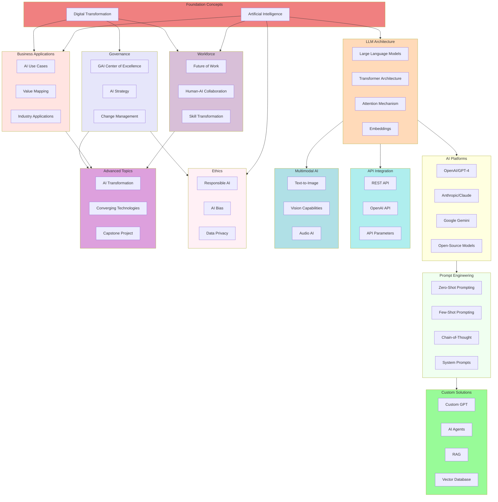
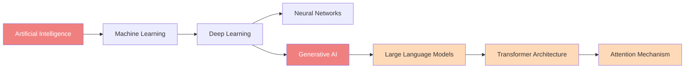
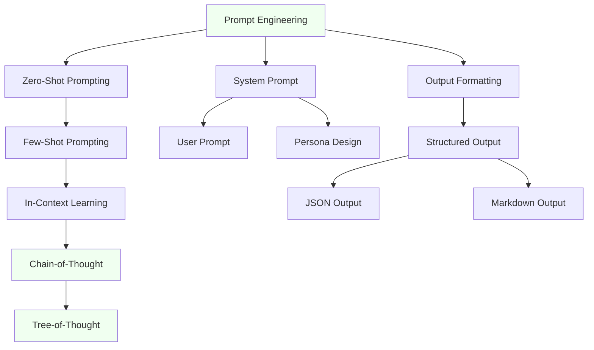
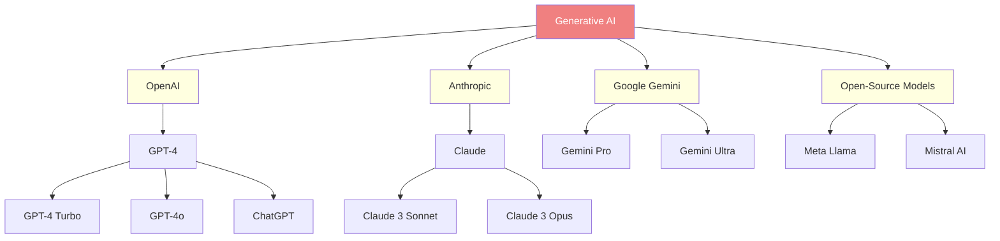
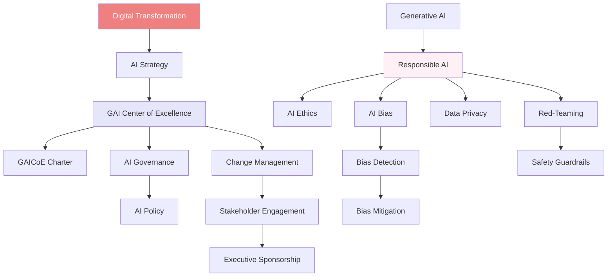
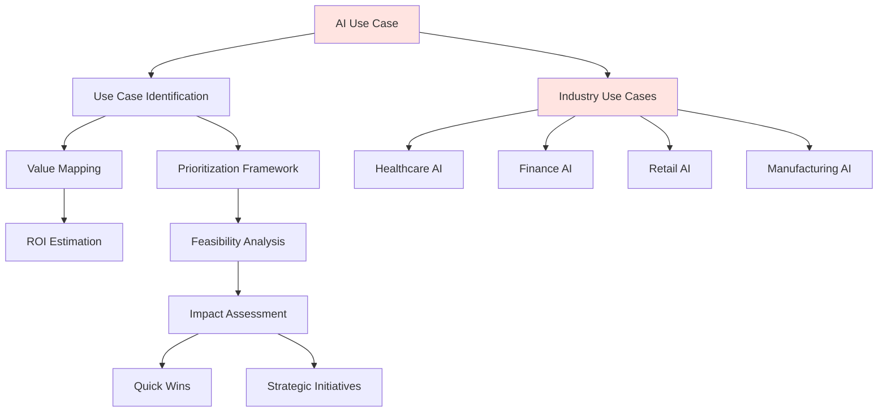
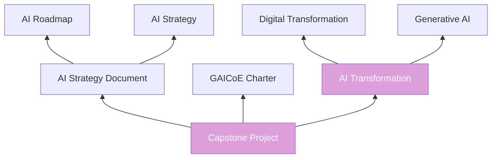

# Learning Graph Mermaid Diagram

This page provides a visual representation of the SEIS 666 learning graph using Mermaid diagrams.

## High-Level Taxonomy Overview

This diagram shows the 12 taxonomy categories and their primary relationships:

## Core Learning Path: AI Fundamentals

## Prompt Engineering Learning Path

## Platform Ecosystem

## Governance and Ethics Path

## Business Applications Path

## Capstone Project Dependencies

## Taxonomy Legend

| Category | Color | Description |
|----------|-------|-------------|
| **Foundation** | LightCoral | Core concepts like Digital Transformation and AI |
| **LLM Architecture** | PeachPuff | Technical architecture concepts |
| **AI Platforms** | LightYellow | Commercial and open-source AI platforms |
| **Prompt Engineering** | Honeydew | Techniques for effective AI interaction |
| **Custom Solutions** | PaleGreen | Building custom AI applications |
| **API Integration** | PaleTurquoise | Technical integration patterns |
| **Multimodal AI** | PowderBlue | Image, video, and audio AI |
| **Governance** | Lavender | Organizational AI governance |
| **Ethics** | LavenderBlush | Responsible AI and ethics |
| **Workforce** | Thistle | Future of work and skills |
| **Business Applications** | MistyRose | Business use cases and value |
| **Advanced Topics** | Plum | Emerging and capstone concepts |
